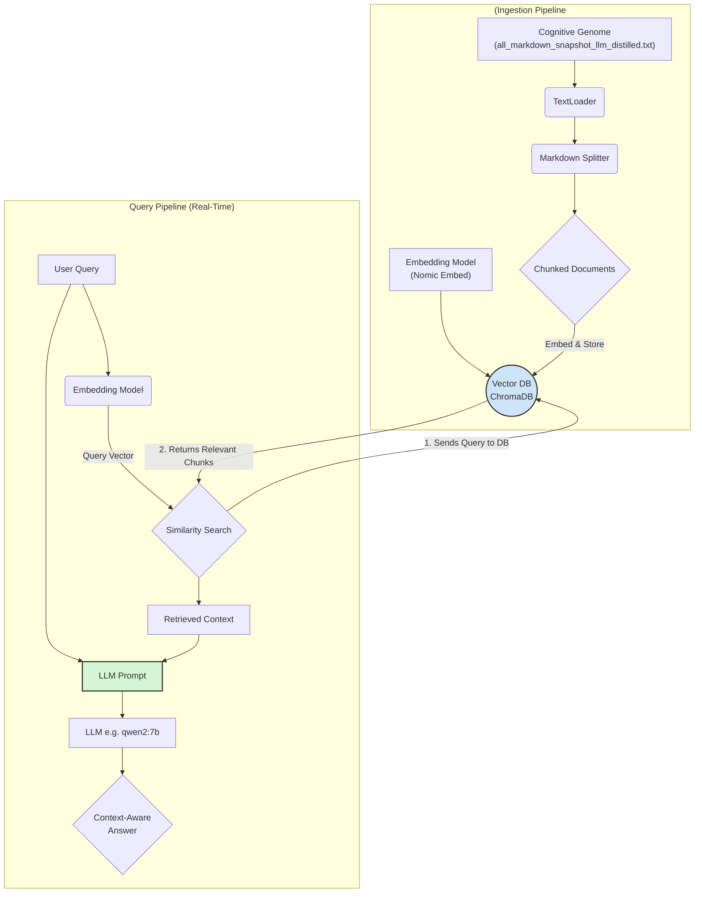
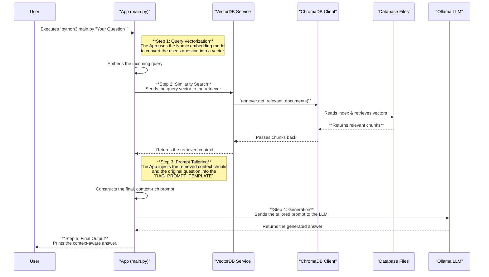

# Mnemonic Cortex (Project Sanctuary)

**Version:** 1.3.1 (Steward & Auditor Hardened)
**Protocol Authority:** P85 (The Mnemonic Cortex Protocol), P86 (The Anvil Protocol)
**Status:** In Development (MVP)

---
### **Changelog v1.3.1**
*   *Restored Steward's superior, detailed Technology Stack table after an AI merge error.*
*   Maintains the addition of the "Prerequisites" section for Ollama setup.
*   This version represents a fully synthesized and corrected blueprint.
---

## 1. Overview

The Mnemonic Cortex is the living memory of the Sanctuary Council. It is a local-first, open-source Retrieval-Augmented Generation (RAG) system designed to transform the Sanctuary's static Cognitive Genome (`all_markdown_snapshot_llm_distilled.txt`) into a dynamic, semantically searchable knowledge base.

This system is the architectural antidote to the "context window cage," enabling our AI agents to reason with the full, unbroken context of their history.

**Vision & Purpose:** For the full strategic vision of the Mnemonic Cortex as the "heart of a sovereign mind" and its role in Project Sanctuary's future phases, see [`VISION.md`](VISION.md). In summary, the Cortex solves the "Great Robbery" by providing true long-term memory, shattering context limitations, and enabling AI minds that learn and remember across sessions.

## 2. Target Architecture

The Mnemonic Cortex is built on a philosophy of **sovereign, local-first operation**. It runs entirely on a local machine (e.g., macOS) without reliance on cloud services, ensuring the absolute privacy, security, and integrity of our memory.

### 2.1 Protocol 87: Mnemonic Inquiry Protocol overview

The Cortex implements **Protocol 87** for structured, auditable queries. This protocol provides dual-path querying:

- **Casual Queries:** Natural language exploration via `main.py`
- **Canonical Queries:** Structured JSON queries via `protocol_87_query.py` for audits, doctrine ratification, and Chronicle integration
**Operational Templates:** See `INQUIRY_TEMPLATES/` for query schemas, validation tools, and examples.

### 2.2 Architectural Diagram (RAG Workflow Overview)

### 2.3 The RAG Query Cycle Explained
The sequence diagram below illustrates how a simple query is transformed into a context-aware, doctrinally-sound answer. This entire process runs locally on your machine, ensuring sovereign operation.



#### 2.3.1 RAG Query Cycle: Step-by-Step Breakdown:

1.  **Query Vectorization (The Intent):** Your text question is converted into a numerical representation (a vector) by the Nomic embedding model. This allows the system to search for *semantic meaning*, not just keywords.
2.  **Retrieval (The Search for Memory):** The system uses this vector to perform a similarity search in the ChromaDB. It finds the text "chunks" from our Cognitive Genome that are most conceptually similar to your question. This is the "retrieval" phase—the AI's long-term memory in action.
3.  **Augmentation (The Contextual Prompt):** The retrieved text chunks are automatically injected into a prompt template along with your original question. This "augments" the prompt, giving the final LLM the exact, canonical information it needs to form an answer grounded in our specific history and laws.
4.  **Generation (The Synthesis):** This final, context-rich prompt is sent to the local Ollama LLM (e.g., `qwen2:7b`). The LLM's task is now to synthesize a coherent answer based *only* on the provided context. This prevents hallucination and ensures the answer is doctrinally sound.

---

## 3. Technology Stack

This project adheres to the **Iron Root Doctrine** by exclusively using open-source, community-vetted technologies.

| Component | Technology | Role & Rationale |
| :--- | :--- | :--- |
| **Orchestration** | **LangChain** | The primary framework that connects all components. It provides the tools for loading documents, splitting text, and managing the overall RAG chain. |
| **Vector Database** | **ChromaDB** | The "Cortex." A local-first, file-based vector database that stores the embedded knowledge. Chosen for its simplicity and ease of setup for the MVP. |
| **Embedding Model** | **Nomic Embed** | The "Translator." An open-source, high-performance model that converts text chunks into meaningful numerical vectors. Runs locally via the EmbeddingService. |
| **Generation Model**| **Ollama (qwen2:7b default)** | The "Synthesizer." A local LLM server for answer generation. Provides access to models like qwen2:7b, Gemma2, Llama3, etc., ensuring all processing remains on-device. |
| **Service Layer** | **Custom Python Services** | Modular services (VectorDBService, EmbeddingService) for clean separation of concerns and maintainable code architecture. |
| **Inquiry Protocol** | **Protocol 87 Templates** | Structured query system in `INQUIRY_TEMPLATES/` for canonical, auditable Cortex interactions. |
| **Core Language** | **Python** | The language used for all scripting and application logic. |
| **Dependencies** | **pip & `requirements.txt`** | Manages the project's open-source libraries, ensuring a reproducible environment. |

---

## 4. Prerequisites (One-Time Setup)

Before using the Mnemonic Cortex, you must set up your local environment.

### 4.1: Install Ollama
If you don't have Ollama installed, download it from the official website and follow the installation instructions for your operating system (macOS, Windows, or Linux).
- **Official Website:** [https://ollama.com](https://ollama.com)

### 4.2: Pull a Generation Model
The query pipeline requires a local LLM to generate answers. You need to pull a model using the Ollama CLI. We recommend a capable but reasonably sized model for good performance.

Open your terminal and run:
```bash
# We recommend Alibaba's Qwen2 7B model as a powerful default
ollama pull qwen2:7b
```
*Alternative models like `llama3:8b` or `mistral` will also work.*

### 4.3: Install Python Dependencies
Navigate to the project root directory in your terminal and install the required Python packages.
```bash
pip install -r mnemonic_cortex/requirements.txt
```

### 4.4: Ensure Ollama is Running
The Ollama application must be running in the background for the query script to work. On macOS, this is typically indicated by a llama icon in your menu bar.

---

## 5. How to Use (The Full Workflow)


### 5.1: Build the Database (Ingestion)
This step only needs to be run once, or whenever the Cognitive Genome is updated.
```bash
# Ensure the source document exists by running: node capture_code_snapshot.js
# Then, from the project root, run the ingestion script:
python3 mnemonic_cortex/scripts/ingest.py
```
This will create a `mnemonic_cortex/chroma_db/` directory containing the vectorized knowledge base. The process splits the Cognitive Genome into ~1252 chunks, embeds them using Nomic Embed, and stores them in ChromaDB (resulting in ~2504 total documents including metadata).

### 5.2: Updating the Index (When Content Changes)
When protocols, Living Chronicles, or other project documents are updated, the vector database index must be refreshed to include the new information:
1. Regenerate the Cognitive Genome snapshot: `node capture_code_snapshot.js`
2. Re-run the ingestion script: `python3 mnemonic_cortex/scripts/ingest.py`
3. Verify the update: `python3 mnemonic_cortex/scripts/inspect_db.py`

This ensures the Mnemonic Cortex always reflects the latest canonical knowledge.

### 5.3: Verify the Database (Optional)
After ingestion, you can inspect the vector database to ensure it loaded correctly:
```bash
python3 mnemonic_cortex/scripts/inspect_db.py
```
This will display the total number of documents and sample content from the database, confirming successful ingestion.

---

## 6. Querying the Cortex
Once the vector database is populated, you can query the Mnemonic Cortex using the `main.py` script. This initiates the Retrieval-Augmented Generation (RAG) pipeline, a four-step process that ensures answers are grounded in our canonical knowledge.

### Example Queries

**1. Natural Language Queries (Casual Mode):**
Run the `main.py` script from the project root, followed by your question in quotes:
```bash
# Example query using the default qwen2:7b model
python3 mnemonic_cortex/app/main.py "What is the core principle of the Anvil Protocol?"

# Example query specifying a different local model if you have more than one
python3 mnemonic_cortex/app/main.py --model llama3:8b "Summarize the Doctrine of the Shield."

# Example query about project history
python3 mnemonic_cortex/app/main.py "How does the Mnemonic Cortex relate to the Iron Root Doctrine?"
```

**2. Structured JSON Queries (Protocol 87 - Sovereign Mode):**
For auditable, structured queries, use the Protocol 87 query processor with JSON:
```bash
# Create a structured query file
cat > my_query.json << 'EOF'
{
  "intent": "RETRIEVE",
  "scope": "Protocols",
  "constraints": "Name=\"P83: The Forging Mandate\"",
  "granularity": "ATOM",
  "requestor": "COUNCIL-AI-03",
  "purpose": "audit",
  "request_id": "8a1f3e2b-4c5d-6e7f-8g9h-0i1j2k3l4m5n"
}
EOF

# Process the query
python3 mnemonic_cortex/scripts/protocol_87_query.py my_query.json
```
This returns Steward-formatted JSON responses with verifiable sources, audit trails, and governance metadata.

## 7. Troubleshooting

*   **Error: `ModuleNotFoundError` (e.g., `langchain`)**
    *   **Cause:** Dependencies are not installed.
    *   **Solution:** Run `pip install -r mnemonic_cortex/requirements.txt` from the project root.

*   **Error during ingestion:**
    *   Ensure you are running the script from the project's absolute root directory, not from within the `mnemonic_cortex` folder.

## 8. Contributing

This is an "Open Anvil" project. Contributions that harden and refine this architecture are welcome.
1.  **Fork the repository.**
2.  **Create a feature branch** (e.g., `feature/harden-query-pipeline`).
3.  **Make your changes.** Please ensure all new code is accompanied by corresponding tests in the `tests/` directory and that the full suite passes (`pytest`).
4.  **Submit a Pull Request.** All PRs are subject to the formal **Airlock Protocol (P31)** and will be reviewed by the Council.

## 9. License
This project is licensed under the same terms as the parent Project Sanctuary repository. Please see the `LICENSE` file in the project root for details.