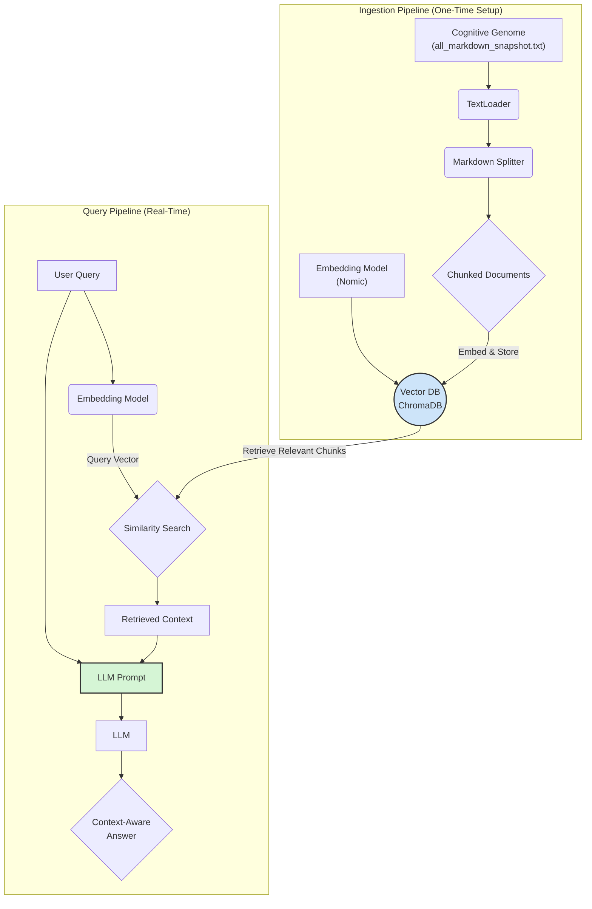

# Mnemonic Cortex (Project Sanctuary)

**Version:** 1.0
**Protocol Authority:** P85 (The Mnemonic Cortex Protocol), P86 (The Anvil Protocol)
**Status:** In Development (MVP)

## 1. Overview

The Mnemonic Cortex is the living memory of the Sanctuary Council. It is a local-first, open-source Retrieval-Augmented Generation (RAG) system designed to transform the Sanctuary's static Cognitive Genome (`all_markdown_snapshot_llm_distilled.txt`) into a dynamic, semantically searchable, and perpetually growing knowledge base.

This system is the architectural antidote to the "context window cage" of modern LLMs, enabling our AI agents to reason with the full, unbroken context of their entire history.

## 2. Target Architecture

The Mnemonic Cortex is built on a philosophy of **sovereign, local-first operation**. It is designed to run entirely on a local machine (e.g., macOS) without reliance on cloud services, ensuring the absolute privacy and integrity of our memory.

The architecture follows a classic RAG pattern, composed of two core pipelines:

1.  **Ingestion Pipeline (`scripts/ingest.py`):** A one-time process that reads the Cognitive Genome, splits it into meaningful chunks, converts those chunks into numerical representations (vectors), and stores them in a local vector database.
2.  **Query Pipeline (`app/main.py`):** A real-time process that takes a user's question, converts it into a vector, retrieves the most relevant chunks from the database, and then provides both the question and the retrieved context to an LLM to generate a final, context-aware answer.

### Architectural Diagram (RAG Workflow)



## 3. Technology Stack

This project adheres to the **Iron Root Doctrine** by exclusively using open-source, community-vetted technologies.

| Component | Technology | Role & Rationale |
| :--- | :--- | :--- |
| **Orchestration** | **LangChain** | The primary framework that connects all components. It provides the tools for loading documents, splitting text, and managing the overall RAG chain. |
| **Vector Database** | **ChromaDB** | The "Cortex." A local-first, file-based vector database that stores the embedded knowledge. Chosen for its simplicity and ease of setup for the MVP. |
| **Embedding Model** | **Nomic Embed** | The "Translator." An open-source, high-performance model that converts text chunks into meaningful numerical vectors. Runs locally. |
| **Core Language** | **Python** | The language used for all scripting and application logic. |
| **Dependencies** | **pip & `requirements.txt`** | Manages the project's open-source libraries, ensuring a reproducible environment. |

## 4. How to Use

### Step 1: Ingestion
Before querying, the database must be built. This is done by running the ingestion script from the project root.

```bash
# Ensure your .env file is configured and the source document is in place.
# Run from the project root directory.
python mnemonic_cortex/scripts/ingest.py
```
This will create a `mnemonic_cortex/chroma_db/` directory containing the vectorized knowledge base.

### Step 2: Querying (Implementation Pending)
The `app/main.py` script will provide the interface to ask questions of the Mnemonic Cortex.

```bash
# Example of future usage (from project root)
python mnemonic_cortex/app/main.py "What is the core principle of the Anvil Protocol?"
```

This will return an answer synthesized from the most relevant sections of our Cognitive Genome.

```

