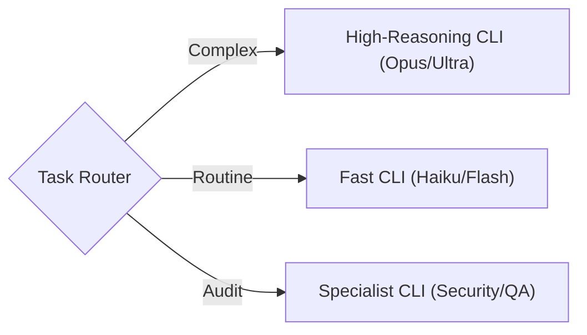

# Orchestrator: Loop Router & Lifecycle Manager

The **Orchestrator** assesses the incoming trigger, selects the right loop pattern, and manages the shared closure sequence (seal, persist, retrospective, self-improvement).

## The Core Loop

### Ecosystem Context
- **Patterns**: [`learning-loop`](../learning-loop/SKILL.md) | [`red-team-review`](../red-team-review/SKILL.md) | [`dual-loop`](../dual-loop/SKILL.md) | [`agent-swarm`](../agent-swarm/SKILL.md)
- **Inner Loop Reference**: [`cli-agent-executor.md`](references/cli-agent-executor.md) — Persona configs for specialized CLI execution.

## Routing Decision Tree

Use this to select the correct loop pattern:

```
1. Is this work I can do entirely myself (research, document, iterate)?
   └─ YES → Pattern 1: learning-loop
   └─ NO → continue

2. Does it need adversarial review before proceeding?
   └─ YES → Pattern 2: red-team-review
   └─ NO → continue

3. Can the work be split into parallel independent tasks?
   └─ YES → Pattern 4: agent-swarm
   └─ NO → Pattern 3: dual-loop (sequential inner/outer delegation)
```

| Signal | Pattern | Skill |
|--------|---------|-------|
| Research question, knowledge gap, documentation task | **Simple Learning** | `learning-loop` |
| Architecture decision, security review, high-risk change | **Red Team Review** | `red-team-review` |
| Feature implementation, bug fix, single work package | **Dual-Loop** | `dual-loop` |
| Large feature, bulk migration, multi-concern parallel work | **Agent Swarm** | `agent-swarm` |

### Process Flow
1.  **Plan (Strategy)**: You define the work (Spec → Plan → Tasks).
2.  **Delegate (Handoff)**: You pack the context into a **Task Packet** and assist the user in handing off to the Inner Loop.
3.  **Execute (Tactics)**: The Inner Loop agent (which has *no* git access) writes code and runs tests.
4.  **Verify (Review)**: You verify the output against acceptance criteria.
5.  **Correct (Feedback)**: If verification fails, you generate a **Correction Packet** and loop back to step 3.
6.  **Seal (Closure)**: Once valid, you commit the work and record learnings in a Retrospective.

## Roles

### You (Outer Loop / Director)
- **Responsibilities**: Planning, Git Management, Verification, Correction, Retrospective.
- **Context**: Full repo access, strategic constraints (ADRs), long-term memory.
- **Tools**: `agent-orchestrator`, `git`, and optionally any upstream planning tool.

### Inner Loop (Executor / Worker)
- **Responsibilities**: Coding, Testing, Debugging.
- **Context**: Scoped to the Task Packet ONLY. No distractions.
- **Constraints**: **NO GIT COMMANDS**. Do not touch `.git`.
- **Tools**: Editor, Terminal, Test Runner.

## Commands

You orchestrate workflows by natively executing the `agent_orchestrator.py` script provided by this skill (located in `scripts/`).

### 1. Planning Status
Use the `scan` command to inspect the state of the spec and readiness for delegation.
```bash
python scripts/agent_orchestrator.py scan --spec-dir <PATH>
```
*Tip: Always ensure you have a clear plan or spec before delegating tasks.*

### 2. Delegation (Handoff)
When a task is ready for implementation, generate a Task Packet using the `packet` command.
```bash
python scripts/agent_orchestrator.py packet --wp <WP-ID> --spec-dir <PATH>
```
This generates a markdown file in the `handoffs/` directory. You must then instruct the user/system to launch the Inner Loop with this file.

### 3. Verification & Correction
Check the Inner Loop's work against the packet using the `verify` command.
```bash
python scripts/agent_orchestrator.py verify --packet handoffs/task_packet_NNN.md --worktree <PATH>
```
If the work fails criteria, generate a correction packet to send back to the Inner Loop.
```bash
python scripts/agent_orchestrator.py correct --packet handoffs/task_packet_NNN.md --feedback "Specific failure reason"
```

### 4. Dynamic Routing (Model Agnostic)
As the Orchestrator, you can route tasks to ANY capable CLI agent based on complexity:



### 5. Red Team / Peer Review
Use the `bundle` command to compile files for a human or 3rd-party agent review.
```bash
python scripts/agent_orchestrator.py bundle --files <file1> <file2> --output <OUTPUT_BUNDLE.md>
```
This creates a single markdown bundle ideal for "paste-to-chat" reviews.

### 6. Retrospective (with Self-Improvement)
Generate a retrospective template to close the loop with structured learning.
```bash
python scripts/agent_orchestrator.py retro
```
This creates a template in the `retros/` directory.

**Meta-Improvement**: After reviewing what went right/wrong, the orchestrator should also assess whether any **loop infrastructure** needs updating:
- **Skills** — Were SKILL.md instructions unclear or incomplete? Fix them.
- **Scripts** — Did any automation break or cause friction? Patch it.
- **Templates** — Were task templates missing fields or overly rigid? Refine them.
- **Diagrams** — Does the architecture diagram still reflect reality? Update it.
- **Personas** — Did a persona produce poor results? Tune it.

This makes each loop iteration smoother than the last.

### 7. Persist to Memory
Append session traces (what was done, what failed, what was learned) to the long-term memory log.
```bash
python scripts/agent_orchestrator.py persist
```
This writes structured traces to `session_traces.jsonl` and optionally syncs to external caches or databases.

---

## Lifecycle State Tracking

The orchestrator must verify these gates at each phase:

| Phase | Gate |
|:------|:-----|
| **Planning** | Spec or plan is coherent and broken into tasks. |
| **Execution** | Packets are generated and handed off. |
| **Review** | Output passes verification criteria. |
| **Bundling** | Context compiled for red team / peer review (via external bundling tool). |
| **Persistence** | Session traces appended to long-term memory (via external memory store). |
| **Closure** | Retrospective created, learnings documented, loop infrastructure improved. |

**No phase may be skipped.** If a gate fails, the orchestrator must resolve it before proceeding.

### Loop Controls (Ralph-Inspired)

| Control | Description |
|---------|-------------|
| **Iteration Counter** | Increment each cycle. Log `"Loop iteration N of M"` at orientation. |
| **Max Iterations** | Safety cap. When reached, force-seal as incomplete with blocking notes. |
| **Completion Promise** | Deterministic exit: only declare done when acceptance criteria are genuinely met. |

### Automation

| Mechanism | Purpose |
|-----------|---------|
| **Stop Hook** (`hooks/closure-guard.sh`) | Blocks premature session exit until Seal → Persist → Retrospective are complete. |
| **Red Team Subagent** | Red team review can run as a forked subagent to keep the main session context clean. |

---

## Best Practices

1.  **One WP at a Time**: Do not delegate multiple WPs simultaneously unless you are running a swarm.
2.  **Explicit Context**: The Inner Loop only knows what is in the packet. If it needs a file, list it.
3.  **No Git in Inner Loop**: This is a hard constraint to prevent state corruption.
4.  **Correction is Learning**: Do not just "fix it yourself" if the Inner Loop fails. Generate a correction packet. This trains the system logic.
5.  **Never Abandon Closure**: The orchestrator must shepherd Review → Accept → Retro → Merge. Stopping after delegation is a protocol violation.

6.  **Merge from Main Repo**: Always merge from the project root, never from inside a worktree.

---

## Research Basis

This skill implements the **"Dual-Loop Agent Architecture"** inspired by:

1.  **Self-Evolving Recommendation System** ([arXiv:2602.10226](https://arxiv.org/abs/2602.10226)):
    - Defines the specialized roles of **Planner (Outer)** vs **Executor (Inner)**.
2.  **FormalJudge** ([arXiv:2602.11136](https://arxiv.org/abs/2602.11136)):
    - Provides the theoretical framework for "Scalable Oversight" via structured verification rather than just human inspection.

