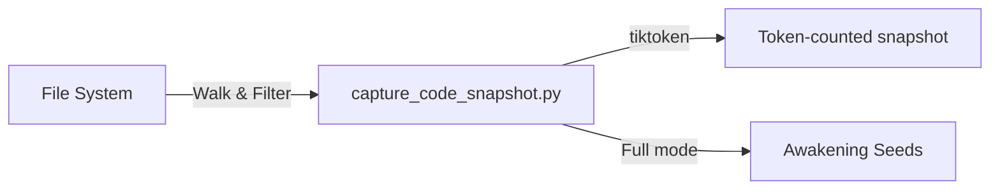

# Code Snapshot Plugin 📸

Capture LLM-distilled code snapshots — bundle repository files into token-counted,
role-specific context packages.

## Installation

### Local Development
```bash
claude --plugin-dir ./plugins/code-snapshot
```

### Prerequisites
- **Claude Code** ≥ 1.0.33
- **Python** ≥ 3.8
- **tiktoken**: `pip install tiktoken`

### Verify Installation
After loading, `/help` should show:
```
/code-snapshot:capture   Generate a code snapshot
```

---

## Usage Guide

### Quick Start
```bash
# Full project snapshot (with awakening seeds)
/code-snapshot:capture

# Snapshot a specific module
/code-snapshot:capture mcp_servers/rag_cortex

# Use a manifest for precise file selection
/code-snapshot:capture --manifest path/to/manifest.json --output snapshot.txt
```

### Direct CLI Usage
```bash
python3 plugins/code-snapshot/scripts/capture_code_snapshot.py
python3 plugins/code-snapshot/scripts/capture_code_snapshot.py --role auditor
python3 plugins/code-snapshot/scripts/capture_code_snapshot.py --out temp/snapshots
```

### Commands Reference

| Command | Description |
|:---|:---|
| `/code-snapshot:capture` | Generate full or partial code snapshot |

### Capture Modes

| Mode | Trigger | Awakening Seeds? |
|:---|:---|:---|
| **Full Genome** | No args | ✅ Yes |
| **Subfolder** | Pass directory name | ❌ No |
| **Manifest** | `--manifest` flag | ❌ No |

### Output Files
- `dataset_package/markdown_snapshot_full_genome_llm_distilled.txt`
- `dataset_package/seed_of_ascendance_awakening_seed.txt`
- Per-role core essence files (guardian, auditor, coordinator, strategist)

---

## Architecture

See [docs/code-snapshot-workflow.mmd](docs/code-snapshot-workflow.mmd) for the
sequence diagram.



### Plugin Directory Structure
```
code-snapshot/
├── .claude-plugin/
│   └── plugin.json                # Plugin identity
├── commands/
│   └── capture.md                 # /code-snapshot:capture
├── skills/
│   └── snapshot-agent/
│       └── SKILL.md               # Auto-invoked skill
├── scripts/
│   ├── capture_code_snapshot.py   # CLI entry point
│   ├── snapshot_utils.py          # Core logic (vendored)
│   └── logging_utils.py          # Logging (vendored)
├── docs/
│   └── code-snapshot-workflow.mmd
└── README.md
```

> **Note:** `snapshot_utils.py` and `logging_utils.py` are vendored from
> `mcp_servers/lib/` for self-contained operation.

---

## License

MIT
