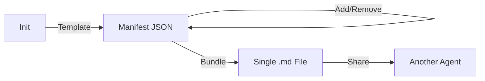

# Context Bundler Plugin 📦

Bundle source files and documentation into single-file Markdown context packages
for portable AI agent distribution.

## Installation

### Option 1: Local Development
```bash
claude --plugin-dir ./plugins/context-bundler
```

### Option 2: From Marketplace (when published)
```
/plugin install context-bundler
```

### Option 3: From GitHub
```json
// In your marketplace.json
{
  "name": "context-bundler",
  "source": { "source": "github", "repo": "richfrem/Project_Sanctuary" }
}
```

### Prerequisites
- **Claude Code** ≥ 1.0.33
- **Python** ≥ 3.8 (for scripts)

### Verify Installation
After loading the plugin, run `/help` in Claude Code — you should see:
```
/context-bundler:init     Initialize a new manifest
/context-bundler:add      Add a file to the manifest
/context-bundler:bundle   Compile into a Markdown bundle
```

---

## Usage Guide

### Quick Start
```bash
# 1. Initialize a manifest for your project
/context-bundler:init --target MyProject --type generic

# 2. Add files you want to bundle
/context-bundler:add --path "src/main.py" --note "Application entry point"
/context-bundler:add --path "docs/architecture.md" --note "System architecture"
/context-bundler:add --path "README.md" --note "Project overview"

# 3. Generate the bundle
/context-bundler:bundle --output my-project-bundle.md
```

### Direct CLI Usage (without Claude)
```bash
# From the plugin directory
python3 scripts/manifest_manager.py --help

# Initialize
python3 scripts/manifest_manager.py init --bundle-title MyTool --type generic

# Add files
python3 scripts/manifest_manager.py add --path "src/main.py" --note "Entry point"

# Bundle
python3 scripts/manifest_manager.py bundle --output output.md
```

> **Note:** Global flags (`--manifest`, `--base`) must come **before** the subcommand.

### Commands Reference

| Command | Description | Example |
|:---|:---|:---|
| `/context-bundler:init` | Create a new manifest from template | `--target MyTool --type generic` |
| `/context-bundler:add` | Add a file entry to the manifest | `--path "file.py" --note "desc"` |
| `/context-bundler:bundle` | Compile manifest into single `.md` | `--output bundle.md` |

### Available Template Types

| Type | Use Case |
|:---|:---|
| `generic` | Ad-hoc bundling for any project |
| `context-bundler` | Self-bundling (bundle the bundler itself) |
| `bootstrap` | Project bootstrapping context |
| `guardian` | Constitution / governance context |
| `learning-audit-core` | Learning audit packages |
| `learning` | Learning loop context |
| `red-team` | Red team review context |

### Skills (Auto-Invoked)

- **`bundler-agent`** — Claude automatically uses this skill when tasks involve
  bundling, packaging, or distributing files. It enforces standard ordering
  (identity → manifest → docs → code) and dependency checking.

---

## Architecture

See [docs/context-bundler-workflow.mmd](docs/context-bundler-workflow.mmd) for the
full sequence diagram.



### Plugin Directory Structure
```
context-bundler/
├── .claude-plugin/
│   └── plugin.json              # Plugin identity & metadata
├── commands/
│   ├── bundle.md                # /context-bundler:bundle
│   ├── init.md                  # /context-bundler:init
│   └── add.md                   # /context-bundler:add
├── skills/
│   └── bundler-agent/
│       └── SKILL.md             # Auto-invoked bundling skill
├── scripts/
│   ├── manifest_manager.py      # CLI entry point
│   ├── bundle.py                # Core bundling engine
│   └── path_resolver.py         # Path resolution utility
├── resources/
│   ├── base-manifests/ (7 templates)
│   ├── base-manifests-index.json
│   └── file-manifest-schema.json
├── docs/
│   └── context-bundler-workflow.mmd  # Sequence diagram
└── README.md
```

---

## License

MIT
