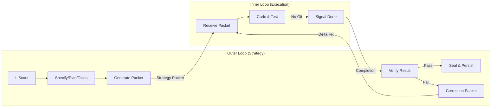
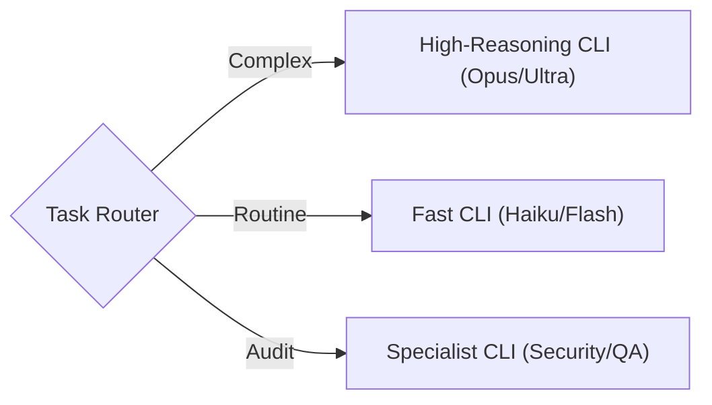

# Dual-Loop Supervisor

Orchestration skill for the Dual-Loop Agent Architecture. The Outer Loop (Antigravity) uses this skill to delegate work to the Inner Loop (Opus/Claude Code) and verify results.

## CRITICAL: Anti-Simulation Rules

> **YOU MUST ACTUALLY RUN EVERY COMMAND LISTED BELOW.**
> Describing what you "would do", summarizing expected output, or marking
> a step complete without pasting real tool output is a **PROTOCOL VIOLATION**.
>
> **Proof = pasted command output.** No output = not done.
>
> **Closure is NOT optional.** After all WPs are done, you MUST run the full
> closure sequence (Seal → Persist → Retrospective → End).

### Known Agent Failure Modes (DO NOT DO THESE)
1. **Checkbox theater**: Marking `[x]` without running the command
2. **Kanban neglect**: Not updating task lanes between phases
3. **Closure skip**: Finishing code but not running seal/persist/retrospective
4. **Packet fabrication**: Writing a strategy packet by hand instead of using the generator
5. **Verification bypass**: Skipping `verify_inner_loop_result.py` and just assuming PASS

---

## Architecture Overview




### Dynamic Routing & Model Agnosticism

The "Inner Loop" isn't a single agent or model. The architecture is **Model Agnostic**:

*   **Outer Loop (Strategy)**: Any high-reasoning agent (e.g., Antigravity, Gemini 1.5 Pro, Claude 3.5 Sonnet).
*   **Inner Loop (Execution)**: Any CLI-driven agent (e.g., Cortex, Claude Code, Custom Scripts).

The Outer Loop dynamically routes tasks based on complexity:



**Reference**:
- [Standard Loop Architecture](resources/diagrams/dual_loop_architecture.mmd)
- [Dynamic Routing Architecture](resources/diagrams/dual_loop_dynamic_routing.mmd)

---

### Ecosystem Integration (The Trinity)

This skill is the **Protocol Definition**. It is operationalized by two other specialized skills:

1.  **Planner & Coordinator**: [`agent-orchestrator`](../../agent-orchestrator/skills/orchestrator-agent/SKILL.md)
    -   **Role**: Acts as the "Outer Loop".
    -   **Function**: Runs `spec-kitty`, generates strategy packets, and reviews work.
    
2.  **Executor & Specialist**: [`claude-cli-agent`](../../claude-cli/skills/claude-cli-agent/SKILL.md)
    -   **Role**: Acts as a specialized "Inner Loop".
    -   **Function**: Provides persona-based execution (e.g., Security Auditor, QA Expert) via CLI pipe.

### Workflow Steps

### Prerequisites (Protocol 128 Context)
> **CRITICAL**: This is a **Child Protocol**.
> You must strictly follow the **Parent Protocol (128)** for Session Lifecycle.
> *   **Parent**: `/sanctuary-start` (Scout/Boot)
> *   **Diagram**: `protocol_128_learning_loop.mmd` (See "Dual Loop Branch")

### Step 1: Plan (Outer Loop — Spec Kitty)

```bash
/spec-kitty.specify    # → spec.md
/spec-kitty.plan       # → plan.md
/spec-kitty.tasks      # → tasks.md + tasks/WP-*.md
```
**PROOF**: Paste output of each command.

Then verify:
```bash
python3 tools/orchestrator/verify_workflow_state.py --feature <SLUG> --phase tasks
```
**PROOF**: Paste verification output showing checkmarks.
**STOP**: Do NOT proceed to Step 2 until verification passes.

### Step 1.5: Protocol 128 Audit (Mandatory)

> **Red Team Review**: Before generating the strategy packet, you MUST run the audit to bundle context for the Red Team.

```bash
/sanctuary-audit
```
**PROOF**: Paste output showing the audit packet generation.
**STOP**: Do NOT proceed to Step 2 until the audit is complete.

---

### Step 2: Prepare Worktree & Packet (Outer Loop)

#### 2a. Create isolated worktree
```bash
/spec-kitty.implement <WP-ID>
```
**PROOF**: Paste output showing worktree path.

#### 2b. Update kanban to "doing"
```bash
python3 .kittify/scripts/tasks/tasks_cli.py update <FEATURE> <WP-ID> doing \
  --agent "Antigravity" --note "Delegated to Inner Loop"
```
**PROOF**: Paste CLI output.

#### 2c. Generate strategy packet
```bash
python3 tools/orchestrator/dual_loop/generate_strategy_packet.py \
  --tasks-file kitty-specs/<FEATURE>/tasks.md \
  --task-id <WP-ID>
```
**PROOF**: Paste output showing `[OK] Strategy Packet written to: ...`

**Alternative** — end-to-end runner (does 2a + 2c + launches Claude):
```bash
python3 tools/orchestrator/dual_loop/run_workflow.py <WP-ID> --feature <SLUG>
# --no-launch    → generate packet only, don't launch Claude
# --skip-worktree → Branch-Direct Mode (no worktree)
```

**STOP**: Do NOT hand off to Inner Loop until packet file exists on disk.

---

### Step 3: Hand-off (Human Bridge)

Outer Loop signals "Ready for Execution." User switches terminal:

```bash
claude "Read .agent/handoffs/task_packet_NNN.md. Execute the mission. Do NOT use git commands."
```

---

### Step 4: Execute (Inner Loop)

- Inner Loop reads packet, writes code, runs tests
- **MUST NOT** run git commands
- **MUST NOT** modify files outside packet scope
- Signals "Done" when acceptance criteria are met

---

### Step 5: Verify (Outer Loop)

#### 5a. Verify output against packet criteria
```bash
python3 tools/orchestrator/dual_loop/verify_inner_loop_result.py \
  --packet .agent/handoffs/task_packet_NNN.md \
  --verbose \
  --update-status kitty-specs/<FEATURE>/tasks.md \
  --task-id <WP-ID>
```
**PROOF**: Paste the full verification report output.

#### 5b. Verify worktree is clean
```bash
python3 tools/orchestrator/verify_workflow_state.py --wp <WP-ID> --phase review
```
**PROOF**: Paste output showing "Worktree is clean".

#### On PASS:
```bash
# Commit in worktree
cd .worktrees/<WP> && git add . && git commit -m "feat(<WP>): description"

# Update task lane
python3 .kittify/scripts/tasks/tasks_cli.py update <FEATURE> <WP-ID> done \
  --agent "Antigravity" --note "Verified and committed"
```
**PROOF**: Paste commit hash + CLI lane update output.

Then verify kanban:
```bash
/spec-kitty.status
```
**PROOF**: Paste the board showing WP in "done" lane.

#### On FAIL:
- `verify_inner_loop_result.py` auto-generates `.agent/handoffs/correction_packet_NNN.md`
- Hand off the correction packet to Inner Loop (repeat Step 3)
- **PROOF**: Paste the path to the generated correction packet.

---

### Step 6: Closure (MANDATORY — DO NOT SKIP)

> **After all WPs are complete, you MUST run closure.**
> This is not optional. Skipping means the next session starts blind.

```bash
/sanctuary-seal           # Phase VI — Paste output
/sanctuary-persist        # Phase VII — Paste output
/sanctuary-retrospective  # Phase VIII — Paste output
/sanctuary-end            # Phase IX — Paste output
```
**PROOF**: Paste the output of EACH command. All four must show real output.
**STOP after each**: Do NOT proceed to the next closure step until the previous one shows output.

---

## Protocol 128 Integration

| P128 Phase | Dual-Loop Role | Notes |
|------------|---------------|-------|
| I (Scout) | Outer Loop | Boot, orient, read spec context |
| II-III (Synthesis/Gate) | Outer Loop | Strategy planning, user approval |
| IV (Audit) | Outer Loop | Pre-execution checkpoint |
| *Execution* | **Inner Loop** | Code-only, no git, no P128 phases |
| *Verification* | Outer Loop | Inspect diff, run checks |
| V (RLM Synthesis) | Outer Loop | Cognitive Hologram generation |
| VI-IX (Seal→End) | Outer Loop | Standard closure sequence |

**Key rule**: The Inner Loop does NOT run Learning Loop phases. All cognitive continuity is the Outer Loop's responsibility.

---

## Fallback: Branch-Direct Mode

If worktree creation fails or the Inner Loop cannot access it:
1. Inner Loop implements on the **feature branch** directly
2. Outer Loop logs this in `.agent/frictionlogs/`
3. Outer Loop reviews **branch diff** instead of worktree diff
4. Use `run_workflow.py --skip-worktree` to explicitly enter this mode

---

## Task Lane Management

```bash
# Move WP to "doing" when launching Inner Loop
python3 .kittify/scripts/tasks/tasks_cli.py update <FEATURE> <WP-ID> doing \
  --agent "Antigravity" --note "Delegated to Inner Loop"

# Move to "for_review" after Inner Loop completes
python3 .kittify/scripts/tasks/tasks_cli.py update <FEATURE> <WP-ID> for_review \
  --agent "Antigravity" --note "Inner Loop complete, verifying"

# Move to "done" after verification passes
python3 .kittify/scripts/tasks/tasks_cli.py update <FEATURE> <WP-ID> done \
  --agent "Antigravity" --note "Verified and committed"
```

**After every lane change**, run `/spec-kitty.status` and confirm the board updated.

---

## Constraints

- The Inner Loop MUST NOT run git commands. Only the Outer Loop manages version control.
- Strategy Packets must be minimal. No conversation history, no redundant context.
- The Human Gate applies at every loop boundary.
- All verification failures produce a correction packet, not a rejection.
- Worktree Isolation: All coding happens in `.worktrees/` (preferred) or feature branch (fallback).

---


## Research Basis

This skill operationalizes the following advanced agentic patterns:

1.  **Dual-Loop Architecture** (*Self-Evolving Recommendation System*, [arXiv:2602.10226](https://arxiv.org/abs/2602.10226)):
    - Separates **Strategy (Outer)** from **Execution (Inner)** to optimize token usage and oversight.
2.  **Neuro-Symbolic Verification** (*FormalJudge*, [arXiv:2602.11136](https://arxiv.org/abs/2602.11136)):
    - Uses deterministic checks (verification scripts) rather than just LLM-based "vibes" to validate work.
3.  **Iterative Self-Correction** (*iGRPO*, [arXiv:2602.09000](https://arxiv.org/abs/2602.09000)):
    - The **Correction Packet** loop implements the bootstrapping mechanism where the agent learns from its own failures.

## Related

- **Protocol doc**: `.agent/workflows/sanctuary_protocols/dual-loop-learning.md`
- **Spec**: `kitty-specs/001-dual-loop-agent-architecture/spec.md`
- **Protocol 128**: [ADR 071](../../../ADRs/071_protocol_128_cognitive_continuity.md)
- **Prompt templates**: `prompts/strategy_generation.md`, `prompts/verification.md`
