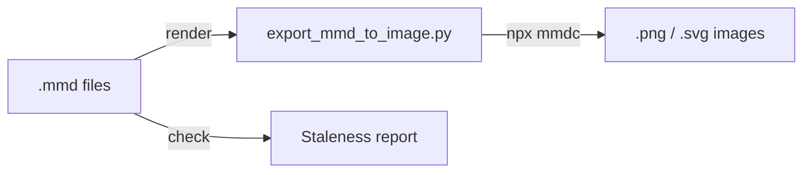

# Mermaid Export Plugin 🎨

Render Mermaid `.mmd` diagram files to PNG or SVG images using `@mermaid-js/mermaid-cli`.

## Installation

### Local Development
```bash
claude --plugin-dir ./plugins/mermaid-export
```

### Prerequisites
- **Claude Code** ≥ 1.0.33
- **Python** ≥ 3.8 (stdlib only)
- **Node.js** (for `npx` — mermaid-cli is auto-installed on first run)

### Verify Installation
After loading, `/help` should show:
```
/mermaid-export:render   Convert .mmd to PNG/SVG
/mermaid-export:check    Find outdated diagram images
```

---

## Usage Guide

### Quick Start
```bash
# Render a single diagram
/mermaid-export:render -i docs/architecture.mmd

# Render all diagrams in a directory
/mermaid-export:render -i docs/diagrams/

# Check which diagrams need re-rendering
/mermaid-export:check -i docs/diagrams/

# Render as SVG
/mermaid-export:render -i diagram.mmd --svg
```

### Direct CLI Usage
```bash
# Single file
python3 plugins/mermaid-export/scripts/export_mmd_to_image.py -i diagram.mmd

# Custom output path
python3 plugins/mermaid-export/scripts/export_mmd_to_image.py -i diagram.mmd -o output.png

# Directory batch
python3 plugins/mermaid-export/scripts/export_mmd_to_image.py -i docs/diagrams/ -o images/

# Check outdated
python3 plugins/mermaid-export/scripts/export_mmd_to_image.py --check
```

### Commands Reference

| Command | Description |
|:---|:---|
| `/mermaid-export:render` | Convert `.mmd` → PNG (default) or SVG |
| `/mermaid-export:check` | Report outdated/missing images |

### Features
- **Auto-install**: Uses `npx -y` to auto-install mermaid-cli if not present
- **Transparent backgrounds**: All exports use transparent backgrounds
- **Batch rendering**: Process entire directories recursively
- **Staleness detection**: `--check` compares file timestamps
- **Custom output paths**: `-o` for single files or output directories

---

## Architecture

See [docs/mermaid-export-workflow.mmd](docs/mermaid-export-workflow.mmd) for the
sequence diagram.



### Plugin Directory Structure
```
mermaid-export/
├── .claude-plugin/
│   └── plugin.json              # Plugin identity
├── commands/
│   ├── render.md                # /mermaid-export:render
│   └── check.md                 # /mermaid-export:check
├── skills/
│   └── diagram-agent/
│       └── SKILL.md             # Auto-invoked skill
├── scripts/
│   └── export_mmd_to_image.py   # The renderer
├── docs/
│   └── mermaid-export-workflow.mmd
└── README.md
```

---

## License

MIT
