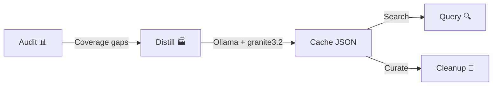

# RLM Factory Plugin 🏭

Recursive Language Model factory — distill repository files into semantic summaries
using Ollama for instant context retrieval.

## Installation

### Local Development
```bash
claude --plugin-dir ./plugins/rlm-factory
```

### Prerequisites
- **Claude Code** ≥ 1.0.33
- **Python** ≥ 3.8
- **Ollama** (for distillation only): `brew install ollama` or [ollama.com](https://ollama.com/)
- **Model**: `ollama pull granite3.2:8b`
- **Python deps**: `pip install requests python-dotenv`

> **Note:** Only `distill` requires Ollama. The `query`, `audit`, and `cleanup` commands
> work offline — they just read/write JSON.

### Verify Installation
After loading, `/help` should show:
```
/rlm-factory:distill   Summarize files via Ollama
/rlm-factory:query     Search the semantic ledger
/rlm-factory:audit     Report cache coverage
/rlm-factory:cleanup   Remove stale entries
```

---

## Usage Guide

### Quick Start
```bash
# 1. Check what's already memorized
/rlm-factory:audit

# 2. Search for a topic (no Ollama needed)
/rlm-factory:query "authentication"

# 3. Distill missing files (requires Ollama running)
ollama serve  # in another terminal
/rlm-factory:distill

# 4. Clean up deleted files
/rlm-factory:cleanup --apply
```

### Memory Banks (Profiles)

| Profile | Flag | Cache File | Use For |
|:---|:---|:---|:---|
| **Legacy** | `--type legacy` | `rlm_summary_cache.json` | Docs, protocols, ADRs |
| **Tool** | `--type tool` | `rlm_tool_cache.json` | Python scripts, CLI tools |

### Commands Reference

| Command | Script | Ollama? | Description |
|:---|:---|:---|:---|
| `/rlm-factory:distill` | `distiller.py` | ✅ | LLM-powered file summarization |
| `/rlm-factory:query` | `query_cache.py` | ❌ | Search the semantic ledger |
| `/rlm-factory:audit` | `inventory.py` | ❌ | Coverage report (fs vs cache) |
| `/rlm-factory:cleanup` | `cleanup_cache.py` | ❌ | Remove stale/orphan entries |

### Agent Distillation (The "Brain Upgrade")

For small batches (< 10 files), the agent can distill directly without Ollama by
reading the file and writing the summary into the cache JSON. This is 3-5x faster
and produces higher-quality summaries using frontier model intelligence.

See `skills/rlm-curator/SKILL.md` for the full Agent Distill protocol.

---

## Architecture

See [docs/rlm-factory-workflow.mmd](docs/rlm-factory-workflow.mmd) for the full
sequence diagram.



Additional diagrams (from original tool):
- [distillation_process.mmd](docs/distillation_process.mmd) — Detailed data flow
- [search_process.mmd](docs/search_process.mmd) — Summary-first search
- [logic.mmd](docs/logic.mmd) — Internal decision logic
- [workflow.mmd](docs/workflow.mmd) — User workflow

### How It Works
1. **Distiller** reads each file, computes a content hash
2. If hash differs from cache → sends content to Ollama with a summarization prompt
3. Ollama (granite3.2:8b) returns a dense semantic summary
4. Summary is persisted to JSON immediately (crash-resilient)
5. **Query** does O(1) substring search across all summaries
6. **Cleanup** compares cache keys against filesystem to remove stale entries

### Plugin Directory Structure
```
rlm-factory/
├── .claude-plugin/
│   └── plugin.json              # Plugin identity + runtime deps
├── commands/
│   ├── distill.md               # /rlm-factory:distill
│   ├── query.md                 # /rlm-factory:query
│   ├── audit.md                 # /rlm-factory:audit
│   └── cleanup.md               # /rlm-factory:cleanup
├── skills/
│   └── rlm-curator/
│       └── SKILL.md             # Auto-invoked curator skill
├── scripts/
│   ├── distiller.py             # The Writer (Ollama)
│   ├── query_cache.py           # The Reader
│   ├── inventory.py             # The Auditor
│   ├── cleanup_cache.py         # The Janitor
│   └── rlm_config.py            # Shared config (RLMConfig)
├── resources/
│   ├── manifest-index.json      # Profile registry
│   ├── distiller_manifest.json  # Default scope config
│   └── rlm_manifest.json        # Legacy manifest
├── docs/
│   ├── rlm-factory-workflow.mmd # Plugin sequence diagram
│   ├── BLUEPRINT.md             # Architecture theory
│   ├── research-summary.md      # RLM research paper summary
│   ├── distillation_process.mmd # Data flow detail
│   ├── search_process.mmd       # Search flow
│   ├── logic.mmd                # Internal logic
│   ├── workflow.mmd             # User workflow
│   └── unpacking.mmd            # Legacy unpacking
├── requirements.in              # Python dependencies
└── README.md
```

---

## License

MIT
