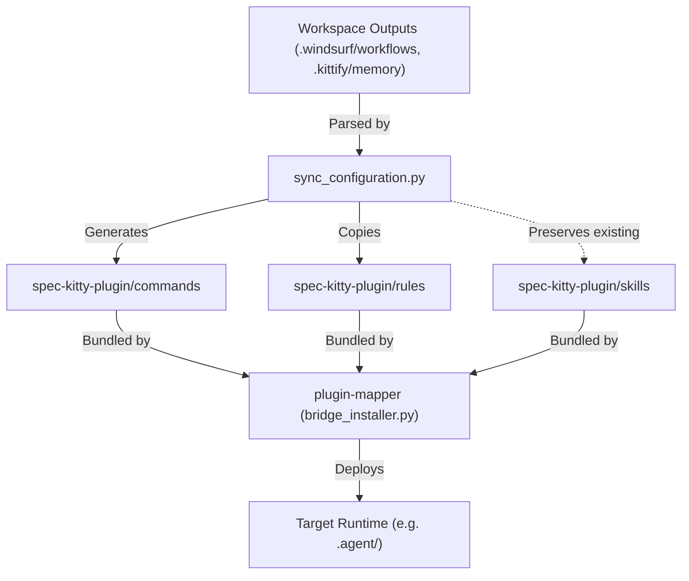

# Spec-Kitty Plugin 🐱

The flagship workflow plugin — **Spec-Driven Development lifecycle** + **Universal Bridge sync engine**.

Source repo [https://github.com/Priivacy-ai/spec-kitty](https://github.com/Priivacy-ai/spec-kitty)

## Prerequisites
```bash
# Install CLI
pip install spec-kitty-cli  # or: uv tool install spec-kitty-cli

# update CLI
pip install spec-kitty-cli --upgrade

# Initialize in project
spec-kitty init . --ai windsurf
```

## Installation
### Universal IDE Deployment (Antigravity, Claude Code, Gemini, Copilot)
This plugin leverages the **Agent Skills Open Standard**. To install it into your active environment, use the ecosystem's `plugin-mapper`:
```bash
python3 plugins/plugin-mapper/skills/agent-bridge/scripts/bridge_installer.py --plugin plugins/spec-kitty-plugin --target antigravity
```
*(Replace `antigravity` with your target IDE, e.g. `claude`, `gemini`, `github`)*

### 1. Initializing Spec Kitty (First Time)
Once the plugin is installed, you can ask your agent to trigger the `spec-kitty-init` skill:
> "Hey Assistant, run spec-kitty-init to set up this repository."

The agent will autonomously:
1. Run the `spec-kitty init` CLI command.
2. Synchronize the generated `.windsurf/workflows` into the plugin's `commands/` directory.
3. Synchronize the generated `.kittify/memory` rules into the plugin's `rules/` directory.
4. Redeploy the updated bundle into your IDE so the slash commands become active.

## Active Skills (2)
These skills automate the administration of the framework itself.

| Skill | Description |
|:---|:---|
| `spec-kitty-init` | Initialize the Spec-kitty environment and deploy the slash commands. |
| `spec-kitty-update`| Update an existing environment, pulling new templates and redeploying. |

## Slash Command Workflows (14)
| Command | Description |
|:---|:---|
| `/spec-kitty:specify` | Create feature specification |
| `/spec-kitty:plan` | Generate implementation plan |
| `/spec-kitty:tasks` | Generate work packages |
| `/spec-kitty:implement` | Create worktree for WP |
| `/spec-kitty:review` | Submit WP for review |
| `/spec-kitty:accept` | Validate feature readiness |
| `/spec-kitty:merge` | Automated batch merge |
| `/spec-kitty:status` | Show kanban board |

## Architecture

This plugin acts as a formal bundle containing Workflows (Commands), Active Skills, and Rules.



## Structure
```
spec-kitty-plugin/
├── .claude-plugin/plugin.json
├── commands/ (14 slash command workflows)
├── rules/ (constitution and guidance logic)
├── skills/
│   ├── spec-kitty-agent/ (Lifecycle handler)
│   ├── spec-kitty-init/ (Installer routine)
│   └── spec-kitty-update/ (Upgrader routine)
├── docs/
│   ├── bridge_architecture_overview.md
│   ├── LLM_UNPACKAGING_INSTRUCTIONS.md
│   └── agent-worktree-reference.md
├── references/
│   ├── standard-spec-kitty-workflow.mmd
│   ├── standard-workflow-rules.md
│   └── spec_driven_development_policy.md
└── README.md
```

## License
MIT
