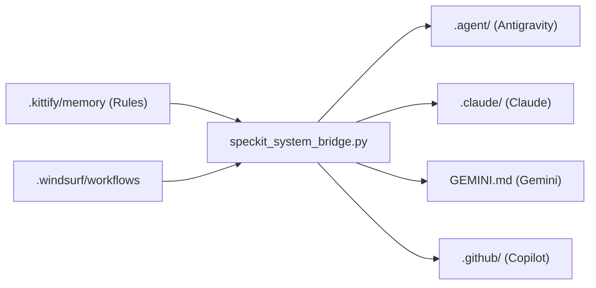

# Spec-Kitty Plugin 🐱

The flagship workflow plugin — **Spec-Driven Development lifecycle** + **Universal Bridge sync engine**.

## Prerequisites
```bash
# Install CLI
pip install spec-kitty-cli  # or: uv tool install spec-kitty-cli

# Initialize in project
spec-kitty init . --ai windsurf
```

## Installation
### Claude CLI
```bash
claude --plugin-dir ./plugins/spec-kitty
```

### Antigravity / Windsurf
1. **Initialize** (if not done): `spec-kitty init . --ai windsurf`
2. **Sync Bridge**: Run the bridge script to propagate workflows and rules to the IDE.
   ```bash
   python plugins/spec-kitty/scripts/speckit_system_bridge.py
   ```
3. **Restart IDE**: Reload the window to pick up the new slash commands.

## Commands (13)

### Bridge (Sync Engine)
| Command | Description |
|:---|:---|
| `/spec-kitty:sync` | Universal sync — propagate rules + workflows to all agents |
| `/spec-kitty:verify` | Verify bridge integrity |
| `/spec-kitty:sync-rules` | Sync rules only |
| `/spec-kitty:sync-skills` | Sync skills only |
| `/spec-kitty:sync-workflows` | Sync workflows only |

### Workflow (SDD Lifecycle)
| Command | Description |
|:---|:---|
| `/spec-kitty:specify` | Create feature specification |
| `/spec-kitty:plan` | Generate implementation plan |
| `/spec-kitty:tasks` | Generate work packages |
| `/spec-kitty:implement` | Create worktree for WP |
| `/spec-kitty:review` | Submit WP for review |
| `/spec-kitty:accept` | Validate feature readiness |
| `/spec-kitty:merge` | Automated batch merge |
| `/spec-kitty:status` | Show kanban board |

## Architecture



## Structure
```
spec-kitty/
├── .claude-plugin/plugin.json
├── commands/ (13 commands)
├── skills/spec-kitty-agent/SKILL.md
├── scripts/
│   ├── speckit_system_bridge.py    # Universal sync
│   ├── sync_rules.py              # Rule propagation
│   ├── sync_skills.py             # Skill distribution
│   ├── sync_workflows.py          # Workflow distribution
│   └── verify_bridge_integrity.py # Auditor
├── docs/
│   ├── bridge_architecture_overview.md
│   ├── bridge_mapping_matrix.md
│   ├── bridge_process.mmd
│   ├── standard-spec-kitty-workflow.md
│   ├── standard-spec-kitty-workflow.mmd
│   ├── agent-worktree-reference.md
│   └── LLM_UNPACKAGING_INSTRUCTIONS.md
├── references/
│   ├── standard-workflow-rules.md
│   └── spec_driven_development_policy.md
└── README.md
```

## License
MIT
