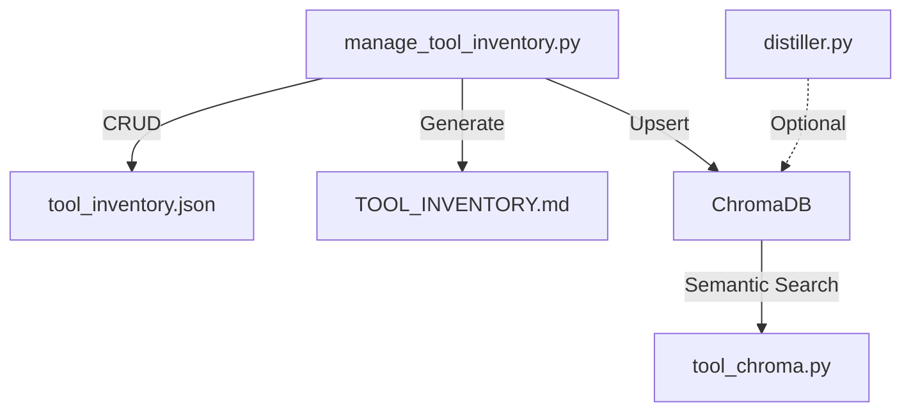

# Tool Inventory Plugin 📊

Manage tool registries with embedded ChromaDB for semantic tool discovery.
Self-contained with vendored RLM scripts — no external plugin dependencies.

## Installation

### Local Development
```bash
claude --plugin-dir ./plugins/tool-inventory
```

### Prerequisites
- **Claude Code** ≥ 1.0.33
- **Python** ≥ 3.8
- **Ollama** (Required for `distill` command):
    1.  **Install**: `brew install ollama` or download from [ollama.com](https://ollama.com/)
    2.  **Pull Model**: `ollama pull granite3.2:8b` (or your preferred model)
    3.  **Run Server**: `ollama serve` (must be running for distillation)
- **Python Dependencies**: `pip install chromadb requests python-dotenv`

### Configuration
Environment variables can be used to customize behavior:
- `OPENAI_API_KEY`: Your OpenAI API key for LLM distillation (if not using Ollama).
- `OLLAMA_HOST`: The host for your Ollama server (default: `http://localhost:11434`).
- `OLLAMA_MODEL`: The Ollama model to use for distillation (default: `granite3.2:8b`).
- `RLM_TOOL_CACHE`: Override the default tool cache path (default: `.agent/learning/rlm_tool_cache.json`).
- `RLM_SUMMARY_CACHE`: Override the default summary cache path (default: `.agent/learning/rlm_summary_cache.json`).

### Verify Installation
After loading, `/help` should show:
```
/tool-inventory:list      List all registered tools
/tool-inventory:add       Register a new tool
/tool-inventory:remove    Remove a tool
/tool-inventory:search    Search (keyword or semantic)
/tool-inventory:audit     Check coverage
/tool-inventory:discover  Find untracked scripts
/tool-inventory:generate  Render TOOL_INVENTORY.md
/tool-inventory:sync      Import/migrate cache data
```

---

## Usage Guide

### Quick Start
```bash
# 1. Seed ChromaDB from existing cache (one-time migration)
/tool-inventory:sync import-json .agent/learning/rlm_tool_cache.json

# 2. Semantic search for tools
/tool-inventory:search "cache management"

# 3. Discover untracked scripts
/tool-inventory:discover --auto-stub

# 4. Generate docs
/tool-inventory:generate
```

### Dual-Store Architecture

| Store | Location | Purpose |
|:---|:---|:---|
| **ChromaDB** | `plugins/tool-inventory/data/chroma/` | Semantic search (primary) |
<<<<<<< HEAD
| **JSON Inventory** | `plugins/tool_inventory.json` | Project-level structured registry |
=======
| **JSON Inventory** | `tools/tool_inventory.json` | Project-level structured registry |
>>>>>>> origin/main
| **JSON Cache** | `.agent/learning/rlm_tool_cache.json` | Backward compat |

ChromaDB is the primary truth store. JSON cache is kept for backward compatibility.

### Commands Reference

| Command | Script | Description |
|:---|:---|:---|
| `/tool-inventory:list` | `manage_tool_inventory.py list` | List all tools |
| `/tool-inventory:add` | `manage_tool_inventory.py add` | Register tool + ChromaDB upsert |
| `/tool-inventory:remove` | `manage_tool_inventory.py remove` | Deregister + ChromaDB delete |
| `/tool-inventory:search` | `tool_chroma.py search` | Semantic vector search |
| `/tool-inventory:audit` | `manage_tool_inventory.py audit` | Coverage report |
| `/tool-inventory:discover` | `manage_tool_inventory.py discover` | Find untracked scripts |
| `/tool-inventory:generate` | `manage_tool_inventory.py generate` | Render markdown docs |
| `/tool-inventory:sync` | `tool_chroma.py import-json` | Migrate from JSON cache |

### Vendored RLM Scripts

| Script | Purpose | Ollama? |
|:---|:---|:---|
| `distiller.py` | LLM-powered file summarization | ✅ Required |
| `query_cache.py` | Legacy JSON cache search | ❌ |
| `cleanup_cache.py` | Stale entry cleanup | ❌ |
| `inventory.py` | Coverage reporting | ❌ |
| `rlm_config.py` | Shared configuration | ❌ |

---

## Architecture

See [docs/tool-inventory-workflow.mmd](docs/tool-inventory-workflow.mmd).



### Plugin Directory Structure
```
tool-inventory/
├── .claude-plugin/
│   └── plugin.json
├── commands/
│   ├── list.md
│   ├── add.md
│   ├── remove.md
│   ├── search.md
│   ├── audit.md
│   ├── discover.md
│   ├── generate.md
│   └── sync.md
├── skills/
│   └── inventory-agent/
│       └── SKILL.md
├── scripts/
│   ├── manage_tool_inventory.py   # Core registry manager
│   ├── tool_chroma.py             # ChromaDB wrapper (NEW)
│   ├── audit_plugins.py           # Inventory auditor (filesystem check)
│   ├── distiller.py               # Vendored from RLM
│   ├── query_cache.py             # Vendored from RLM
│   ├── cleanup_cache.py           # Vendored from RLM
│   ├── inventory.py               # Vendored from RLM
│   └── rlm_config.py              # Vendored from RLM
├── data/
│   └── chroma/                    # ChromaDB persistent storage
├── docs/
│   └── tool-inventory-workflow.mmd
└── README.md
```

---

## License

MIT
