# 🧪 Project Sanctuary Test Suite

This directory contains the comprehensive test suite for Project Sanctuary. We adhere to the principle of **Designing for Successor-State** (Chronicle Entry 308): A new agent must be able to run and understand the test suite instantly.

## Test Pyramid Architecture

Our testing strategy follows a three-layer pyramid, applied consistently across all components:

```mermaid
---
config:
  look: classic
  layout: elk
---
flowchart TB
 subgraph MCP_Test_Pyramid["Model Context Protocol (MCP) Server Test Pyramid"]
        E2E["🔝 E2E Tests<br>MCP Client Call Lifecycle<br>*Requires all 12 servers running*"]
        INT["🔗 Integration Tests<br>Server-to-DB/Local-API Verification<br>*Minimal mocking*"]
        UNIT["⚡ Unit Tests<br>Internal Functions/Atomic Logic<br>*No network calls*"]
  end
    E2E --> INT
    INT --> UNIT

    style E2E fill:#ff6b6b,stroke:#333,stroke-width:2px,color:#fff
    style INT fill:#ffd93d,stroke:#333,stroke-width:2px
    style UNIT fill:#6bcb77,stroke:#333,stroke-width:2px
```



| Layer | Scope | Goal | Speed |
|-------|-------|------|-------|
| **Unit** | Functions/classes in isolation | Verify atomic logic, no I/O | Fast (ms) |
| **Integration** | Component-to-dependency | Verify interactions with DB, filesystem, APIs | Medium (sec) |
| **E2E** | Full MCP client workflows | Verify complete user scenarios | Slow (sec-min) |

## Directory Structure

```
tests/
├── README.md                 # This file
├── conftest.py               # Root pytest configuration and shared fixtures
├── test_utils.py             # Portable path utilities for tests
│
├── mcp_servers/              # Component tests for all 12 MCP servers
│   ├── README.md             # MCP server test pyramid documentation
│   ├── adr/
│   ├── agent_persona/
│   ├── chronicle/
│   ├── code/
│   ├── config/
│   ├── council/
│   ├── forge_llm/
│   ├── git/
│   ├── orchestrator/
│   ├── protocol/
│   ├── rag_cortex/
│   └── task/
│
├── integration/              # Multi-MCP workflow tests
│   ├── README.md             # Integration test documentation
│   └── test_*.py             # Cross-server integration scenarios
│
├── benchmarks/               # Performance benchmarks (optional)
├── browser_automation/       # Browser-based UI tests
├── data/                     # Test fixtures and sample data
├── manual/                   # Manual test procedures
├── reproduction/             # Bug reproduction scripts
├── verification_scripts/     # System verification utilities
└── verify_wslenv_setup.py    # WSL environment validation
```

## Quick Reference

### Run All Tests

```bash
# Run the full test suite (unit + integration)
pytest tests/ -v

# Run with coverage report
pytest tests/ --cov=mcp_servers --cov-report=html
```

### Run MCP Server Component Tests

```bash
# All MCP server tests
pytest tests/mcp_servers/ -v

# Specific server (e.g., git)
pytest tests/mcp_servers/git/ -v

# Only unit tests for a server
pytest tests/mcp_servers/chronicle/unit/ -v
```

### Run Integration Tests

```bash
# All multi-MCP integration tests
pytest tests/integration/ -v

# Specific integration scenario
pytest tests/integration/test_strategic_crucible_loop.py -v
```

### Run with Real LLM (Optional)

By default, LLM calls are mocked. To test against a real Ollama instance:

```bash
pytest tests/ --real-llm -v
```

## Test Markers

We use pytest markers to categorize tests:

| Marker | Description |
|--------|-------------|
| `@pytest.mark.unit` | Pure unit tests (no I/O) |
| `@pytest.mark.integration` | Component integration tests |
| `@pytest.mark.e2e` | End-to-end tests requiring running servers |
| `@pytest.mark.slow` | Tests that take >5 seconds |
| `@pytest.mark.requires_db` | Tests requiring ChromaDB |
| `@pytest.mark.requires_ollama` | Tests requiring Ollama LLM |

Run specific markers:

```bash
# Only fast unit tests
pytest tests/ -m "unit and not slow"

# Integration tests without DB dependency
pytest tests/ -m "integration and not requires_db"
```

## CI/CD Integration

The test suite is designed for CI/CD pipelines:

1. **PR Checks**: Run `pytest tests/mcp_servers/*/unit/` (fast, isolated)
2. **Merge to Main**: Run `pytest tests/` (full suite)
3. **Nightly**: Run with `--real-llm` and benchmarks

## Related Documentation

- [MCP Server Tests](mcp_servers/README.md) — Per-server test pyramid details
- [Integration Tests](integration/README.md) — Multi-MCP workflow test scenarios
- [Protocol 101 v3.0](../01_PROTOCOLS/101_functional_coherence_gate.md) — Commit must pass tests
- [Chronicle Entry 308](../00_CHRONICLE/ENTRIES/308_doctrine_of_successor_state.md) — Successor-State principle

## Troubleshooting

### Tests Fail with Import Errors

Ensure `PYTHONPATH` includes the project root:

```bash
export PYTHONPATH=/path/to/Project_Sanctuary
pytest tests/ -v
```

### ChromaDB Connection Errors

Start the ChromaDB container before running RAG tests:

```bash
docker start chroma-server
pytest tests/mcp_servers/rag_cortex/ -v
```

### Ollama Not Available

Use mocked tests by default (no `--real-llm` flag), or ensure Ollama is running:

```bash
ollama serve  # In a separate terminal
pytest tests/ --real-llm -v
```
