# 🧪 Project Sanctuary Test Suite

This directory contains the comprehensive test suite for Project Sanctuary. We adhere to the principle of **Designing for Successor-State** (Chronicle Entry 308): A new agent must be able to run and understand the test suite instantly.

## Test Pyramid Architecture

Our testing strategy follows a three-layer pyramid, applied consistently across all components:

```mermaid
---
config:
  look: classic
  layout: elk
---
flowchart TB
 subgraph MCP_Test_Pyramid["Model Context Protocol (MCP) Server Test Pyramid"]
        E2E["🔝 Layer 3: E2E Tests<br>Full MCP Protocol Lifecycle<br>Base: BaseE2ETest<br>Deps: All 12 MCP servers<br>Speed: Slow (min)"]
        INT["🔗 Layer 2: Integration Tests<br>Server ↔ Local Services<br>Base: BaseIntegrationTest<br>Deps: ChromaDB, Ollama, Git<br>Speed: Medium (sec)"]
        UNIT["⚡ Layer 1: Unit Tests<br>Atomic Logic in Isolation<br>Base: None (isolated)<br>Deps: None (mocked)<br>Speed: Fast (ms)"]
  end
    E2E --> INT
    INT --> UNIT

    style E2E fill:#ff6b6b,stroke:#333,stroke-width:2px,color:#fff
    style INT fill:#ffd93d,stroke:#333,stroke-width:2px
    style UNIT fill:#6bcb77,stroke:#333,stroke-width:2px
```



| Layer | Scope | Goal | Speed |
|-------|-------|------|----------|
| **Unit** | Functions/classes in isolation | Verify atomic logic, no I/O | Fast (ms) |
| **Integration** | Server ↔ Local Services | Verify interactions with ChromaDB, Ollama, Git | Medium (sec) |
| **E2E** | Full MCP protocol lifecycle | Verify complete MCP client workflows (requires all 12 servers) | Slow (min) |

## Directory Structure

```
tests/
├── README.md                 # This file
├── conftest.py               # Root pytest configuration and shared fixtures
├── test_utils.py             # Portable path utilities for tests
│
├── mcp_servers/              # Component tests for all 12 MCP servers (3-layer pyramid)
│   ├── README.md             # MCP server test pyramid documentation
│   ├── base/                 # Base classes and common patterns
│   │   ├── base_integration_test.py  # Layer 2 base class
│   │   ├── base_e2e_test.py          # Layer 3 base class
│   │   └── README.md                 # Common patterns documentation
│   ├── adr/
│   │   ├── unit/             # Layer 1: Isolated unit tests
│   │   ├── integration/      # Layer 2: Real dependency tests
│   │   └── e2e/              # Layer 3: Full MCP protocol tests
│   ├── agent_persona/
│   ├── chronicle/
│   ├── code/
│   ├── config/
│   ├── council/
│   ├── forge_llm/
│   ├── git/
│   ├── orchestrator/
│   ├── protocol/
│   ├── rag_cortex/
│   └── task/
│       └── (each with unit/, integration/, e2e/ subdirectories)
│
├── benchmarks/               # Performance benchmarks (optional)
├── browser_automation/       # Browser-based UI tests
├── data/                     # Test fixtures and sample data
├── manual/                   # Manual test procedures
├── reproduction/             # Bug reproduction scripts
├── verification_scripts/     # System verification utilities
└── verify_wslenv_setup.py    # WSL environment validation
```

**Note:** Multi-MCP integration tests (if needed in the future) should be created in `tests/integration/`. Currently, all integration tests are properly organized within their respective MCP server folders (`tests/mcp_servers/<server>/integration/`).

## Quick Reference

### Run All Tests

```bash
# Run the full test suite (unit + integration)
pytest tests/ -v

# Run with coverage report
pytest tests/ --cov=mcp_servers --cov-report=html
```

### Run MCP Server Component Tests

```bash
# All MCP server tests
pytest tests/mcp_servers/ -v

# Specific server (e.g., git)
pytest tests/mcp_servers/git/ -v

# Only unit tests for a server
pytest tests/mcp_servers/chronicle/unit/ -v

# Only integration tests for a server
pytest tests/mcp_servers/rag_cortex/integration/ -v

# Only E2E tests for a server
pytest tests/mcp_servers/git/e2e/ -v -m e2e
```

## Headless E2E (CI-friendly)

Headless E2E tests exercise full MCP client workflows programmatically using the in-repo `MCPClient.route_query()` helper. They are intended to provide end-to-end coverage in CI without requiring the IDE to start servers. Note that some headless tests may still require supporting services (ChromaDB, Ollama) depending on the scenario.

```bash
# Run headless end-to-end tests
pytest tests/mcp_servers/ -m headless -v

# Run a single headless test file
pytest tests/mcp_servers/adr/e2e/test_headless.py -k headless -v
```

Add headless tests to CI (nightly or PR gate) using the `-m headless` marker so they run separately from fast unit tests.

### Run with Real LLM (Optional)

By default, LLM calls are mocked. To test against a real Ollama instance:

```bash
pytest tests/ --real-llm -v
```

## Test Markers

We use pytest markers to categorize tests:

| Marker | Description |
|--------|-------------|
| `@pytest.mark.unit` | Pure unit tests (no I/O) |
| `@pytest.mark.integration` | Component integration tests |
| `@pytest.mark.e2e` | End-to-end tests requiring running servers |
| `@pytest.mark.slow` | Tests that take >5 seconds |
| `@pytest.mark.requires_db` | Tests requiring ChromaDB |
| `@pytest.mark.requires_ollama` | Tests requiring Ollama LLM |

Run specific markers:

```bash
# Only fast unit tests
pytest tests/ -m "unit and not slow"

# Integration tests without DB dependency
pytest tests/ -m "integration and not requires_db"
```

## CI/CD Integration

The test suite is designed for CI/CD pipelines:

1. **PR Checks**: Run `pytest tests/mcp_servers/*/unit/` (fast, isolated)
2. **Merge to Main**: Run `pytest tests/` (full suite)
3. **Nightly**: Run with `--real-llm` and benchmarks

## Test Reorganization Notice

Some single-server integration tests previously under `tests/integration/` were moved into their respective server folders to clarify scope and make the top-level `tests/integration/` directory exclusively contain multi-server workflows. If you see a test in `tests/integration/` that now acts as a redirect, it will be a small skip stub pointing to the new location.

Moved files (examples):

- `tests/integration/test_strategic_crucible_loop.py` -> `tests/mcp_servers/orchestrator/integration/test_strategic_crucible_loop.py`
- `tests/integration/test_056_loop_hardening.py` -> `tests/mcp_servers/orchestrator/integration/test_056_loop_hardening.py`
- `tests/integration/test_end_to_end_rag_pipeline.py` -> `tests/mcp_servers/rag_cortex/integration/test_end_to_end_pipeline.py`
- `tests/integration/test_rag_simple.py` -> `tests/mcp_servers/rag_cortex/integration/test_simple_query.py`
- `tests/integration/test_git_workflow_end_to_end.py` -> `tests/mcp_servers/git/integration/test_git_workflow_end_to_end.py`

If you'd like, I can continue scanning and moving any other single-server tests into their server folders.


## Related Documentation

- [MCP Server Tests](mcp_servers/README.md) — Per-server test pyramid details
- [Integration Tests](integration/README.md) — Multi-MCP workflow test scenarios
- [Protocol 101 v3.0](../01_PROTOCOLS/101_functional_coherence_gate.md) — Commit must pass tests
- [Chronicle Entry 308](../00_CHRONICLE/ENTRIES/308_doctrine_of_successor_state.md) — Successor-State principle

## Troubleshooting

### Tests Fail with Import Errors

Ensure `PYTHONPATH` includes the project root:

```bash
export PYTHONPATH=/path/to/Project_Sanctuary
pytest tests/ -v
```

### ChromaDB Connection Errors

Start the ChromaDB container before running RAG tests:

```bash
docker start chroma-server
pytest tests/mcp_servers/rag_cortex/ -v
```

### Ollama Not Available

Use mocked tests by default (no `--real-llm` flag), or ensure Ollama is running:

```bash
ollama serve  # In a separate terminal
pytest tests/ --real-llm -v
```
