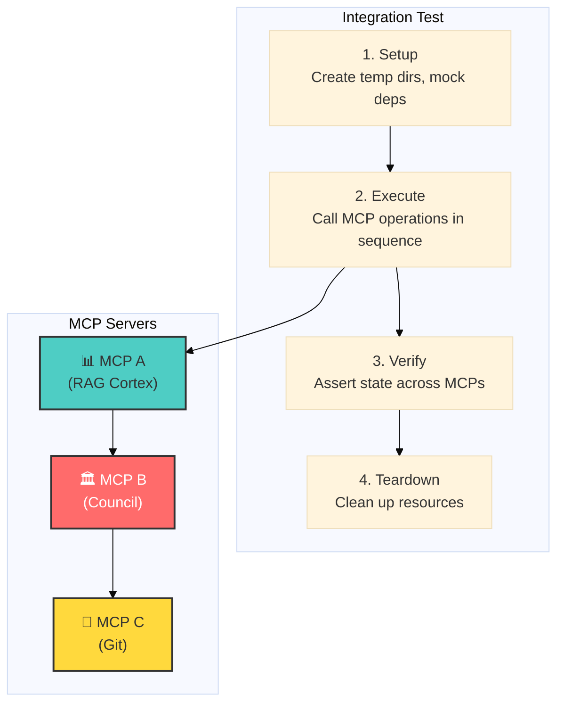

# 🔗 Integration Tests — Multi-MCP Workflow Validation

This directory contains **integration tests** that validate multi-step, multi-MCP workflows. These tests sit at the apex of our test pyramid, exercising the coordination between multiple MCP servers.

## Purpose

While component tests (`tests/mcp_servers/<server>/`) verify individual MCP servers in isolation, integration tests validate:

- **Cross-server communication** — MCP servers calling each other
- **Workflow orchestration** — Multi-step sequences (e.g., query → dispatch → commit)
- **Protocol compliance** — Adherence to defined protocols (e.g., Strategic Crucible Loop)
- **State propagation** — Data flowing correctly between services

## Test Inventory

| Test File | Description | MCP Servers Involved |
|-----------|-------------|---------------------|
| `test_strategic_crucible_loop.py` | Protocol 056: Full Strategic Crucible Loop | RAG Cortex, Orchestrator, Chronicle |
| `test_056_loop_hardening.py` | Edge cases and error handling for P056 | RAG Cortex, Orchestrator |
| `test_chain_agent_forge.py` | Agent dispatch to Forge LLM | Agent Persona, Forge LLM |
| `test_chain_council_agent.py` | Council deliberation with agents | Council, Agent Persona |
| `test_chain_forge_ollama.py` | Forge LLM to Ollama model | Forge LLM |
| `test_council_with_git.py` | Council decisions affecting Git | Council, Git |
| `test_cortex_operations.py` | RAG Cortex core operations | RAG Cortex |
| `test_end_to_end_rag_pipeline.py` | Full RAG pipeline: ingest → query | RAG Cortex |
| `test_git_workflow_end_to_end.py` | Complete Git workflow cycle | Git |
| `test_rag_simple.py` | Simple RAG query validation | RAG Cortex |

## Running Integration Tests

### All Integration Tests

```bash
pytest tests/integration/ -v
```

### Specific Workflow

```bash
# Strategic Crucible Loop
pytest tests/integration/test_strategic_crucible_loop.py -v

# Git workflow end-to-end
pytest tests/integration/test_git_workflow_end_to_end.py -v
```

### With Real LLM

By default, LLM calls are mocked. To test with real Ollama:

```bash
pytest tests/integration/ --real-llm -v
```

## Suite Runner

For running a curated subset of integration tests with enhanced logging:

```bash
python tests/integration/suite_runner.py
```

## Architecture

Integration tests follow this pattern:



## Dependencies

Integration tests may require:

| Dependency | Required For | How to Start |
|------------|--------------|--------------|
| ChromaDB | RAG Cortex tests | `docker start chroma-server` |
| Ollama | `--real-llm` tests | `ollama serve` |
| Git repo | Git workflow tests | Automatic (uses tmp_path) |

## Relationship to MCP Server Tests

```
tests/
├── mcp_servers/           ← Component tests (per-server isolation)
│   ├── git/unit/          ← Git server unit tests
│   └── git/integration/   ← Git server + filesystem
│
└── integration/           ← THIS DIRECTORY (multi-MCP workflows)
    └── test_council_with_git.py  ← Council + Git together
```

The key distinction:
- `tests/mcp_servers/<server>/integration/` — Server talks to its **local dependencies** (DB, filesystem)
- `tests/integration/` — Multiple **MCP servers** coordinate in a workflow

## Adding New Integration Tests

1. Create a new file: `test_<workflow_name>.py`
2. Document which MCP servers are involved in the docstring
3. Use fixtures from `tests/conftest.py` for LLM mocking
4. Clean up all temp resources in teardown
5. Add entry to the test inventory table above

## Related Documentation

- [Tests README](../README.md) — Master test strategy
- [MCP Server Tests](../mcp_servers/README.md) — Component test pyramid
- [Protocol 056](../../01_PROTOCOLS/056_strategic_crucible_loop.md) — Strategic Crucible Loop
