# Gateway MCP Test Pyramid: Zero-Trust Verification

This directory documents the mandatory, 4-tier verification process for the **Sanctuary Gateway**. To combat deceit and unverified assumptions, no tool is marked as "Gateway Ready" until it has ascended all four tiers.

## 🏛️ The 4-Tier Zero-Trust Pyramid

### Tier 1: Unit (Internal Logic)
- **Repo Location:** `tests/mcp_servers/<server_name>/unit/`
- **Focus:** Validates the core Python logic of the MCP function (e.g., `adr_create`).
- **Isolation:** Runs against local file stubs or mocks.
- **Verification:** `pytest tests/mcp_servers/<server_name>/unit/ -v`

### Tier 2: Integration (SSE Server Readiness)
- **Repo Location:** `tests/mcp_servers/<server_name>/integration/`
- **Focus:** Validates the standalone SSE server is responding correctly at its dedicated port.
- **Isolation:** Bypasses the Gateway. Direct HTTP/SSE probe.
- **Verification:** `pytest tests/mcp_servers/<server_name>/integration/ -v`

### Tier 3: Gateway RPC (The Bridge)
- **Repo Location:** `mcp_servers/gateway/gateway_client.py` (Helper)
- **Focus:** Validates the Gateway `/rpc` endpoint accurately routes traffic to the SSE server.
- **Isolation:** Tests the "SSE-to-RPC" translation layer. This is where most "Bridge" failures occur.
- **Verification:** `python3 -m mcp_servers.gateway.gateway_client --step verify --cluster <cluster>`

### Tier 4: IDE (Absolute Reality)
- **Repo Location:** `~/.gemini/antigravity/mcp_config.json` (Local)
- **Focus:** Validates the tool is visible to the agent (Gemini/Claude) and callable with real user parameters.
- **Isolation:** The final peak of the pyramid. Requires Config update + IDE Restart.
- **Verification:** Successful execution of the tool via the Antigravity/Claude UI.

---

## 🛠️ The Role of `gateway_client.py`

The `execute_mcp_tool` function in `mcp_servers/gateway/gateway_client.py` is a **utility**, not a replacement for a test suite. 

- **Library Usage**: Used by orchestrators (like Protocol 125 loop) to programmatically command the fleet.
- **Verification Usage**: Provides a fast, terminal-based way to probe the Gateway bridge (Tier 3) without restarting an IDE.
- **Strict Policy**: Passing Tier 3 via `gateway_client.py` is NOT a "success" for the tool—it is only a pass for the **Bridge**. Success is only claimed at **Tier 4**.

---

## 🔀 Test Execution Flow Diagram

> **Key Insight:** Both Integration and E2E tests run **locally** (on your machine) but execute code **inside containers** via HTTP requests.

```mermaid
---
config:
  theme: base
  layout: elk
---
flowchart LR
    subgraph Local["🖥️ Local Host"]
        direction TB
        subgraph TestSuites["📊 Testing Hierarchy"]
            Unit{{"Tier 1: Unit Tests"}}
            Int{{"Tier 2: Integration Tests"}}
            E2E{{"Tier 3: E2E Tests"}}
        end
        Client["LLM Chat / Developer IDE"]
        Bridge["MCP Gateway Bridge<br/>mcp_servers/gateway/bridge.py"]
        
        subgraph LocalDev["🔧 Local Dev Mode"]
            LocalServer["python -m server<br/>(MCP_TRANSPORT=stdio)"]
            StdioWrap["FastMCP Wrapper<br/>fastmcp library"]
        end
    end

    subgraph Containers["🐳 Podman Network"]
        direction LR
        Gateway["sanctuary_gateway<br/>IBM MCP Cortex Gateway Clone<br/>localhost:4444"]
        
        subgraph Cluster["📦 MCP Cluster Container<br/>(MCP_TRANSPORT=sse)"]
            direction TB
            SSEWrap["SSEServer Wrapper<br/>lib/sse_adaptor.py"]
            Logic["🧠 operations.py<br/>(Shared Logic Layer)"]
        end
    end
    Unit -. "Import & Mock" .-> Logic
    Int -. "Local Stdio<br/>⏳ Not Implemented" .-> LocalServer
    Int -- "HTTP/SSE :8100-8105<br/>✅ Health ✅ Tools" --> SSEWrap
    E2E -- "Simulates Stdio" --> Bridge
    Client -- "Stdio" --> Bridge
    Bridge -- "HTTPS (Auth + SSL)" --> Gateway
    Gateway -- "SSE Handshake" --> SSEWrap
    LocalServer --> StdioWrap
    StdioWrap --> Logic
    SSEWrap --> Logic
    style Bridge fill:#f9f,stroke:#333
    style Gateway fill:#69f,stroke:#333
    style LocalDev fill:#e3f2fd,stroke:#1565c0,stroke-width:2px
    style TestSuites fill:#fff3e0,stroke:#e65100,stroke-width:2px
    style Unit fill:#e1f5fe,stroke:#01579b
    style Int fill:#fff9c4,stroke:#fbc02d
    style E2E fill:#ffebee,stroke:#c62828
    style Cluster fill:#eceff1,stroke:#455a64,stroke-width:2px
```



### 📊 Deep Dive into the Three Levels

| Level | Path Taken | Goal | Status |
|-------|------------|------|--------|
| **Tier 1: Unit** | Internal Process | Verifies pure business logic in `operations.py` | ✅ 100% Success |
| **Tier 2: Integration** | Direct to Cluster | Validates `server.py` entry points and ADR 076 metadata | ✅ Cluster ready |
| **Tier 3: E2E** | Full Nervous System | Proves Gateway can discover and route to entire fleet | ✅ 85/85 passing |

### 🚀 Key Takeaway for Optimization

- **Direct vs. Federated**: Unit and Integration tests are lightning-fast because they bypass Gateway's SSL and SSE handshake overhead
- **Gateway Latency**: The 28s+ hangs seen in E2E are strictly Tier 3 issues
- **Diagnosis Rule**: 
  - If Integration test fails → **Code bug** in cluster
  - If only E2E test fails → **Network/infrastructure** timeout

---

## Architecture & Integration Context

### The Hybrid Fleet (ADR 060)
The system uses a "Controller-Worker" architecture where the IBM Gateway (Controller) routes traffic to 7 distinct Project Sanctuary microservices (Workers) over a shared Podman network (`sanctuary-net`).

**Topology Constraints:**
*   **Network:** All services must be on `sanctuary-net`.
*   **Discovery:** Gateway uses **Container Names** for DNS resolution.
*   **Ports:** Internal ports generally map to `8000-8004` (see `podman-compose.yaml`).

| Service | Container Name | Port | Role |
| :--- | :--- | :--- | :--- |
| **Utils** | `sanctuary_utils` | `8000` | Basic tools (Time, Calc) |
| **Network** | `sanctuary_network` | `8002` | Web fetch/search |
| **Filesystem** | `sanctuary_filesystem` | `8001` | File operations |
| **Git** | `sanctuary_git` | `8003` | Git operations |
| **Cortex** | `sanctuary_cortex` | `8004` | RAG/Memory Coordinator |
| *VectorDB* | `sanctuary_vector_db` | `8000`* | ChromaDB Backend |
| *Ollama* | `sanctuary_ollama` | `11434`* | AI Backend |

*\*Internal backend ports. Do not expose 8000/11434 on host to avoid conflicts.*

### Critical Constraint: The "Hanging Request" Bug
The IBM Gateway's SSE client has a strict requirement that prevents synchronous JSON-RPC responses in the HTTP POST body.
*   **Problem:** Returning a JSON-RPC response directly in `POST /messages` causes the Gateway to hang.
*   **Solution:** All Sanctuary servers must use the **Deferred Response Pattern**:
    1.  `POST /messages` returns `202 Accepted` immediately (empty body).
    2.  The actual JSON-RPC response is pushed asynchronously via the `GET /sse` connection.
    *   *Implementation:* This is handled centrally by `mcp_servers/lib/sse_adaptor.py`.

---

## Manual Verification (Project Sanctuary Integration)

In addition to the pytest suite, a standalone Python script is provided to verify connectivity and token configuration for Project Sanctuary's integration.

### `verify_gateway_connection.py`

This script performs a "Hello World" RPC call to the Gateway to ensure:
1.  The Gateway is reachable (default: `https://localhost:4444`).
2.  The Authentication Token is valid.
3.  The `hello-world` tool is registered and responsive.

#### Prerequisites

Ensure your project root `.env` file contains the following:

```bash
# Required
MCP_GATEWAY_URL="https://localhost:4444"

# Authentication Token
MCPGATEWAY_BEARER_TOKEN="your-token-here"
```

#### Usage

Run the script from the **Project Root** directory to ensure correct path resolution:

```bash
python3 tests/mcp_servers/gateway/verify_gateway_connection.py
```

#### Expected Output

```
INFO:gateway-verifier:Target Gateway: https://localhost:4444
INFO:gateway-verifier:Token: **********XXXXX
INFO:gateway-verifier:Sending request...
INFO:gateway-verifier:Response Status: 200
INFO:gateway-verifier:✅ SUCCESS!
INFO:gateway-verifier:Response Body: {"jsonrpc":"2.0","result": ... "Hello, SanctuaryAgent!" ...}
```
