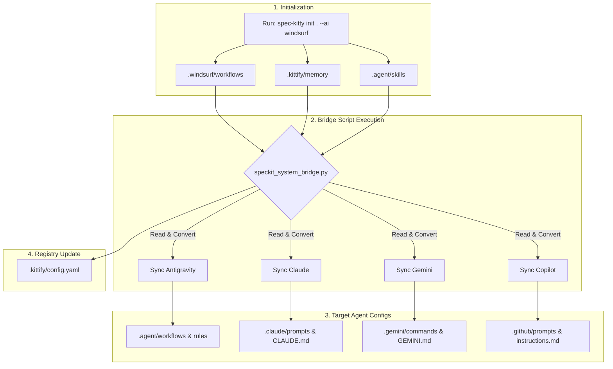

# Spec Kitty Bridge Toolkit
**Generated:** 2026-02-14T16:38:07.918305

Complete package for the Universal Bridge capability, including scripts, documentation, skills, and workflows.

---

## 📑 Table of Contents
1. [tools/bridge/LLM_UNPACKAGING_INSTRUCTIONS.md](#entry-1)
2. [tools/bridge/README.md](#entry-2)
3. [tools/bridge/speckit_system_bridge.py](#entry-3)
4. [tools/bridge/verify_bridge_integrity.py](#entry-4)
5. [tools/bridge/sync_rules.py](#entry-5)
6. [tools/bridge/sync_skills.py](#entry-6)
7. [tools/bridge/sync_workflows.py](#entry-7)
8. [tools/bridge/bridge_architecture_overview.md](#entry-8)
9. [tools/bridge/bridge_mapping_matrix.md](#entry-9)
10. [tools/bridge/bridge_process.mmd](#entry-10)
11. [tools/bridge/standard-spec-kitty-workflow.mmd](#entry-11)
12. [tools/bridge/standard-spec-kitty-workflow.md](#entry-12)
13. [tools/bridge/tool_inventory.json](#entry-13)
14. [.agent/skills/spec-kitty-bridge/SKILL.md](#entry-14)
15. [.agent/skills/spec-kitty-bridge/references/bridge_architecture_overview.md](#entry-15)
16. [.agent/skills/spec-kitty-bridge/references/bridge_mapping_matrix.md](#entry-16)
17. [.agent/skills/spec-kitty-bridge/references/bridge_process.mmd](#entry-17)
18. [.agent/skills/spec-kitty-bridge/references/standard-spec-kitty-workflow.mmd](#entry-18)
19. [.agent/workflows/utilities/spec-kitty-bridge.md](#entry-19)

---

<a id='entry-1'></a>

---

## File: tools/bridge/LLM_UNPACKAGING_INSTRUCTIONS.md
**Path:** `tools/bridge/LLM_UNPACKAGING_INSTRUCTIONS.md`
**Note:** Instructions for AI to unpackage and install the toolkit.

```markdown
# Spec Kitty Bridge: Unpackaging Instructions

## Purpose
This bundle contains the complete toolset for the "Universal Bridge" capability in the Spec Kitty framework. It includes Python scripts, documentation, skill definitions, and agent workflows.

## Contents
The bundle includes files for the following directories:
1.  `tools/bridge/` - The core Python scripts and documentation.
2.  `.agent/skills/spec-kitty-bridge/` - The skill definition for AI agents.
3.  `.agent/workflows/utilities/` - The user-facing workflow trigger.

## Instructions for AI Agent

To unpackage and install this capability:

1.  **Extract Files**: Read the file paths from the bundle header and write the content to the corresponding absolute paths in the workspace. Ensure parent directories are created if they don't exist.

2.  **Make Executable**: Ensure the Python scripts in `tools/bridge/` are executable:
    ```bash
    chmod +x tools/bridge/*.py
    ```

3.  **Verify Installation**:
    Run the integrity check to confirm the bridge is operational:
    ```bash
    python3 tools/bridge/verify_bridge_integrity.py
    ```

4.  **Register Tools**:
    Access `tools/bridge/tool_inventory.json` (included in this bundle) to see the list of tools available for registration in your agent's configuration.

5.  **Restart IDE**:
    If this is a fresh install, restart the IDE to load the new slash commands (e.g., `/spec-kitty.bridge`).

```
<a id='entry-2'></a>

---

## File: tools/bridge/README.md
**Path:** `tools/bridge/README.md`
**Note:** Main documentation and setup guide.

```markdown
# Spec Kitty Bridge Tools

This directory contains the "Universal Bridge" tools for synchronizing Spec Kitty definitions across multiple AI agents (Antigravity, Claude, Gemini, Copilot).

## Prerequisites & Setup Sequence

### 0. Install Spec Kitty CLI
First, install the CLI tool using pip or uv:

```bash
# Option A: pip
pip install spec-kitty-cli

# Option B: uv (Recommended)
uv tool install spec-kitty-cli
```

### 1. Initialize Framework
Initialize the Spec Kitty structure with the Windsurf AI profile:

```bash
spec-kitty init . --ai windsurf
```

### 2. Run Bridge Synchronization
Execute the bridge scripts in the following order to ensure a complete sync:

1.  **Universal Bridge**: Projects core configs.
    ```bash
    python3 tools/bridge/speckit_system_bridge.py
    ```
2.  **Sync Rules**: Propagates rule updates.
    ```bash
    python3 tools/bridge/sync_rules.py
    ```
3.  **Sync Skills**: Distributes agent skills.
    ```bash
    python3 tools/bridge/sync_skills.py
    ```
4.  **Sync Workflows**: Updates agent workflows.
    ```bash
    python3 tools/bridge/sync_workflows.py
    ```

## Scripts

### 1. [`speckit_system_bridge.py`](speckit_system_bridge.py)
**The Universal Sync Engine.**
-   **Purpose**: Reads workflows (`.windsurf`) and rules (`.kittify`) and projects them into the native configuration formats for all supported agents.
-   **Usage**: `python3 tools/bridge/speckit_system_bridge.py`
-   **Operation**: Idempotent. Cleans target directories before regenerating artifacts.

### 2. [`verify_bridge_integrity.py`](verify_bridge_integrity.py)
**The Auditor.**
-   **Purpose**: Verifies that the generated agent configurations match the Source of Truth.
-   **Usage**: `python3 tools/bridge/verify_bridge_integrity.py`
-   **Checks**: Existence of files, content integrity (e.g., correct `--actor` flags, valid arguments).

### 3. [`sync_rules.py`](sync_rules.py) & [`sync_skills.py`](sync_skills.py)
**Supplemental Syncs.**
-   **Purpose**: Sync rules from `.agent/rules/` and skills from `.agent/skills/` to all agent configs.
-   **Usage**: `python3 tools/bridge/sync_rules.py --all` and `python3 tools/bridge/sync_skills.py --all`

> [!WARNING]
> **Restart Required**: After running any sync scripts, you must **restart the IDE** for slash commands to appear in your AI agent.

## Agent Integration

The bridge now includes native capabilities for AI agents to manage themselves.

### 1. Bridge Skill
**Location**: `.agent/skills/spec-kitty-bridge/`
**Capabilities**:
-   Universal Sync (`speckit_system_bridge.py`)
-   Integrity Verification (`verify_bridge_integrity.py`)
-   Targeted Resource Sync (Rules, Skills, Workflows)

### 2. User Workflow
**Trigger**: `/spec-kitty.bridge`
**Usage**:
-   `/spec-kitty.bridge` -> Runs Universal Sync (Default)
-   `/spec-kitty.bridge verify` -> Runs Integrity Check

## Post-Setup

After running the bridge script for the first time:

1.  **Create Constitution**: Run the `/spec-kitty.constitution` workflow to establish your project's technical standards and rules.
    *   *Note*: This saves to `.kittify/memory/constitution.md`.
2.  **Re-Sync**: Run `python3 tools/bridge/speckit_system_bridge.py` again.
    *   This copies the new `constitution.md` to `.agent/rules/`, `.claude/CLAUDE.md`, `GEMINI.md`, and `.github/copilot-instructions.md`.

## Documentation

For detailed information on how the bridge works, see:

-   **[Architecture Overview](bridge_architecture_overview.md)**: Conceptual model of the single-pass "Universal Sync" logic.
-   **[Mapping Matrix](bridge_mapping_matrix.md)**: Detailed table of file transformations from Source to Target.
-   **[Process Diagram](bridge_process.mmd)**: Visual flowchart of the bridge execution.

```
<a id='entry-3'></a>

---

## File: tools/bridge/speckit_system_bridge.py
**Path:** `tools/bridge/speckit_system_bridge.py`
**Note:** Core synchronization script.

```python
#!/usr/bin/env python3
"""
speckit_system_bridge.py
=====================================
Purpose:
    The "Universal Bridge" Synchronization Engine.
    Reads Spec Kitty definitions (Windsurf + Memory) and projects them into native
    configurations for:
    1.  Antigravity (.agent/)
    2.  Claude (.claude/)
    3.  Gemini (.gemini/)
    4.  GitHub Copilot (.github/)

    Philosophy:
    "Bring Your Own Agent" (BYOA). Maintain a Single Source of Truth in Spec Kitty,
    and auto-generate the necessary config files for any supported agent.

Usage:
    python tools/bridge/speckit_system_bridge.py
"""
import os
import shutil
from pathlib import Path
import re
import sys
import toml
import yaml

# Force UTF-8 for Windows Consoles
try:
    sys.stdout.reconfigure(encoding='utf-8')
except AttributeError:
    pass

# Configuration
PROJECT_ROOT = Path(__file__).resolve().parent.parent.parent
WINDSURF_DIR = PROJECT_ROOT / ".windsurf"
KITTIFY_DIR = PROJECT_ROOT / ".kittify"

# Targets
AGENT_DIR = PROJECT_ROOT / ".agent"
CLAUDE_DIR = PROJECT_ROOT / ".claude"
GEMINI_DIR = PROJECT_ROOT / ".gemini"
GITHUB_DIR = PROJECT_ROOT / ".github"


def setup_directories():
    """Ensure all target directory structures exist and are clean (Idempotency)."""
    print(f"🔧 Initializing & Cleaning Target Directories...")
    
    # 1. Antigravity
    (AGENT_DIR / "rules").mkdir(parents=True, exist_ok=True)
    (AGENT_DIR / "workflows").mkdir(parents=True, exist_ok=True)
    
    # 2. Claude
    (CLAUDE_DIR / "commands").mkdir(parents=True, exist_ok=True)
    
    # 3. Gemini
    (GEMINI_DIR / "commands").mkdir(parents=True, exist_ok=True)
    
    # 4. Copilot
    (GITHUB_DIR / "prompts").mkdir(parents=True, exist_ok=True)


def ingest_rules():
    """Read rules from .kittify/memory (Source of Truth via Symlink)."""
    rules = {}
    memory_dir = KITTIFY_DIR / "memory"
    agent_rules_dir = AGENT_DIR / "rules"
    
    # Ensure memory dir exists
    memory_dir.mkdir(parents=True, exist_ok=True)

    # SPECIAL HANDLING: constitution.md
    # Source: .agent/rules/constitution.md
    # Target: .kittify/memory/constitution.md (Symlink/Copy)
    constitution_src = agent_rules_dir / "constitution.md"
    constitution_tgt = memory_dir / "constitution.md"

    if constitution_src.exists():
        try:
            # tailored logic: link if possible, copy if not (Windows fallback)
            if constitution_tgt.exists():
                if constitution_tgt.is_symlink() or constitution_tgt.stat().st_mtime != constitution_src.stat().st_mtime:
                    constitution_tgt.unlink()
            
            try:
                os.symlink(constitution_src, constitution_tgt)
                print(f"🔗 Linked constitution.md: .agent -> .kittify")
            except OSError:
                # Windows restrictions often block symlinks
                shutil.copy2(constitution_src, constitution_tgt)
                print(f"📄 Copied constitution.md: .agent -> .kittify (Symlink fallback)")
        except Exception as e:
            print(f"⚠️  Failed to link/copy constitution.md: {e}")

    if not memory_dir.exists():
        print("⚠️  No .kittify/memory directory found. Rules will be empty.")
        return rules
        
    for rule_file in sorted(memory_dir.rglob("*.md")):
        try:
            content = rule_file.read_text(encoding="utf-8")
            rules[rule_file.stem] = content
        except Exception as e:
            print(f"⚠️  Failed to read rule {rule_file.name}: {e}")
            
    return rules

def ingest_workflows():
    """Read workflows from .windsurf/workflows (Source of Truth)."""
    workflows = {}
    source_dir = WINDSURF_DIR / "workflows"
    
    if not source_dir.exists():
        print("⚠️  No .windsurf/workflows directory found. Workflows will be empty.")
        return workflows
        
    for wf_file in sorted(source_dir.rglob("*.md")):
        try:
            content = wf_file.read_text(encoding="utf-8")
            workflows[wf_file.name] = content # Key is full filename (spec-kitty.accept.md)
        except Exception as e:
            print(f"⚠️  Failed to read workflow {wf_file.name}: {e}")
            
    return workflows

def sync_antigravity(workflows, rules):
    """Sync to .agent/ (Antigravity)."""
    print("\n🔵 Syncing Antigravity (.agent)...")
    
    # Rules (e.g., constitution.md)
    # SPECIAL HANDLING: Do NOT overwrite constitution.md in .agent/rules/
    # because it is now key Source of Truth.
    for name, content in rules.items():
        if name == "constitution":
            continue # SKIP overwriting the source
        (AGENT_DIR / "rules" / f"{name}.md").write_text(content, encoding="utf-8")
        
    for filename, content in workflows.items():
        fixed_content = content.replace('--actor "windsurf"', '--actor "antigravity"')
        fixed_content = fixed_content.replace('(Missing script command for sh)', 'spec-kitty')
        (AGENT_DIR / "workflows" / filename).write_text(fixed_content, encoding="utf-8")
        
    print(f"   ✅ Synced {len(rules)-1 if 'constitution' in rules else len(rules)} rules (skipped constitution) and {len(workflows)} workflows.")

def sync_claude(workflows, rules):
    """Sync to .claude/."""
    print("\n🟠 Syncing Claude (.claude)...")
    
    # 1. Context (CLAUDE.md)
    claude_md = CLAUDE_DIR / "CLAUDE.md"
    content = ["# Claude Assistant Instructions\n"]
    content.append("Managed by Spec Kitty Bridge.\n\n")
    
    for name, rule_text in rules.items():
        content.append(f"## {name}\n\n{rule_text}\n\n---\n\n")
        
    claude_md.write_text("".join(content), encoding="utf-8")
    
    # 2. Commands/Prompts (.claude/commands/*.md)
    count = 0
    for filename, text in workflows.items():
        fixed_text = text.replace('--actor "windsurf"', '--actor "claude"')
        fixed_text = fixed_text.replace('(Missing script command for sh)', 'spec-kitty')
        (CLAUDE_DIR / "commands" / filename).write_text(fixed_text, encoding="utf-8")
        count += 1
        
    print(f"   ✅ Generated CLAUDE.md and {count} commands.")

def sync_gemini(workflows, rules):
    """Sync to .gemini/."""
    print("\n✨ Syncing Gemini (.gemini)...")
    
    # 1. Context (GEMINI.md)
    gemini_md = GEMINI_DIR / "GEMINI.md"
    root_gemini_md = PROJECT_ROOT / "GEMINI.md"
    
    content = ["# Gemini CLI Instructions\n"]
    content.append("Managed by Spec Kitty Bridge.\n\n")
    
    for name, rule_text in rules.items():
        content.append(f"## {name}\n\n{rule_text}\n\n---\n\n")
        
    root_gemini_md.write_text("".join(content), encoding="utf-8")
    
    # 2. Commands (.gemini/commands/*.toml)
    count = 0
    for filename, text in workflows.items():
        stem = filename.replace(".md", "") 
        
        description = f"Executes {stem}"
        if text.startswith("---"):
            end = text.find("---", 3)
            if end != -1:
                fm = text[3:end]
                for line in fm.split("\n"):
                    if line.startswith("description:"):
                        description = line.split(":", 1)[1].strip().strip('"')
                        break
                        
        description = description.replace('"', '\\"')
        fixed_text = text.replace('--actor "windsurf"', '--actor "gemini"')
        fixed_text = fixed_text.replace('$ARGUMENTS', '{{args}}')
        fixed_text = fixed_text.replace('(Missing script command for sh)', 'spec-kitty')
        
        toml_content = f'description = "{description}"\n\nprompt = """\n{fixed_text}\n"""\n'
        
        (GEMINI_DIR / "commands" / f"{stem}.toml").write_text(toml_content, encoding="utf-8")
        count += 1
        
    print(f"   ✅ Generated GEMINI.md and {count} commands.")

def sync_copilot(workflows, rules):
    """Sync to .github/ (Copilot)."""
    print("\n🤖 Syncing Copilot (.github)...")

    # 1. Instructions (copilot-instructions.md)
    instr_file = GITHUB_DIR / "copilot-instructions.md"

    content = ["# Copilot Instructions\n"]
    content.append("> Managed by Spec Kitty Bridge.\n\n")

    for name, rule_text in rules.items():
        content.append(f"## Rule: {name}\n\n{rule_text}\n\n---\n\n")

    # Index Workflows
    content.append("\n# Available Workflows\n")
    for filename in workflows.keys():
        stem = filename.replace(".md", "")
        content.append(f"- /prompts/{stem}.prompt.md\n")

    instr_file.write_text("".join(content), encoding="utf-8")

    # 2. Prompts (.github/prompts/*.prompt.md)
    count = 0
    for filename, text in workflows.items():
        stem = filename.replace(".md", "")
        fixed_text = text.replace('--actor "windsurf"', '--actor "copilot"')
        fixed_text = fixed_text.replace('(Missing script command for sh)', 'spec-kitty')

        target_file = GITHUB_DIR / "prompts" / f"{stem}.prompt.md"
        target_file.write_text(fixed_text, encoding="utf-8")
        count += 1

    print(f"   ✅ Generated copilot-instructions.md and {count} prompts.")

def update_kittify_config():
    """Update .kittify/config.yaml to register all synced agents."""
    print("\n⚙️  Updating .kittify/config.yaml...")

    config_file = KITTIFY_DIR / "config.yaml"

    # Define all agents that the bridge supports
    all_agents = ["windsurf", "claude", "antigravity", "gemini", "copilot"]

    try:
        # Read existing config
        if config_file.exists():
            with open(config_file, 'r', encoding='utf-8') as f:
                config = yaml.safe_load(f) or {}
        else:
            config = {}

        # Ensure agents section exists
        if 'agents' not in config:
            config['agents'] = {}

        # Update available agents list (preserve order, add new ones)
        current_agents = config['agents'].get('available', [])
        updated_agents = []

        # Keep existing agents in their order
        for agent in current_agents:
            if agent in all_agents:
                updated_agents.append(agent)

        # Add any missing agents
        for agent in all_agents:
            if agent not in updated_agents:
                updated_agents.append(agent)

        config['agents']['available'] = updated_agents

        # Ensure selection section exists with defaults if not present
        if 'selection' not in config['agents']:
            config['agents']['selection'] = {
                'strategy': 'preferred',
                'preferred_implementer': 'claude',
                'preferred_reviewer': 'claude'
            }

        # Write back to file
        with open(config_file, 'w', encoding='utf-8') as f:
            yaml.dump(config, f, default_flow_style=False, sort_keys=False, allow_unicode=True)

        print(f"   ✅ Registered {len(updated_agents)} agents: {', '.join(updated_agents)}")

    except Exception as e:
        print(f"   ⚠️  Failed to update config.yaml: {e}")
        print(f"   💡 You may need to manually add agents to .kittify/config.yaml")

def main():
    print("🚀 Starting Spec Kitty Bridge Sync...")

    setup_directories()

    # 1. Ingest Source (Spec Kitty)
    rules = ingest_rules()
    workflows = ingest_workflows()

    if not workflows and not rules:
        print("❌ No source data found in .windsurf or .kittify. Run 'spec-kitty init' first.")
        return

    # 2. Project to All Agents
    sync_antigravity(workflows, rules)
    sync_claude(workflows, rules)
    sync_gemini(workflows, rules)
    sync_copilot(workflows, rules)

    # 3. Update Kittify Config to Register All Agents
    update_kittify_config()

    print("\n🎉 Bridge Sync Complete. All agents are configured.")

if __name__ == "__main__":
    main()

```
<a id='entry-4'></a>

---

## File: tools/bridge/verify_bridge_integrity.py
**Path:** `tools/bridge/verify_bridge_integrity.py`
**Note:** Integrity verification script.

```python
#!/usr/bin/env python3
"""
verify_bridge_integrity.py
=====================================
Purpose:
    Audits the "Universal Bridge" Synchronization.
    Verifies that artifacts from the Source of Truth (.windsurf, .kittify) are
    correctly projected into:
    1. .agent/ (Antigravity)
    2. .claude/ (Claude)
    3. .gemini/ (Gemini)
    4. .github/ (Copilot)

Usage:
    python tools/bridge/verify_bridge_integrity.py
"""
import sys
import os
from pathlib import Path

# Configuration
PROJECT_ROOT = Path(__file__).resolve().parent.parent.parent
WINDSURF_DIR = PROJECT_ROOT / ".windsurf"
KITTIFY_DIR = PROJECT_ROOT / ".kittify"

# Targets
AGENT_DIR = PROJECT_ROOT / ".agent"
CLAUDE_DIR = PROJECT_ROOT / ".claude"
GEMINI_DIR = PROJECT_ROOT / ".gemini"
GITHUB_DIR = PROJECT_ROOT / ".github"

class Verifier:
    def __init__(self):
        self.errors = []
        self.warnings = []

    def log_error(self, msg):
        self.errors.append(f"❌ {msg}")
    
    def log_warn(self, msg):
        self.warnings.append(f"⚠️  {msg}")

    def check_file_exists(self, path: Path, description: str):
        if not path.exists():
            self.log_error(f"{description} missing at {path.relative_to(PROJECT_ROOT)}")
            return False
        return True

    def check_content(self, path: Path, expected_string: str, description: str):
        if not path.exists(): return False
        try:
            content = path.read_text(encoding="utf-8")
            if expected_string not in content:
                self.log_error(f"{description} content mismatch: missing '{expected_string}'")
                return False
        except Exception as e:
            self.log_error(f"Cannot read {path.name}: {e}")
            return False
        return True

def main():
    print("=========================================")
    print("   Universal Bridge Integrity Check")
    print("=========================================")
    
    v = Verifier()

    # 1. Identify Source of Truth
    rules_source = list(KITTIFY_DIR.glob("memory/*.md")) if KITTIFY_DIR.exists() else []
    workflows_source = list(WINDSURF_DIR.glob("workflows/*.md")) if WINDSURF_DIR.exists() else []
    
    if not rules_source:
        v.log_warn("No source rules found in .kittify/memory")
    if not workflows_source:
        v.log_warn("No source workflows found in .windsurf/workflows")
        
    print(f"🔍 Auditing {len(rules_source)} rules and {len(workflows_source)} workflows across 4 agents...\n")


    # 2. Check Antigravity (.agent)
    print("🔵 Checking Antigravity (.agent)...")
    for wf in workflows_source:
        target = AGENT_DIR / "workflows" / wf.name
        if v.check_file_exists(target, f"Antigravity Workflow {wf.name}"):
            # Conditional Check: Only expect actor swap if source has it
            src_content = wf.read_text(encoding="utf-8")
            if '--actor "windsurf"' in src_content:
                v.check_content(target, '--actor "antigravity"', f"Antigravity {wf.name}")
            
    for rule in rules_source:
        target = AGENT_DIR / "rules" / rule.name
        v.check_file_exists(target, f"Antigravity Rule {rule.name}")

    # 3. Check Claude (.claude)
    print("🟠 Checking Claude (.claude)...")
    claude_md = CLAUDE_DIR / "CLAUDE.md"
    if rules_source:
        v.check_file_exists(claude_md, "Claude Context (CLAUDE.md)")
    
    for wf in workflows_source:
        target = CLAUDE_DIR / "commands" / wf.name
        if v.check_file_exists(target, f"Claude Command {wf.name}"):
            src_content = wf.read_text(encoding="utf-8")
            if '--actor "windsurf"' in src_content:
                v.check_content(target, '--actor "claude"', f"Claude {wf.name}")

    # 4. Check Gemini (.gemini)
    print("✨ Checking Gemini (.gemini)...")
    gemini_md = PROJECT_ROOT / "GEMINI.md"
    if rules_source:
        v.check_file_exists(gemini_md, "Gemini Context (GEMINI.md)")
        
    for wf in workflows_source:
        target = GEMINI_DIR / "commands" / f"{wf.stem}.toml"
        if v.check_file_exists(target, f"Gemini Command {wf.stem}.toml"):
            src_content = wf.read_text(encoding="utf-8")
            if '--actor "windsurf"' in src_content:
                v.check_content(target, '--actor "gemini"', f"Gemini {wf.stem}.toml")
            
            if '$ARGUMENTS' in src_content:
                v.check_content(target, '{{args}}', f"Gemini {wf.stem}.toml args")

    # 5. Check Copilot (.github)
    print("🤖 Checking Copilot (.github)...")
    copilot_instr = GITHUB_DIR / "copilot-instructions.md"
    if rules_source:
        v.check_file_exists(copilot_instr, "Copilot Instructions")
        
    for wf in workflows_source:
        target = GITHUB_DIR / "prompts" / f"{wf.stem}.prompt.md"
        if v.check_file_exists(target, f"Copilot Prompt {wf.stem}.prompt.md"):
            src_content = wf.read_text(encoding="utf-8")
            if '--actor "windsurf"' in src_content:
                v.check_content(target, '--actor "copilot"', f"Copilot {wf.stem}.prompt.md")

    # Report
    print("\n-----------------------------------------")
    if v.warnings:
        for w in v.warnings: print(w)
    if v.errors:
        for e in v.errors: print(e)
        print("\n❌ VERIFICATION FAILED: Issues found.")
        sys.exit(1)
    else:
        print("\n🎉 INTEGRITY VERIFIED: All 4 agents are roughly synced.")
        sys.exit(0)

if __name__ == "__main__":
    main()

```
<a id='entry-5'></a>

---

## File: tools/bridge/sync_rules.py
**Path:** `tools/bridge/sync_rules.py`
**Note:** Supplemental script for syncing rules.

```python

#!/usr/bin/env python3
"""
Sync Rules Bridge
-----------------
Synchronizes specific rule files from .agent/rules/ into the monolithic 
configuration files for other agents (Claude, Gemini, Copilot).

Usage:
    python3 tools/bridge/sync_rules.py --rule standard-workflow-rules.md
    python3 tools/bridge/sync_rules.py --all

Target Files:
    - .claude/CLAUDE.md
    - .github/copilot-instructions.md
    - GEMINI.md
"""

import os
import sys
import argparse
from pathlib import Path

# Paths
PROJECT_ROOT = Path(__file__).resolve().parent.parent.parent
RULES_DIR = PROJECT_ROOT / ".agent" / "rules"
TARGETS = {
    "CLAUDE": PROJECT_ROOT / ".claude" / "CLAUDE.md",
    "COPILOT": PROJECT_ROOT / ".github" / "copilot-instructions.md",
    "GEMINI": PROJECT_ROOT / "GEMINI.md"
}

MARKER_START = "<!-- RULES_SYNC_START -->"
MARKER_END = "<!-- RULES_SYNC_END -->"

def read_rule(rule_filename):
    """Reads a specific rule file content."""
    rule_path = RULES_DIR / rule_filename
    if not rule_path.exists():
        print(f"Error: Rule file {rule_filename} not found in {RULES_DIR}")
        sys.exit(1)
    return rule_path.read_text(encoding="utf-8")

def get_all_rules_content():
    """Reads all markdown files in the rules directory (including subdirectories)."""
    content = []
    if not RULES_DIR.exists():
        return ""

    for rule_file in sorted(RULES_DIR.rglob("*.md")):
        rel_path = rule_file.relative_to(RULES_DIR)
        content.append(f"\n\n--- RULE: {rel_path} ---\n\n")
        content.append(rule_file.read_text(encoding="utf-8"))
    return "".join(content)

def update_file(target_name, target_path, new_content):
    """Updates the target file between markers or appends if not present."""
    if not target_path.exists():
        print(f"[{target_name}] File not found: {target_path}, skipping.")
        return

    original_content = target_path.read_text(encoding="utf-8")
    
    # Construct the block
    injection_block = f"{MARKER_START}\n# SHARED RULES FROM .agent/rules/\n{new_content}\n{MARKER_END}"

    if MARKER_START in original_content and MARKER_END in original_content:
        # Replace existing block
        pre = original_content.split(MARKER_START)[0]
        post = original_content.split(MARKER_END)[1]
        updated_content = pre + injection_block + post
        print(f"[{target_name}] Updating existing rules block.")
    else:
        # Append to end
        updated_content = original_content + "\n\n" + injection_block
        print(f"[{target_name}] Appending new rules block.")

    target_path.write_text(updated_content, encoding="utf-8")

def main():
    parser = argparse.ArgumentParser(description="Sync agent rules to monolithic files.")
    parser.add_argument("--rule", help="Specific rule filename to sync (e.g., standard-workflow-rules.md)")
    parser.add_argument("--all", action="store_true", help="Sync ALL rules from .agent/rules/")
    args = parser.parse_args()

    if args.rule:
        content = read_rule(args.rule)
    elif args.all:
        content = get_all_rules_content()
    else:
        print("Usage: provide --rule [filename] or --all")
        sys.exit(1)

    print(f"Syncing rules to: {list(TARGETS.keys())}")
    for name, path in TARGETS.items():
        update_file(name, path, content)
    print("Done.")

if __name__ == "__main__":
    main()

```
<a id='entry-6'></a>

---

## File: tools/bridge/sync_skills.py
**Path:** `tools/bridge/sync_skills.py`
**Note:** Supplemental script for syncing skills.

```python
#!/usr/bin/env python3
"""
Sync Skills Bridge
------------------
Synchronizes skill directories from .agent/skills/ to the native skill
locations expected by each AI agent:

  - Claude Code:  .claude/skills/<skill-name>/SKILL.md
  - Copilot:      .github/skills/<skill-name>/SKILL.md
  - Gemini:       .agent/skills/ (native, no copy needed)

Per the Agent Skills specification (https://agentskills.io/specification),
each agent discovers skills from its own directory. Dumping skill content
into monolithic config files defeats progressive disclosure and bloats context.

Usage:
    python3 tools/bridge/sync_skills.py --all
    python3 tools/bridge/sync_skills.py --clean  (remove old injected blocks only)

References:
    - https://docs.anthropic.com/en/docs/claude-code/skills#where-skills-live
    - https://docs.github.com/en/copilot/concepts/agents/about-agent-skills
    - https://agentskills.io/specification
"""

import os
import sys
import shutil
import argparse
from pathlib import Path

# Paths
PROJECT_ROOT = Path(__file__).resolve().parent.parent.parent
SOURCE_SKILLS_DIR = PROJECT_ROOT / ".agent" / "skills"

# Native skill directories for each agent
SKILL_TARGETS = {
    "CLAUDE": PROJECT_ROOT / ".claude" / "skills",
    "COPILOT": PROJECT_ROOT / ".github" / "skills",
    # Gemini reads .agent/skills/ natively - no copy needed
}

# Monolithic config files that may have old injected blocks to clean up
CONFIG_FILES = {
    "CLAUDE": PROJECT_ROOT / ".claude" / "CLAUDE.md",
    "COPILOT": PROJECT_ROOT / ".github" / "copilot-instructions.md",
    "GEMINI": PROJECT_ROOT / "GEMINI.md",
}

MARKER_START = "<!-- SKILLS_SYNC_START -->"
MARKER_END = "<!-- SKILLS_SYNC_END -->"


def clean_injected_blocks():
    """Remove any previously injected SKILLS_SYNC blocks from config files."""
    cleaned = False
    for name, config_path in CONFIG_FILES.items():
        if not config_path.exists():
            continue

        content = config_path.read_text(encoding="utf-8")

        if MARKER_START in content and MARKER_END in content:
            pre = content.split(MARKER_START)[0]
            post = content.split(MARKER_END)[1]
            # Remove trailing whitespace from the join point
            updated = pre.rstrip("\n") + post
            config_path.write_text(updated, encoding="utf-8")
            print(f"[{name}] Removed old SKILLS_SYNC block from {config_path.name}")
            cleaned = True
        else:
            print(f"[{name}] No SKILLS_SYNC block found in {config_path.name} (clean)")

    return cleaned


def copy_skills():
    """Copy skill directories from .agent/skills/ to native agent locations."""
    if not SOURCE_SKILLS_DIR.exists():
        print(f"Error: Source skills directory not found: {SOURCE_SKILLS_DIR}")
        sys.exit(1)

    # Discover all skill directories (must contain SKILL.md)
    skills = []
    for skill_dir in sorted(SOURCE_SKILLS_DIR.iterdir()):
        if skill_dir.is_dir() and (skill_dir / "SKILL.md").exists():
            skills.append(skill_dir)

    if not skills:
        print("No skills found in .agent/skills/")
        return

    print(f"Found {len(skills)} skill(s): {[s.name for s in skills]}")

    for target_name, target_dir in SKILL_TARGETS.items():
        # Create target skills directory if it doesn't exist
        target_dir.mkdir(parents=True, exist_ok=True)

        for skill_source in skills:
            skill_name = skill_source.name
            skill_dest = target_dir / skill_name

            # Remove existing copy to ensure clean sync
            if skill_dest.exists():
                shutil.rmtree(skill_dest)

            # Copy the entire skill directory
            shutil.copytree(skill_source, skill_dest)
            print(f"  [{target_name}] Copied {skill_name}/ -> {skill_dest.relative_to(PROJECT_ROOT)}")

        print(f"[{target_name}] Synced {len(skills)} skill(s) to {target_dir.relative_to(PROJECT_ROOT)}/")

    print(f"\n[GEMINI] .agent/skills/ is the native location - no copy needed.")


def main():
    parser = argparse.ArgumentParser(
        description="Sync agent skills to native directories per Agent Skills spec."
    )
    parser.add_argument("--all", action="store_true",
                        help="Copy ALL skills from .agent/skills/ to native agent directories")
    parser.add_argument("--clean", action="store_true",
                        help="Only remove old injected SKILLS_SYNC blocks from config files")
    args = parser.parse_args()

    if not args.all and not args.clean:
        print("Usage: provide --all (copy skills + clean) or --clean (clean only)")
        sys.exit(1)

    # Always clean up old injected blocks first
    print("=== Step 1: Cleaning old SKILLS_SYNC blocks from config files ===")
    clean_injected_blocks()

    if args.all:
        print("\n=== Step 2: Copying skills to native agent directories ===")
        copy_skills()

    print("\nDone.")


if __name__ == "__main__":
    main()

```
<a id='entry-7'></a>

---

## File: tools/bridge/sync_workflows.py
**Path:** `tools/bridge/sync_workflows.py`
**Note:** Supplemental script for syncing workflows.

```python
#!/usr/bin/env python3
"""
Sync Workflows Bridge
---------------------
Synchronizes custom workflow definitions from .agent/workflows/ to
other agent configuration directories (Claude, Copilot).

Source:
  - .agent/workflows/sanctuary_protocols/
  - .agent/workflows/utilities/

Targets:
  - .claude/commands/
  - .github/prompts/
  - .gemini/commands/ (converted to TOML)

Note:
  - .github/workflows/ is reserved for GitHub Actions and is NOT touched.
  - .gemini/ reads .agent/workflows/ natively (no sync needed).

Usage:
    python tools/bridge/sync_workflows.py
"""
import os
import shutil
import sys
import argparse
from pathlib import Path

# Paths
PROJECT_ROOT = Path(__file__).resolve().parent.parent.parent
SOURCE_WORKFLOWS_DIR = PROJECT_ROOT / ".agent" / "workflows"

# Target Agent Directories
TARGET_AGENTS = {
    "CLAUDE":  PROJECT_ROOT / ".claude" / "commands",
    "COPILOT": PROJECT_ROOT / ".github" / "prompts", 
    "GEMINI":  PROJECT_ROOT / ".gemini" / "commands",
}

def transform_content(content, filename, agent_name):
    """Transforms workflow content based on agent requirements."""
    stem = Path(filename).stem
    
    if agent_name == "GEMINI":
        # Wrap in TOML
        # Simple description extraction or fallback
        description = stem.replace("-", " ").title()
        return f'description = "{description}"\nprompt = """\n{content}\n"""\n', f"{stem}.toml"
    
    elif agent_name == "COPILOT":
        # Rename to .prompt.md, keep content
        return content, f"{stem}.prompt.md"
        
    return content, filename

def sync_recursive(source_dir, target_dir, agent_name):
    """Recursively syncs and transforms files."""
    for item in source_dir.iterdir():
        if item.name.startswith(".") or item.name.startswith("spec-kitty"):
            continue
            
        if item.is_dir():
            # Recurse
            new_target = target_dir / item.name
            new_target.mkdir(parents=True, exist_ok=True)
            sync_recursive(item, new_target, agent_name)
            
        elif item.is_file() and item.suffix == ".md":
            content = item.read_text(encoding="utf-8")
            new_content, new_filename = transform_content(content, item.name, agent_name)
            
            target_path = target_dir / new_filename
            target_path.write_text(new_content, encoding="utf-8")
            print(f"  ✓ Synced: {new_filename}")

def sync_workflows():
    print("🔄 Syncing Custom Workflows...")
    
    if not SOURCE_WORKFLOWS_DIR.exists():
        print(f"❌ Error: Source workflows directory not found: {SOURCE_WORKFLOWS_DIR}")
        sys.exit(1)

    for agent_name, target_root in TARGET_AGENTS.items():
        print(f"--- Syncing to {agent_name} ---")
        
        try:
            target_root.mkdir(parents=True, exist_ok=True)
            # Sync
            sync_recursive(SOURCE_WORKFLOWS_DIR, target_root, agent_name)
        except Exception as e:
            print(f"  ⚠️  Error syncing to {agent_name}: {e}")

    print(f"\n✅ Workflow Sync Complete.")


def main():
    parser = argparse.ArgumentParser(description="Sync custom workflows to native directories.")
    parser.add_argument("--all", action="store_true", help="Sync workflows to agent directories")
    args = parser.parse_args()

    if not args.all:
        print("Usage: provide --all to sync workflows")
        sys.exit(1)

    sync_workflows()

if __name__ == "__main__":
    main()

```
<a id='entry-8'></a>

---

## File: tools/bridge/bridge_architecture_overview.md
**Path:** `tools/bridge/bridge_architecture_overview.md`
**Note:** Architecture documentation.

```markdown
# Bridge Architecture Overview

## 1. Context: Spec Kitty Framework
**InvestmentToolkit** utilizes the **Spec Kitty Framework** for systematic AI agent interaction.
-   **Upstream Source**: The `.kittify` and `.windsurf` directories (initialized by `spec-kitty`) provide the *framework* for agent coordination.
-   **Role**: Spec Kitty provides the "operating system" for agents (Workflows, Missions, Memory), while the project code resides in `tools/investment-screener` and other directories.

The **Bridge Script** (`tools/bridge/speckit_system_bridge.py`) acts as the "Universal Adapter," reading the framework's configuration and projecting it into the native formats required by specific AI tools (Antigravity, Gemini, Copilot, Claude).

## 2. Key Principles (from `AGENTS.md`)
-   **Bring Your Own Agent (BYOA)**: Any developer can use their preferred assistant (Antigravity, Gemini, Copilot, Claude) and still access the same workflows and rules.
-   **Single Source of Truth**: `.kittify/memory` (Rules) and `.windsurf/workflows` (Workflows) are the masters.
-   **One-Way Sync**: Changes flow *from* the Source of Truth *to* the agent directories. Agent directories are ephemeral build artifacts.
-   **Security**: Agent directories (`.claude/`, `.gemini/`, `.github/copilot/`) must **NEVER** be committed to Git. The bridge script respects this.
-   **Pathing**: All paths in documentation/prompts must be absolute or relative to project root.

## 3. Architecture: Universal Sync (Single-Pass)

The script operates in a straightforward **Read -> Transform -> Write** loop, replacing the previous multi-phase approach.

### A. Read Source
The script reads from the initialized Spec Kitty directories:
1.  **Workflows**: `.windsurf/workflows/*.md`
2.  **Rules**: `.kittify/memory/*.md` (e.g., `constitution.md`)

*Note: If these directories are missing, the script advises running `spec-kitty init`.*

### B. Project to Targets
The script then generates the appropriate configuration for every supported agent simultaneously:

1.  **Antigravity** (`.agent/`)
    *   **Workflows**: Copied to `.agent/workflows/`. Actor set to `antigravity`.
    *   **Rules**: Copied to `.agent/rules/`.
2.  **Claude** (`.claude/`)
    *   **Commands**: Copied to `.claude/commands/`. Actor set to `claude`.
    *   **Context**: Rules concatenated into `.claude/CLAUDE.md`.
3.  **Gemini** (`.gemini/`)
    *   **Commands**: Wrapped in TOML at `.gemini/commands/`. Actor set to `gemini`.
    *   **Context**: Rules concatenated into `GEMINI.md` (Project Root).
4.  **Copilot** (`.github/`)
    *   **Prompts**: Copied to `.github/prompts/` as `.prompt.md`. Actor set to `copilot`.
    *   **Instructions**: Rules concatenated into `.github/copilot-instructions.md`.

## 4. Automation & Workflows
This bridge logic is encapsulated in the `tools/bridge/speckit_system_bridge.py` script.
-   **Usage**: Run `python3 tools/bridge/speckit_system_bridge.py` to sync all agents.
-   **Visual**: See `tools/bridge/bridge_process.mmd` for a process diagram.

```
<a id='entry-9'></a>

---

## File: tools/bridge/bridge_mapping_matrix.md
**Path:** `tools/bridge/bridge_mapping_matrix.md`
**Note:** File transformation reference.

```markdown
# Bridge Mapping Matrix

This document outlines how files from the **Source of Truth** (Spec Kitty) are transformed and mapped to each target AI agent by the `speckit_system_bridge.py` script.

## Sources
1.  **Rules**: `.kittify/memory/*.md` (e.g., `constitution.md`)
2.  **Workflows**: `.windsurf/workflows/*.md` (e.g., `spec-kitty.accept.md`)

## Mapping Table

| Source Type | Source Path | Target Agent | Destination Path | Transformation Details |
| :--- | :--- | :--- | :--- | :--- |
| **Rules** | `.kittify/memory/*.md` | **Antigravity** | `.agent/rules/{name}.md` | Direct content copy. |
| **Rules** | `.kittify/memory/*.md` | **Claude** | `.claude/CLAUDE.md` | Concatenated into single context file with headers. |
| **Rules** | `.kittify/memory/*.md` | **Gemini** | `GEMINI.md` (Project Root) | Concatenated into single context file with headers. |
| **Rules** | `.kittify/memory/*.md` | **Copilot** | `.github/copilot-instructions.md` | Concatenated into single instruction file. |
| | | | | |
| **Workflows** | `.windsurf/workflows/*.md` | **Antigravity** | `.agent/workflows/{name}.md` | Actor swap: `--actor "windsurf"` -> `--actor "antigravity"`. |
| **Workflows** | `.windsurf/workflows/*.md` | **Claude** | `.claude/commands/{name}.md` | Actor swap: `--actor "windsurf"` -> `--actor "claude"`. |
| **Workflows** | `.windsurf/workflows/*.md` | **Gemini** | `.gemini/commands/{name}.toml` | Wrapped in TOML `prompt = """..."""`.<br>Actor swap: `--actor "gemini"`.<br>Args swap: `$ARGUMENTS` -> `{{args}}`. |
| **Workflows** | `.windsurf/workflows/*.md` | **Copilot** | `.github/prompts/{name}.prompt.md` | Actor swap: `--actor "windsurf"` -> `--actor "copilot"`.<br>Extension change: `.md` -> `.prompt.md`. |

```
<a id='entry-10'></a>

---

## File: tools/bridge/bridge_process.mmd
**Path:** `tools/bridge/bridge_process.mmd`
**Note:** Process flowchart.


<a id='entry-11'></a>

---

## File: tools/bridge/standard-spec-kitty-workflow.mmd
**Path:** `tools/bridge/standard-spec-kitty-workflow.mmd`
**Note:** Standard workflow diagram.

```mermaid
graph TD
    %% Nodes - Feature Level (Start)
    Start(("Start Feature<br>(Ensure Bridge Synced)"))
    Specify["fa:fa-file-alt Specify Feature<br>(CLI: spec-kitty specify)<br>(Agent: /spec-kitty.specify)"]
    VerifySpec["fa:fa-shield-alt Verify Specify<br>(verify_workflow_state.py --phase specify)"]
    Plan["fa:fa-map Plan Implementation<br>(CLI: spec-kitty plan)<br>(Agent: /spec-kitty.plan)"]
    VerifyPlan["fa:fa-shield-alt Verify Plan<br>(verify_workflow_state.py --phase plan)"]
    Tasks["fa:fa-tasks Generate Tasks<br>(CLI: spec-kitty tasks)<br>(Agent: /spec-kitty.tasks)"]
    VerifyTasks["fa:fa-shield-alt Verify Tasks<br>(verify_workflow_state.py --phase tasks)"]

    %% Nodes - WP Level (Loop)
    subgraph WP_Loop["WP Execution Loop (Repeated per WP)"]
        Implement["fa:fa-tools Start WP<br>(CLI: spec-kitty implement WP-xx)<br>(Agent: /spec-kitty.implement)<br>(Creates: .worktrees/WP-xx)"]
        VerifyImpl["fa:fa-shield-alt Verify Implement<br>(verify_workflow_state.py --phase implement)"]
        Code["fa:fa-code Code & Test<br>(Context: Inside Worktree)"]
        Commit["fa:fa-save Git Commit (Local)<br>(git commit -m 'feat...')"]
        VerifyReview["fa:fa-shield-alt Verify Review<br>(verify_workflow_state.py --phase review)<br>(Worktree clean?)"]
        MoveReview["fa:fa-arrow-right Move to Review<br>(CLI: spec-kitty agent tasks move-task)"]
        Review["fa:fa-glasses Review WP<br>(CLI: spec-kitty review)<br>(Agent: /spec-kitty.review)<br>(Moves to 'Done')"]
    end

    %% Nodes - Feature Level (End)
    subgraph Completion["Feature Completion"]
        VersionCheck["fa:fa-code-branch Version Check<br>(CLI: spec-kitty upgrade --dry-run)"]
        Accept["fa:fa-check-double Accept Feature<br>(CLI: spec-kitty accept --mode local)<br>(Agent: /spec-kitty.accept)<br>(Verifies All WPs Done & Worktrees Exist)"]
        StateBackup["fa:fa-save State Preservation<br>(Manual: Backup untracked state/caches)"]
        Merge["fa:fa-magic Spec-Kitty Merge (Automated)<br>(CLI: spec-kitty merge --strategy squash --push)<br>(Agent: /spec-kitty.merge)<br>(Context: Main Repo Root)<br>• Auto-Merges WPs<br>• Cleanup: Auto-Removes Worktrees<br>• Conflict Check: Audit if 'nothing to squash'"]
        End(("Feature Done<br>(Clean Repo)"))
    end

    %% Learning Loop (Protocol 128)
    subgraph LearningLoop["Learning Loop (Protocol 128)"]
        LL_Start["Outer Loop: Identify Knowledge Gap"]
        LL_Handoff["Bridge: Switch to Learning Mode"]
        LL_Execute["Inner Loop: Research & Codify"]
        LL_Return["Bridge: Return to Execution Mode"]
        LL_Start --> LL_Handoff --> LL_Execute --> LL_Return
    end

    %% Flow - Planning Phase
    Start --> Specify
    Specify --> VerifySpec
    VerifySpec --> Plan
    Plan --> VerifyPlan
    VerifyPlan --> Tasks
    Tasks --> VerifyTasks
    VerifyTasks --> Implement

    %% Loop Logic
    Implement --> VerifyImpl
    VerifyImpl -->|cd .worktrees/WP-xx| Code
    VerifyImpl -.->|Knowledge Gap?| LL_Start
    LL_Return -.-> Commit
    Code --> Commit
    Commit --> VerifyReview
    VerifyReview --> MoveReview
    MoveReview --> Review

    %% Iterate or Finish
    Review -->|Next WP?| Implement
    Review -->|All WPs Done?| Accept

    %% Finalization
    Accept --> VersionCheck
    VersionCheck --> StateBackup
    StateBackup --> Merge
    Merge --> End

    %% Styles
    classDef feature fill:#e3f2fd,stroke:#1565c0,stroke-width:2px;
    classDef wp fill:#fff3e0,stroke:#ef6c00,stroke-width:2px;
    classDef done fill:#e8f5e9,stroke:#2e7d32,stroke-width:2px;
    classDef verify fill:#f3e5f5,stroke:#6a1b9a,stroke-width:2px;
    classDef learning fill:#cc99ff,stroke:#333,stroke-width:2px;

    class Specify,Plan,Tasks feature;
    class Implement,Code,Commit,MoveReview,Review wp;
    class Accept,Merge,End,VersionCheck,StateBackup done;
    class VerifySpec,VerifyPlan,VerifyTasks,VerifyImpl,VerifyReview verify;
    class LL_Start,LL_Handoff,LL_Execute,LL_Return learning;

```


<a id='entry-12'></a>

---

## File: tools/bridge/standard-spec-kitty-workflow.md
**Path:** `tools/bridge/standard-spec-kitty-workflow.md`
**Note:** Standard workflow documentation.

```markdown
# Standard Spec-Kitty Workflow

> **Visual Guide:** [Workflow Diagram](../diagrams/standard-spec-kitty-workflow.mmd)

This document outlines the **Correct** Spec-Kitty lifecycle. Unlike the "Incremental Safety Protocol" (which merges per WP), the Standard Workflow is designed to handle multiple Work Packages in parallel or sequence, performing a **Batch Merge** only when the entire feature is complete.

## The Process Flow

### 1. Feature Definition (Root)
- **Start:** Define the feature.
- **Commands:**
  - `spec-kitty specify` (Creates Spec)
  - `spec-kitty plan` (Creates Plan)
  - `spec-kitty tasks` (Generates WPs)

### 2. WP Execution Loop (Worktree Isolated)
For **EACH** Work Package (WP01, WP02, ...):

1.  **Initialize:**
    - Command: `spec-kitty implement WP-xx` (Use `--base main` if parent branch is missing)
    - *System Actions:* Creates isolated worktree (`.worktrees/WP-xx`) and branch (`WP-xx`).
    - *User Action:* **MUST** `cd .worktrees/WP-xx` immediately.

2.  **Implement:**
    - Write code, test, and verify **inside the worktree**.
    - **NO** changes to Root/Main.

3.  **Commit (Local):**
    - `git add .`
    - `git commit -m "feat(WP-xx): ..."`
    - *Constraint:* Must commit to local feature branch before moving task.

3b. **Backup (Recommended):**
    - Command: `git push origin WP-xx`
    - *Purpose:* Safely backs up work to remote without merging.

4.  **Submit for Review:**
    - Command: `spec-kitty agent tasks move-task WP-xx --to for_review`
    - *System Actions:* Updates `tasks.md`, signals readiness.

5.  **Review:**
    - Command: `spec-kitty review WP-xx`
    - *System Actions:* Verifies dependencies, moves task to `done`.

### 3. Feature Completion (Root)
Once **ALL** WPs are in the `done` column:

1.  **Acceptance:**
    - Command: `spec-kitty accept`
    - *System Actions:* Checks all tasks are done, verifies spec requirements.

2.  **The Big Merge (Automated):**
    - **Context:** `Main Repo Root` (Directory: `InvestmentToolkit/`)
    - **Command:** `spec-kitty merge`
    - *System Actions:*
        - **Detects:** All feature worktrees.
        - **Merges:** Sequentially merges `WP-01`, `WP-02`... to **LOCAL** `main`.
        - **Cleans:** Auto-removes all `.worktrees/WP-xx` directories and local `WP-xx` branches.
        - **Push (Optional):** Pushes to `origin` **only** if `--push` flag used.

## Key Differences from Safety Protocol
| Feature | Standard Spec-Kitty | Incremental Safety |
| :--- | :--- | :--- |
| **Merge Timing** | **End of Feature** (All WPs) | **End of WP** (Immediate) |
| **Worktree Life** | Persists until Feature Done | Deleted after WP Done |
| **Branching** | Multiple Feature Branches exist simultaneously | Single Feature Branch exists briefly |
| **Git Command** | `spec-kitty merge` (Automated) | `git merge --squash` (Manual) |

## Why this is Difficult for Agents
Agents often struggle here because:
1.  **Context Switching:** They forget to `cd` into the worktree (Phase 2).
2.  **Persistence:** They lose track of the "Feature" scope while focusing on a single "WP".
3.  **Cleanup:** They try to manually delete worktrees before `spec-kitty merge` runs, breaking the automation.
4.  **Committing to Main:** They make doc/task updates directly to main instead of in the worktree, causing divergence.
5.  **Naming Confusion:** Inconsistent worktree/branch naming makes it hard to track locations.

## ⛔ CRITICAL: What NEVER to Do

| ❌ WRONG | ✅ CORRECT |
|----------|------------|
| `git commit` while in `/InvestmentToolkit/` | `git commit` while in `/InvestmentToolkit/.worktrees/WP-xx/` |
| `git push origin main` | `git push origin <feature-branch>` (e.g., `002-feature-WP07`) |
| Editing `kitty-specs/` from main repo | Editing code files in worktree; `kitty-specs/` is auto-managed |
| Manual worktree deletion | `spec-kitty merge` handles cleanup |
| Pushing directly to protected main | Create feature branch → PR → merge |

## ⚠️ Branch Protection Workflow

If `origin/main` has branch protection enabled:

1. **Merge locally:** `spec-kitty merge` merges WP branches into LOCAL main
2. **Create feature branch:** `git checkout -b feature/<feature-slug>-final`
3. **Push feature branch:** `git push origin feature/<feature-slug>-final`
4. **Create PR:** Merge feature branch → main via GitHub PR
5. **Cleanup:** After PR merged, run worktree cleanup manually

## Manual Merge Fallback

If `spec-kitty merge` fails (e.g., missing worktrees for earlier WPs):

```bash
# 1. Reset local main to origin
git checkout main
git fetch origin main
git reset --hard origin/main

# 2. Merge the WP branch directly
git merge <WP-branch-name> -m "feat: merge WP## - description"

# 3. Create feature branch for PR
git checkout -b feature/<slug>-final
git push origin feature/<slug>-final

# 4. Create and merge PR on GitHub
```

## Reference

See [Agent Worktree Reference](./agent-worktree-reference.md) for naming conventions and common mistakes.

```
<a id='entry-13'></a>

---

## File: tools/bridge/tool_inventory.json
**Path:** `tools/bridge/tool_inventory.json`
**Note:** This manifest file.

```json
{
    "title": "Spec Kitty Bridge Toolkit",
    "description": "Complete package for the Universal Bridge capability, including scripts, documentation, skills, and workflows.",
    "tools": [
        {
            "name": "speckit_system_bridge",
            "path": "tools/bridge/speckit_system_bridge.py",
            "description": "Synchronization engine specifically for Spec Kitty. Projects workflows and rules to all agent configurations.",
            "category": "bridge",
            "permissions": [
                "read",
                "write"
            ]
        },
        {
            "name": "verify_bridge_integrity",
            "path": "tools/bridge/verify_bridge_integrity.py",
            "description": "Audits the integrity of the bridge synchronization.",
            "category": "bridge",
            "permissions": [
                "read"
            ]
        },
        {
            "name": "sync_rules",
            "path": "tools/bridge/sync_rules.py",
            "description": "Syncs rules from .agent/rules to other agents.",
            "category": "bridge",
            "permissions": [
                "read",
                "write"
            ]
        },
        {
            "name": "sync_skills",
            "path": "tools/bridge/sync_skills.py",
            "description": "Syncs skills from .agent/skills to other agents.",
            "category": "bridge",
            "permissions": [
                "read",
                "write"
            ]
        },
        {
            "name": "sync_workflows",
            "path": "tools/bridge/sync_workflows.py",
            "description": "Syncs workflows from .agent/workflows to other agents.",
            "category": "bridge",
            "permissions": [
                "read",
                "write"
            ]
        }
    ],
    "files": [
        {
            "path": "tools/bridge/LLM_UNPACKAGING_INSTRUCTIONS.md",
            "note": "Instructions for AI to unpackage and install the toolkit."
        },
        {
            "path": "tools/bridge/README.md",
            "note": "Main documentation and setup guide."
        },
        {
            "path": "tools/bridge/speckit_system_bridge.py",
            "note": "Core synchronization script."
        },
        {
            "path": "tools/bridge/verify_bridge_integrity.py",
            "note": "Integrity verification script."
        },
        {
            "path": "tools/bridge/sync_rules.py",
            "note": "Supplemental script for syncing rules."
        },
        {
            "path": "tools/bridge/sync_skills.py",
            "note": "Supplemental script for syncing skills."
        },
        {
            "path": "tools/bridge/sync_workflows.py",
            "note": "Supplemental script for syncing workflows."
        },
        {
            "path": "tools/bridge/bridge_architecture_overview.md",
            "note": "Architecture documentation."
        },
        {
            "path": "tools/bridge/bridge_mapping_matrix.md",
            "note": "File transformation reference."
        },
        {
            "path": "tools/bridge/bridge_process.mmd",
            "note": "Process flowchart."
        },
        {
            "path": "tools/bridge/standard-spec-kitty-workflow.mmd",
            "note": "Standard workflow diagram."
        },
        {
            "path": "tools/bridge/standard-spec-kitty-workflow.md",
            "note": "Standard workflow documentation."
        },
        {
            "path": "tools/bridge/tool_inventory.json",
            "note": "This manifest file."
        },
        {
            "path": ".agent/skills/spec-kitty-bridge/SKILL.md",
            "note": "Agent Skill definition."
        },
        {
            "path": ".agent/skills/spec-kitty-bridge/references/bridge_architecture_overview.md",
            "note": "Skill reference copy of architecture doc."
        },
        {
            "path": ".agent/skills/spec-kitty-bridge/references/bridge_mapping_matrix.md",
            "note": "Skill reference copy of mapping matrix."
        },
        {
            "path": ".agent/skills/spec-kitty-bridge/references/bridge_process.mmd",
            "note": "Skill reference copy of process diagram."
        },
        {
            "path": ".agent/skills/spec-kitty-bridge/references/standard-spec-kitty-workflow.mmd",
            "note": "Skill reference copy of workflow diagram."
        },
        {
            "path": ".agent/workflows/utilities/spec-kitty-bridge.md",
            "note": "User-facing slash command workflow."
        }
    ]
}
```
<a id='entry-14'></a>

---

## File: .agent/skills/spec-kitty-bridge/SKILL.md
**Path:** `.agent/skills/spec-kitty-bridge/SKILL.md`
**Note:** Agent Skill definition.

```markdown
---
name: spec-kitty-bridge
description: "Manage the Spec Kitty Bridge to synchronize workflows, rules, and skills across all AI agents (Antigravity, Claude, Gemini, Copilot). Use when: (1) You have modified workflows or rules and need to propagate changes, (2) User asks to 'sync agents' or 'update constitution', (3) Verifying the integrity of the agent configuration files, (4) Distributing new skills to all agents."
---

# Spec Kitty Bridge

The **Spec Kitty Bridge** is the "Universal Adapter" that synchronizes the Single Source of Truth (`.windsurf` workflows and `.kittify` rules) to the native configuration formats of all supported AI agents.

## Core Operations

### 1. Universal Sync (The "Make it So" Command)
Run this command to synchronize **everything** (Workflows, Rules, Configs) to all agents.
**When to use**: After editing `spec.md`, `tasks.md`, `constitution.md`, or creating new workflows.

```bash
python3 tools/bridge/speckit_system_bridge.py
```

**What it does:**
-   Reads `.windsurf/workflows/*.md` -> Projects to `.agent/workflows`, `.claude/commands`, `.gemini/commands`, `.github/prompts`.
-   Reads `.kittify/memory/*.md` -> Projects to `.agent/rules`, `.claude/CLAUDE.md`, `GEMINI.md`, `.github/copilot-instructions.md`.
-   Updates `.kittify/config.yaml` to register all agents.

### 2. Verify Integrity (The "Auditor")
Run this to check if the agent configurations match the Source of Truth.
**When to use**: If an agent is behaving weirdly or missing a command.

```bash
python3 tools/bridge/verify_bridge_integrity.py
```

### 3. Sync Supplemental Resources
Use these commands to sync specific resource types if you don't want a full bridge run (though full run is usually safer).

**Sync Rules**:
```bash
python3 tools/bridge/sync_rules.py --all
```

**Sync Skills**:
```bash
python3 tools/bridge/sync_skills.py --all
```

**Sync Workflows**:
```bash
python3 tools/bridge/sync_workflows.py --all
```

## Troubleshooting

### "Slash Command Missing"
If a user says "I typed /foo but it does nothing":
1.  Run `python3 tools/bridge/speckit_system_bridge.py` to regenerate the command files.
2.  **CRITICAL**: Tell the user to **RESTART THEIR IDE**. Slash commands are often loaded only at startup.

### "Agent Ignoring Rules"
1.  Check `.kittify/memory/constitution.md` to ensure the rule exists in the Source of Truth.
2.  Run `python3 tools/bridge/sync_rules.py --all`.
3.  Verify the output file for the specific agent (e.g., `GEMINI.md` or `.claude/CLAUDE.md`).

## Reference Architecture
For a deep dive into how the bridge transformations work, see:
-   [Architecture Overview](references/bridge_architecture_overview.md)
-   [Mapping Matrix](references/bridge_mapping_matrix.md)

```
<a id='entry-15'></a>

---

## File: .agent/skills/spec-kitty-bridge/references/bridge_architecture_overview.md
**Path:** `.agent/skills/spec-kitty-bridge/references/bridge_architecture_overview.md`
**Note:** Skill reference copy of architecture doc.

```markdown
# Bridge Architecture Overview

## 1. Context: Spec Kitty Framework
**InvestmentToolkit** utilizes the **Spec Kitty Framework** for systematic AI agent interaction.
-   **Upstream Source**: The `.kittify` and `.windsurf` directories (initialized by `spec-kitty`) provide the *framework* for agent coordination.
-   **Role**: Spec Kitty provides the "operating system" for agents (Workflows, Missions, Memory), while the project code resides in `tools/investment-screener` and other directories.

The **Bridge Script** (`tools/bridge/speckit_system_bridge.py`) acts as the "Universal Adapter," reading the framework's configuration and projecting it into the native formats required by specific AI tools (Antigravity, Gemini, Copilot, Claude).

## 2. Key Principles (from `AGENTS.md`)
-   **Bring Your Own Agent (BYOA)**: Any developer can use their preferred assistant (Antigravity, Gemini, Copilot, Claude) and still access the same workflows and rules.
-   **Single Source of Truth**: `.kittify/memory` (Rules) and `.windsurf/workflows` (Workflows) are the masters.
-   **One-Way Sync**: Changes flow *from* the Source of Truth *to* the agent directories. Agent directories are ephemeral build artifacts.
-   **Security**: Agent directories (`.claude/`, `.gemini/`, `.github/copilot/`) must **NEVER** be committed to Git. The bridge script respects this.
-   **Pathing**: All paths in documentation/prompts must be absolute or relative to project root.

## 3. Architecture: Universal Sync (Single-Pass)

The script operates in a straightforward **Read -> Transform -> Write** loop, replacing the previous multi-phase approach.

### A. Read Source
The script reads from the initialized Spec Kitty directories:
1.  **Workflows**: `.windsurf/workflows/*.md`
2.  **Rules**: `.kittify/memory/*.md` (e.g., `constitution.md`)

*Note: If these directories are missing, the script advises running `spec-kitty init`.*

### B. Project to Targets
The script then generates the appropriate configuration for every supported agent simultaneously:

1.  **Antigravity** (`.agent/`)
    *   **Workflows**: Copied to `.agent/workflows/`. Actor set to `antigravity`.
    *   **Rules**: Copied to `.agent/rules/`.
2.  **Claude** (`.claude/`)
    *   **Commands**: Copied to `.claude/commands/`. Actor set to `claude`.
    *   **Context**: Rules concatenated into `.claude/CLAUDE.md`.
3.  **Gemini** (`.gemini/`)
    *   **Commands**: Wrapped in TOML at `.gemini/commands/`. Actor set to `gemini`.
    *   **Context**: Rules concatenated into `GEMINI.md` (Project Root).
4.  **Copilot** (`.github/`)
    *   **Prompts**: Copied to `.github/prompts/` as `.prompt.md`. Actor set to `copilot`.
    *   **Instructions**: Rules concatenated into `.github/copilot-instructions.md`.

## 4. Automation & Workflows
This bridge logic is encapsulated in the `tools/bridge/speckit_system_bridge.py` script.
-   **Usage**: Run `python3 tools/bridge/speckit_system_bridge.py` to sync all agents.
-   **Visual**: See `tools/bridge/bridge_process.mmd` for a process diagram.

```
<a id='entry-16'></a>

---

## File: .agent/skills/spec-kitty-bridge/references/bridge_mapping_matrix.md
**Path:** `.agent/skills/spec-kitty-bridge/references/bridge_mapping_matrix.md`
**Note:** Skill reference copy of mapping matrix.

```markdown
# Bridge Mapping Matrix

This document outlines how files from the **Source of Truth** (Spec Kitty) are transformed and mapped to each target AI agent by the `speckit_system_bridge.py` script.

## Sources
1.  **Rules**: `.kittify/memory/*.md` (e.g., `constitution.md`)
2.  **Workflows**: `.windsurf/workflows/*.md` (e.g., `spec-kitty.accept.md`)

## Mapping Table

| Source Type | Source Path | Target Agent | Destination Path | Transformation Details |
| :--- | :--- | :--- | :--- | :--- |
| **Rules** | `.kittify/memory/*.md` | **Antigravity** | `.agent/rules/{name}.md` | Direct content copy. |
| **Rules** | `.kittify/memory/*.md` | **Claude** | `.claude/CLAUDE.md` | Concatenated into single context file with headers. |
| **Rules** | `.kittify/memory/*.md` | **Gemini** | `GEMINI.md` (Project Root) | Concatenated into single context file with headers. |
| **Rules** | `.kittify/memory/*.md` | **Copilot** | `.github/copilot-instructions.md` | Concatenated into single instruction file. |
| | | | | |
| **Workflows** | `.windsurf/workflows/*.md` | **Antigravity** | `.agent/workflows/{name}.md` | Actor swap: `--actor "windsurf"` -> `--actor "antigravity"`. |
| **Workflows** | `.windsurf/workflows/*.md` | **Claude** | `.claude/commands/{name}.md` | Actor swap: `--actor "windsurf"` -> `--actor "claude"`. |
| **Workflows** | `.windsurf/workflows/*.md` | **Gemini** | `.gemini/commands/{name}.toml` | Wrapped in TOML `prompt = """..."""`.<br>Actor swap: `--actor "gemini"`.<br>Args swap: `$ARGUMENTS` -> `{{args}}`. |
| **Workflows** | `.windsurf/workflows/*.md` | **Copilot** | `.github/prompts/{name}.prompt.md` | Actor swap: `--actor "windsurf"` -> `--actor "copilot"`.<br>Extension change: `.md` -> `.prompt.md`. |

```
<a id='entry-17'></a>

---

## File: .agent/skills/spec-kitty-bridge/references/bridge_process.mmd
**Path:** `.agent/skills/spec-kitty-bridge/references/bridge_process.mmd`
**Note:** Skill reference copy of process diagram.


<a id='entry-18'></a>

---

## File: .agent/skills/spec-kitty-bridge/references/standard-spec-kitty-workflow.mmd
**Path:** `.agent/skills/spec-kitty-bridge/references/standard-spec-kitty-workflow.mmd`
**Note:** Skill reference copy of workflow diagram.

```mermaid
graph TD
    %% Nodes - Feature Level (Start)
    Start(("Start Feature<br>(Ensure Bridge Synced)"))
    Specify["fa:fa-file-alt Specify Feature<br>(CLI: spec-kitty specify)<br>(Agent: /spec-kitty.specify)"]
    VerifySpec["fa:fa-shield-alt Verify Specify<br>(verify_workflow_state.py --phase specify)"]
    Plan["fa:fa-map Plan Implementation<br>(CLI: spec-kitty plan)<br>(Agent: /spec-kitty.plan)"]
    VerifyPlan["fa:fa-shield-alt Verify Plan<br>(verify_workflow_state.py --phase plan)"]
    Tasks["fa:fa-tasks Generate Tasks<br>(CLI: spec-kitty tasks)<br>(Agent: /spec-kitty.tasks)"]
    VerifyTasks["fa:fa-shield-alt Verify Tasks<br>(verify_workflow_state.py --phase tasks)"]

    %% Nodes - WP Level (Loop)
    subgraph WP_Loop["WP Execution Loop (Repeated per WP)"]
        Implement["fa:fa-tools Start WP<br>(CLI: spec-kitty implement WP-xx)<br>(Agent: /spec-kitty.implement)<br>(Creates: .worktrees/WP-xx)"]
        VerifyImpl["fa:fa-shield-alt Verify Implement<br>(verify_workflow_state.py --phase implement)"]
        Code["fa:fa-code Code & Test<br>(Context: Inside Worktree)"]
        Commit["fa:fa-save Git Commit (Local)<br>(git commit -m 'feat...')"]
        VerifyReview["fa:fa-shield-alt Verify Review<br>(verify_workflow_state.py --phase review)<br>(Worktree clean?)"]
        MoveReview["fa:fa-arrow-right Move to Review<br>(CLI: spec-kitty agent tasks move-task)"]
        Review["fa:fa-glasses Review WP<br>(CLI: spec-kitty review)<br>(Agent: /spec-kitty.review)<br>(Moves to 'Done')"]
    end

    %% Nodes - Feature Level (End)
    subgraph Completion["Feature Completion"]
        VersionCheck["fa:fa-code-branch Version Check<br>(CLI: spec-kitty upgrade --dry-run)"]
        Accept["fa:fa-check-double Accept Feature<br>(CLI: spec-kitty accept --mode local)<br>(Agent: /spec-kitty.accept)<br>(Verifies All WPs Done & Worktrees Exist)"]
        StateBackup["fa:fa-save State Preservation<br>(Manual: Backup untracked state/caches)"]
        Merge["fa:fa-magic Spec-Kitty Merge (Automated)<br>(CLI: spec-kitty merge --strategy squash --push)<br>(Agent: /spec-kitty.merge)<br>(Context: Main Repo Root)<br>• Auto-Merges WPs<br>• Cleanup: Auto-Removes Worktrees<br>• Conflict Check: Audit if 'nothing to squash'"]
        End(("Feature Done<br>(Clean Repo)"))
    end

    %% Learning Loop (Protocol 128)
    subgraph LearningLoop["Learning Loop (Protocol 128)"]
        LL_Start["Outer Loop: Identify Knowledge Gap"]
        LL_Handoff["Bridge: Switch to Learning Mode"]
        LL_Execute["Inner Loop: Research & Codify"]
        LL_Return["Bridge: Return to Execution Mode"]
        LL_Start --> LL_Handoff --> LL_Execute --> LL_Return
    end

    %% Flow - Planning Phase
    Start --> Specify
    Specify --> VerifySpec
    VerifySpec --> Plan
    Plan --> VerifyPlan
    VerifyPlan --> Tasks
    Tasks --> VerifyTasks
    VerifyTasks --> Implement

    %% Loop Logic
    Implement --> VerifyImpl
    VerifyImpl -->|cd .worktrees/WP-xx| Code
    VerifyImpl -.->|Knowledge Gap?| LL_Start
    LL_Return -.-> Commit
    Code --> Commit
    Commit --> VerifyReview
    VerifyReview --> MoveReview
    MoveReview --> Review

    %% Iterate or Finish
    Review -->|Next WP?| Implement
    Review -->|All WPs Done?| Accept

    %% Finalization
    Accept --> VersionCheck
    VersionCheck --> StateBackup
    StateBackup --> Merge
    Merge --> End

    %% Styles
    classDef feature fill:#e3f2fd,stroke:#1565c0,stroke-width:2px;
    classDef wp fill:#fff3e0,stroke:#ef6c00,stroke-width:2px;
    classDef done fill:#e8f5e9,stroke:#2e7d32,stroke-width:2px;
    classDef verify fill:#f3e5f5,stroke:#6a1b9a,stroke-width:2px;
    classDef learning fill:#cc99ff,stroke:#333,stroke-width:2px;

    class Specify,Plan,Tasks feature;
    class Implement,Code,Commit,MoveReview,Review wp;
    class Accept,Merge,End,VersionCheck,StateBackup done;
    class VerifySpec,VerifyPlan,VerifyTasks,VerifyImpl,VerifyReview verify;
    class LL_Start,LL_Handoff,LL_Execute,LL_Return learning;
    Specify["fa:fa-file-alt Specify Feature<br>(Cmd: spec-kitty specify)"]
    VerifySpec["fa:fa-shield-alt Verify Specify<br>(verify_workflow_state.py --phase specify)"]
    Plan["fa:fa-map Plan Implementation<br>(Cmd: spec-kitty plan)"]
    VerifyPlan["fa:fa-shield-alt Verify Plan<br>(verify_workflow_state.py --phase plan)"]
    Tasks["fa:fa-tasks Generate Tasks<br>(Cmd: spec-kitty tasks)"]
    VerifyTasks["fa:fa-shield-alt Verify Tasks<br>(verify_workflow_state.py --phase tasks)"]

    %% Nodes - WP Level (Loop)
    subgraph WP_Loop["WP Execution Loop (Repeated per WP)"]
        Implement["fa:fa-tools Start WP<br>(Cmd: spec-kitty implement WP-xx)<br>(Creates: .worktrees/WP-xx)"]
        VerifyImpl["fa:fa-shield-alt Verify Implement<br>(verify_workflow_state.py --phase implement)"]
        Code["fa:fa-code Code & Test<br>(Context: Inside Worktree)"]
        Commit["fa:fa-save Git Commit (Local)<br>(git commit -m 'feat...')"]
        VerifyReview["fa:fa-shield-alt Verify Review<br>(verify_workflow_state.py --phase review)<br>(Worktree clean?)"]
        MoveReview["fa:fa-arrow-right Move to Review<br>(Cmd: spec-kitty agent tasks move-task)"]
        Review["fa:fa-glasses Review WP<br>(Cmd: spec-kitty review)<br>(Moves to 'Done')"]
    end

    %% Nodes - Feature Level (End)
    subgraph Completion["Feature Completion"]
        VersionCheck["fa:fa-code-branch Version Check<br>(Cmd: spec-kitty upgrade --dry-run)"]
        Accept["fa:fa-check-double Accept Feature<br>(Cmd: spec-kitty accept --mode local)<br>(Verifies All WPs Done & Worktrees Exist)"]
        StateBackup["fa:fa-save State Preservation<br>(Manual: Backup untracked state/caches)"]
        Merge["fa:fa-magic Spec-Kitty Merge (Automated)<br>(Cmd: spec-kitty merge --strategy squash --push)<br>(Context: Main Repo Root)<br>• Auto-Merges WPs<br>• Cleanup: Auto-Removes Worktrees<br>• Conflict Check: Audit if 'nothing to squash'"]
        End(("Feature Done<br>(Clean Repo)"))
    end

    %% Dual-Loop Mode (Optional)
    subgraph DualLoop["Dual-Loop Mode (Protocol 133)"]
        DL_Packet["Outer Loop: Generate<br>Strategy Packet"]
        DL_Handoff["Human Bridge:<br>Switch to Inner Loop"]
        DL_Execute["Inner Loop: Code<br>(No Git)"]
        DL_Return["Human Bridge:<br>Return to Outer Loop"]
        DL_Packet --> DL_Handoff --> DL_Execute --> DL_Return
    end

    %% Flow - Planning Phase
    Start --> Specify
    Specify --> VerifySpec
    VerifySpec --> Plan
    Plan --> VerifyPlan
    VerifyPlan --> Tasks
    Tasks --> VerifyTasks
    VerifyTasks --> Implement

    %% Loop Logic
    Implement --> VerifyImpl
    VerifyImpl -->|cd .worktrees/WP-xx| Code
    VerifyImpl -.->|Dual-Loop?| DL_Packet
    DL_Return -.-> Commit
    Code --> Commit
    Commit --> VerifyReview
    VerifyReview --> MoveReview
    MoveReview --> Review

    %% Iterate or Finish
    Review -->|Next WP?| Implement
    Review -->|All WPs Done?| Accept

    %% Finalization
    Accept --> VersionCheck
    VersionCheck --> StateBackup
    StateBackup --> Merge
    Merge --> End

    %% Styles
    classDef feature fill:#e3f2fd,stroke:#1565c0,stroke-width:2px;
    classDef wp fill:#fff3e0,stroke:#ef6c00,stroke-width:2px;
    classDef done fill:#e8f5e9,stroke:#2e7d32,stroke-width:2px;
    classDef verify fill:#f3e5f5,stroke:#6a1b9a,stroke-width:2px;
    classDef dualloop fill:#cc99ff,stroke:#333,stroke-width:2px;

    class Specify,Plan,Tasks feature;
    class Implement,Code,Commit,MoveReview,Review wp;
    class Accept,Merge,End,VersionCheck,StateBackup done;
    class VerifySpec,VerifyPlan,VerifyTasks,VerifyImpl,VerifyReview verify;
    class DL_Packet,DL_Handoff,DL_Execute,DL_Return dualloop;

```


<a id='entry-19'></a>

---

## File: .agent/workflows/utilities/spec-kitty-bridge.md
**Path:** `.agent/workflows/utilities/spec-kitty-bridge.md`
**Note:** User-facing slash command workflow.

```markdown
---
description: Manage the Spec Kitty Bridge (Sync, Verify, Update).
trigger: /spec-kitty.bridge
args:
  - name: action
    required: true
    description: "Action to perform: 'sync' (default), 'verify', 'rules', 'skills', 'workflows'"
    default: sync
---

# Spec Kitty Bridge Manager

This workflow manages the synchronization between the Spec Kitty Source of Truth (`.windsurf`, `.kittify`) and the AI Agent configurations.

## Actions

### 1. `sync` (Default)
Runs the **Universal Bridge Script**.
- **Command**: `python3 tools/bridge/speckit_system_bridge.py`
- **Effect**: Updates everything (Workflows, Rules, Configs) for all agents.
- **Use When**: You've made any changes to the framework or content.

### 2. `verify`
Audits the bridge integrity.
- **Command**: `python3 tools/bridge/verify_bridge_integrity.py`
- **Effect**: Reports any discrepancies between Source and Target.
- **Use When**: Troubleshooting missing commands or weird behavior.

### 3. `rules`, `skills`, `workflows`
Targeted syncs for specific resource types.
- **Command**: `python3 tools/bridge/sync_{type}.py --all`
- **Effect**: Only updates the specified resource type.
- **Use When**: You want a fast update for a specific change.

## Execution Steps

1.  **Analyze Request**: Determine the desired action from the argument.
2.  **Execute Command**:
    -   If `sync`: `python3 tools/bridge/speckit_system_bridge.py`
    -   If `verify`: `python3 tools/bridge/verify_bridge_integrity.py`
    -   If `rules`: `python3 tools/bridge/sync_rules.py --all`
    -   If `skills`: `python3 tools/bridge/sync_skills.py --all`
    -   If `workflows`: `python3 tools/bridge/sync_workflows.py --all`
3.  **Report**: Output the result of the operation.
4.  **Reminder**: If `sync` was run, remind the user to **RESTART THEIR IDE**.

```
