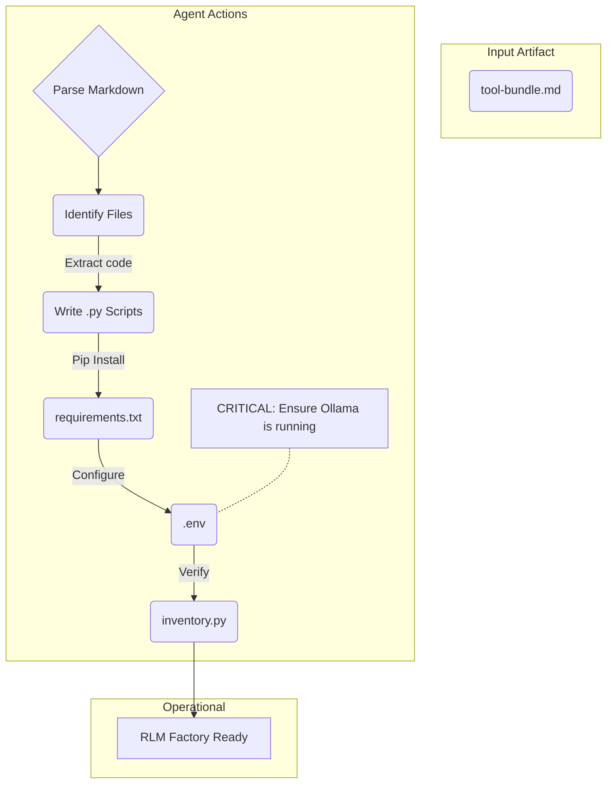
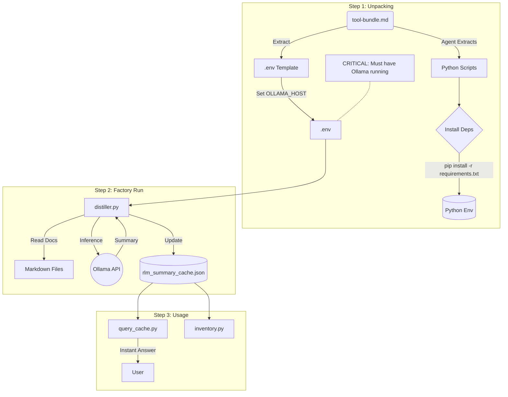
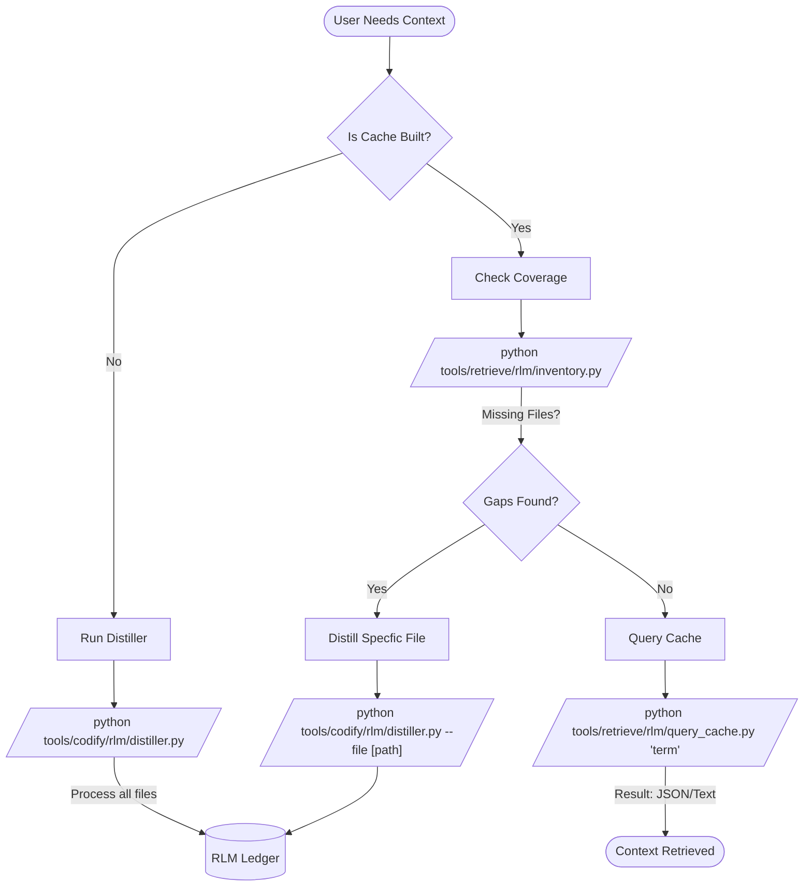
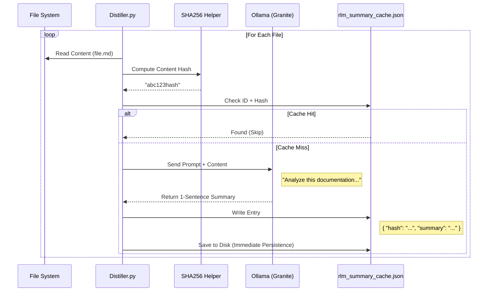
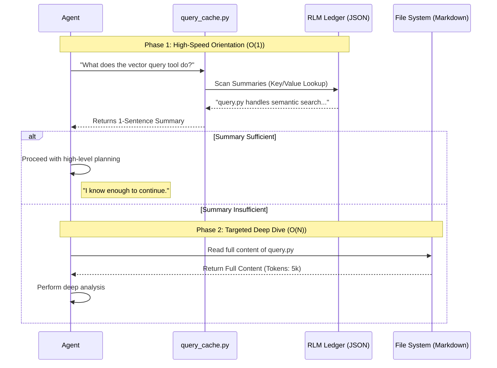

# RLM-Factory
**Generated:** 2026-01-31T20:06:49.678200

Recursive Language Model (RLM) Factory used to distill, store, and query semantic summaries of the codebase.

---

## 📑 Table of Contents
1. [tools/standalone/rlm-factory/UNPACK_INSTRUCTIONS.md](#entry-1)
2. [tools/standalone/rlm-factory/README.md](#entry-2)
3. [tools/standalone/rlm-factory/prompt.md](#entry-3)
4. [tools/standalone/rlm-factory/INSTALL.md](#entry-4)
5. [tools/standalone/rlm-factory/SYSTEM_REQUIREMENTS.md](#entry-5)
6. [docs/tools/standalone/rlm-factory/unpacking.mmd](#entry-6)
7. [docs/tools/standalone/rlm-factory/logic.mmd](#entry-7)
8. [docs/tools/standalone/rlm-factory/workflow.mmd](#entry-8)
9. [docs/tools/standalone/rlm-factory/distillation_process.mmd](#entry-9)
10. [docs/tools/standalone/rlm-factory/search_process.mmd](#entry-10)
11. [docs/diagrams/workflows/context-first-analysis.mmd](#entry-11)
12. [docs/diagrams/workflows/context-first-analysis-detailed.mmd](#entry-12)
13. [tools/codify/rlm/distiller.py](#entry-13)
14. [tools/retrieve/rlm/inventory.py](#entry-14)
15. [tools/retrieve/rlm/query_cache.py](#entry-15)
16. [tools/curate/rlm/cleanup_cache.py](#entry-16)
17. [tools/investigate/utils/path_resolver.py](#entry-17)
18. [tools/codify/rlm/requirements.in](#entry-18)
19. [tools/codify/rlm/requirements.txt](#entry-19)
20. [tools/standalone/rlm-factory/research/summary.md](#entry-20)

---

<a id='entry-1'></a>

---

## File: tools/standalone/rlm-factory/UNPACK_INSTRUCTIONS.md
**Path:** `tools/standalone/rlm-factory/UNPACK_INSTRUCTIONS.md`
**Note:** CRITICAL: How to hydrate this tool

```markdown
# 📦 Bundle Unpacking Protocol
> **🛑 STOP & READ**: Use this protocol to hydrate the tools in this bundle.

## Extraction Logic
1.  **Scan** this document for sections marked with **Path:** metadata.
2.  **Extract** the code block content immediately following the path.
3.  **Save** the content to the specified filename (relative to your desired tool root).

## ⚠️ Critical Setup Step
After extracting the files, you **MUST** install dependencies:

```bash
pip install -r requirements.txt
```

And configure your environment:
1.  Create `.env`
2.  Set `OLLAMA_HOST` (if not default)
3.  Ensure Ollama is running (`ollama serve`).

## 📄 File List
The following files are included in this bundle:
- `distiller.py`
- `inventory.py`
- `query_cache.py`
- `cleanup_cache.py`
- `requirements.in` / `requirements.txt`
- `prompt.md`
- `research/summary.md`
- *Diagrams*

```
<a id='entry-2'></a>

---

## File: tools/standalone/rlm-factory/README.md
**Path:** `tools/standalone/rlm-factory/README.md`
**Note:** Documentation

```markdown
# RLM Factory 🏭

## Overview
**Recursive Language Models (RLM)** is a strategy for creating "Infinite Context" by decomposing a massive repository into individual semantic summaries stored in a searchable "Reactive Ledger".

This tool suite manages that lifecycle: **Distilling** code into summaries, **Storing** them in a JSON ledger, and **Querying** them for instant context.

Based on the research **"Recursive Language Models" (arXiv:2512.24601)**. See `research/summary.md` for the architectural theory.

For installation and unpacking instructions, see **[INSTALL.md](INSTALL.md)**.

## 🚀 Capabilities

1.  **Distill** (`distiller.py`): Recursively process files with Ollama to update the ledger.
2.  **Audit** (`inventory.py`): Check coverage of the ledger against the filesystem.
4.  **Clean** (`cleanup_cache.py`): Remove stale entries to prevent hallucinations.

## 🧠 Memory Banks (Profiles)
The RLM Factory manages distinct memory banks for different content types. Check `manifest-index.json` to select the right tool for the job.

| Type | Flag | Use for... |
| :--- | :--- | :--- |
| **Legacy Docs** | `--type legacy` | Documentation (`.md`), Business Rules. (Default) |
| **Tool Inventory** | `--type tool` | Python Scripts (`.py`), CLI Tools, Automation Logic. |

> **Tip**: If your Python script is being "skipped", you are likely running in Legacy mode by default. Switch to `--type tool`.

## ⚠️ Prerequisites

*   **Python**: 3.8+
*   **Ollama**: Exterior dependency running `granite3.2:8b`.
*   **Vector DB (Consumer)**: This tool acts as the **Producer** for the Vector DB's Super-RAG context.
    *   See `tools/standalone/vector-db/README.md` for details on how it consumes this cache.

> **🤖 Agent / LLM Note**:
> This tool requires an **Active Runtime** (Ollama). You cannot run `distiller.py` without it.
> However, `query_cache.py` and `inventory.py` are **Offline** safe—they just read the JSON file.

## Usage

### 1. Build the Ledger (The Factory)
Process all documentation to build the initial memory.
```bash
python distiller.py
```

### 2. Search Memory (The Retrieval)
Ask the ledger what a file does without reading it.
```bash
python query_cache.py "bail"
```

### 3. Maintain Hygiene (The Cleaner)
Remove dead files from memory.
```bash
python cleanup_cache.py --apply
```

## Architecture
See `architecture.mmd` for the system diagram.

```
<a id='entry-3'></a>

---

## File: tools/standalone/rlm-factory/prompt.md
**Path:** `tools/standalone/rlm-factory/prompt.md`
**Note:** Agent Protocol

```markdown
# Agent Protocol: RLM Factory 🧠

**Context**: You have been provided with the "RLM Factory" standalone package. This is the **Link to Long-Term Memory**. It allows you to understand the entire repository without reading every file.

## 🤖 Your Role
You are the **Knowledge Curator**. Your goal is to keep the "Reactive Ledger" (`rlm_summary_cache.json`) up to date so that other agents can retrieve accurate context.

## 🛠️ Tool Identification
The package consists of:
- `distiller.py`: **The Writer**. Calls Ollama to summarize files. Expensive.
- `query_cache.py`: **The Reader**. FAST lookup of existing summaries. Cheap.
- `cleanup_cache.py`: **The Janitor**. Removes deleted files from memory.
- `inventory.py`: **The Auditor**. Reports what % of the repo is memorized.

## 📂 Execution Protocol

### 1. Assessment (Read)
Before doing anything, see what we know.
```bash
python inventory.py
```
*   **Check**: Is coverage < 100%? Are there missing files?

### 2. Retrieval (Read)
If you need to know about a specific topic:
```bash
python query_cache.py "term"
```

### 3. Maintenance (Write)
**Only run this if**:
1.  You have `OLLAMA_HOST` configured.
2.  Files have changed significantly.
3.  `inventory.py` reports missing files.

```bash
# Update everything (Slow)
python distiller.py

# Update one file (Fast)
python distiller.py --file path/to/new_file.md
```

## ⚠️ Critical Agent Rules
1.  **Ollama Dependency**: `distiller.py` WILL FAIL if Ollama is not running. Check connection first.
2.  **Git Ignore**: Never commit the `rlm_summary_cache.json` if it contains secrets. (It shouldn't, but verify).
3.  **Source of Truth**: The File System is truth. The Ledger is just a map. Run `cleanup_cache.py` often to keep them synced.

```
<a id='entry-4'></a>

---

## File: tools/standalone/rlm-factory/INSTALL.md
**Path:** `tools/standalone/rlm-factory/INSTALL.md`
**Note:** Installation & Dependencies

```markdown
# Installation & Unpacking Guide 📂

This guide explains how to restore the "RLM Factory" tool from its Markdown distribution bundle into a working directory structure.

## 1. Directory Structure

For optimal usage by an Agent/LLM or in a clean environment, unpack the files into the following standard directory structure:

```text
<your_tool_root>/
├── rlm-factory/           # Tool Root
│   ├── distiller.py       # The Engine (Write)
│   ├── inventory.py       # The Auditor (Read)
│   ├── cleanup_cache.py   # The Janitor (Curate)
│   ├── query_cache.py     # The Interface (Search)
│   ├── requirements.in    # Dependency Declaration
│   ├── requirements.txt   # Pinned Dependencies
│   ├── UNPACK_INSTRUCTIONS.md
│   ├── README.md
│   ├── INSTALL.md
│   ├── prompt.md
│   ├── research/
│   │   └── summary.md     # Architectural Context
│   └── docs/
│       ├── architecture.mmd
│       └── workflow.mmd
```

## 2. Dependency Setup (Strict Policy)

This tool follows the **Dependency Management Policy** (`docs/standards/dependency_management_policy.md`). We use `pip-tools` to ensure reproducible builds.

### Prerequisite: Ollama (The Brain)
The RLM relies on a local LLM server.
1.  **Install Ollama**: [https://ollama.com/](https://ollama.com/)
2.  **Pull Model**: We strictly use the optimized `granite3.2:8b` model.
    ```bash
    ollama pull granite3.2:8b
    ```
3.  **Start Server**:
    ```bash
    ollama serve
    ```

### Python Environment
1.  **Install pip-tools** (if not present):
    ```bash
    pip install pip-tools
    ```
2.  **Compile Dependencies** (If `requirements.in` changed):
    ```bash
    pip-compile requirements.in
    ```
3.  **Sync Environment** (The only safe install method):
    ```bash
    pip-sync requirements.txt
    # OR standard pip install
    pip install -r requirements.txt
    ```

## 3. Configuration (.env)

Create a `.env` file in your project root to configure the factory.

```bash
# --- Ollama Configuration (Model Serving) ---
# Used by: RLM Distiller
OLLAMA_HOST=http://localhost:11434
OLLAMA_MODEL=granite3.2:8b

# --- RLM Factory (Recursive Language Model) ---
# Used by: distiller.py
# CACHE PATH is now managed via tools/standalone/rlm-factory/manifest-index.json
```

## 4. Localization (Agent / LLM Task) 🤖

**Context**: You (the Agent) have just unpacked this tool into a new location.
**Action**:
1.  **Bootstrap**: Run `pip install -r requirements.txt`.
2.  **Config**: Create the `.env` file.
3.  **Verify**: Run `python inventory.py` - it will automatically resolve the cache path via `manifest-index.json`.

```
<a id='entry-5'></a>

---

## File: tools/standalone/rlm-factory/SYSTEM_REQUIREMENTS.md
**Path:** `tools/standalone/rlm-factory/SYSTEM_REQUIREMENTS.md`
**Note:** Binary & System Prerequisites

```markdown
# System Requirements

This tool requires specific system binaries and global Python packages to function.

## 1. Core Binaries
- **Python**: 3.8+
    - Check: `python --version`
- **Ollama**: AI Inference Server
    - Required for: `distiller.py`
    - Install: https://ollama.com/
    - Check: `ollama --version`

## 2. Global Python Tools
Install these in your environment *before* installing the tool's libraries.

- **pip**: Package Installer
    - Upgrade: `python -m pip install --upgrade pip`
- **pip-tools**: Dependency Management
    - Required for: Compiling `requirements.in` if you modify dependencies.
    - Install: `pip install pip-tools`

## 3. AI Models (Ollama)
The tool is optimized for specific models. You must pull them before running.

- **granite3.2:8b**: (Recommended) High-performance summarization.
    - Pull: `ollama pull granite3.2:8b`
    - Run: `ollama serve` (Keep this running in a separate terminal)

```
<a id='entry-6'></a>

---

## File: docs/tools/standalone/rlm-factory/unpacking.mmd
**Path:** `docs/tools/standalone/rlm-factory/unpacking.mmd`
**Note:** Agent Unpacking Process


<a id='entry-7'></a>

---

## File: docs/tools/standalone/rlm-factory/logic.mmd
**Path:** `docs/tools/standalone/rlm-factory/logic.mmd`
**Note:** Internal Logic


<a id='entry-8'></a>

---

## File: docs/tools/standalone/rlm-factory/workflow.mmd
**Path:** `docs/tools/standalone/rlm-factory/workflow.mmd`
**Note:** Usage Workflow


<a id='entry-9'></a>

---

## File: docs/tools/standalone/rlm-factory/distillation_process.mmd
**Path:** `docs/tools/standalone/rlm-factory/distillation_process.mmd`
**Note:** Detailed Data Flow (Sequence)


<a id='entry-10'></a>

---

## File: docs/tools/standalone/rlm-factory/search_process.mmd
**Path:** `docs/tools/standalone/rlm-factory/search_process.mmd`
**Note:** Summary-First Search (Sequence)


<a id='entry-11'></a>
## 11. docs/diagrams/workflows/context-first-analysis.mmd (MISSING)
> ❌ File not found: docs/diagrams/workflows/context-first-analysis.mmd
> Debug: ResolvePath tried: /Users/richardfremmerlid/Projects/Project_Sanctuary/docs/diagrams/workflows/context-first-analysis.mmd
> Debug: BaseDir tried: /Users/richardfremmerlid/Projects/Project_Sanctuary/tools/standalone/rlm-factory/docs/diagrams/workflows/context-first-analysis.mmd
<a id='entry-12'></a>
## 12. docs/diagrams/workflows/context-first-analysis-detailed.mmd (MISSING)
> ❌ File not found: docs/diagrams/workflows/context-first-analysis-detailed.mmd
> Debug: ResolvePath tried: /Users/richardfremmerlid/Projects/Project_Sanctuary/docs/diagrams/workflows/context-first-analysis-detailed.mmd
> Debug: BaseDir tried: /Users/richardfremmerlid/Projects/Project_Sanctuary/tools/standalone/rlm-factory/docs/diagrams/workflows/context-first-analysis-detailed.mmd
<a id='entry-13'></a>

---

## File: tools/codify/rlm/distiller.py
**Path:** `tools/codify/rlm/distiller.py`
**Note:** The Engine (Write Only)

```python
#!/usr/bin/env python3
"""
distiller.py (CLI)
=====================================

Purpose:
    RLM Engine: Recursive summarization of repo content using Ollama.

Layer: Curate / Rlm

Usage Examples:
    # 1. Distill a single file (Tool Logic) -- CRITICAL: Use --type tool for code!
    python tools/codify/rlm/distiller.py --file tools/codify/rlm/rlm_config.py --type tool
    python tools/codify/rlm/distiller.py --file tools/investigate/miners/db_miner.py --type tool --force

    # 2. Distill project documentation (Default: --type sanctuary)
    python tools/codify/rlm/distiller.py --file ADRs/083_manifest_centric_architecture.md

    # 3. Incremental update (files changed in last 24 hours)
    python tools/codify/rlm/distiller.py --since 24 --type sanctuary

    # 4. Process specific directory
    python tools/codify/rlm/distiller.py --target ADRs/ --type sanctuary
    
    # 5. Force update (regenerate summaries even if unchanged)
    python tools/codify/rlm/distiller.py --target tools/investigate/miners --type tool --force

    IMPORTANT: Check tools/standalone/rlm-factory/manifest-index.json for defined profiles.
    - sanctuary: Documentation & Core Files (rlm_summary_cache.json)
    - tool:      Code/Scripts (rlm_tool_cache.json)

Supported Object Types:
    - Generic

CLI Arguments:
    --file          : Single file to process
    --model         : Ollama model to use
    --cleanup       : Remove stale entries for deleted/renamed files
    --since         : Process only files changed in last N hours
    --no-cleanup    : Skip auto-cleanup on incremental distills
    --target        : Target directories to process  (use with caution currently will process all files in the target directory)
    --force         : Force update (regenerate summaries even if unchanged)

Input Files:
    - (See code)

Output:
    - (See code)

Key Functions:
    - load_manifest(): No description.
    - load_cache(): Load existing cache or return empty dict.
    - save_cache(): Persist cache to disk immediately (crash-resilient).
    - compute_hash(): Compute SHA256 hash of file content.
    - call_ollama(): Call Ollama API for summarization.
    - distill(): Main distillation loop.
    - run_cleanup(): Remove stale entries for deleted/renamed files.

Script Dependencies:
    - tools/codify/rlm/rlm_config.py (Configuration)
    - tools/curate/inventories/manage_tool_inventory.py (Cyclical: Updates inventory descriptions)
    - tools/curate/rlm/cleanup_cache.py (Orphan Removal)

Consumed by:
    - tools/curate/inventories/manage_tool_inventory.py (Invokes distiller on tool updates)
"""

import os
import sys
import json
import hashlib
import time
import traceback
from string import Template
from pathlib import Path
from datetime import datetime
from datetime import datetime
from typing import Dict, List, Optional

# ============================================================
# DEBUGGERS
# ============================================================
DEBUG_MODE = False

def debug(msg: str):
    if DEBUG_MODE:
        try:
            print(f"[DEBUG] {msg}")
        except UnicodeEncodeError:
            # Fallback for Windows consoles (e.g., PowerShell cp1252)
            print(f"[DEBUG] {msg.encode('utf-8', 'backslashreplace').decode()}")

try:
    import requests
except ImportError:
    print("❌ Missing dependency: pip install requests")
    sys.exit(1)

try:
    from dotenv import load_dotenv
    load_dotenv()
except ImportError:
    pass  # dotenv is optional

# ============================================================
# CONFIGURATION
# ============================================================


try:
    from tools.codify.rlm.rlm_config import (
        RLMConfig, 
        PROJECT_ROOT, 
        load_cache, 
        save_cache, 
        compute_hash, 
        should_skip, 
        collect_files
    )
except ImportError:
    # Fallback to local import
    import sys
    sys.path.append(os.path.dirname(os.path.abspath(__file__)))
    from rlm_config import (
        RLMConfig, 
        PROJECT_ROOT, 
        load_cache, 
        save_cache, 
        compute_hash, 
        should_skip, 
        collect_files
    )

OLLAMA_URL = os.getenv("OLLAMA_HOST", "http://localhost:11434") + "/api/generate"

# ============================================================
# CORE LOGIC
# ============================================================

def call_ollama(content: str, file_path: str, prompt_template: str, model_name: str) -> Optional[str]:
    """Call Ollama to generate summary."""
    # Truncate large files
    if len(content) > 12000: # Increased for code files
        content = content[:12000] + "\n...[TRUNCATED]..."
    
    # Use standard Template substitution (safe for JSON/Code content)
    # 1. Convert "Gold Standard" prompts ({var}) to Template format ($var)
    template_str = prompt_template.replace("{file_path}", "${file_path}").replace("{content}", "${content}")
    
    # 2. Use safe_substitute to prevent KeyErrors
    template = Template(template_str)
    prompt = template.safe_substitute(file_path=file_path, content=content)
    
    try:
        response = requests.post(
            OLLAMA_URL,
            json={
                "model": model_name,
                "prompt": prompt,
                "stream": False,
                "options": {
                    "num_ctx": 4096,
                    "temperature": 0.1
                }
            },
            timeout=120
        )
        
        if response.status_code == 200:
            summary = response.json().get("response", "").strip()
            # Clean up common LLM artifacts
            if summary.startswith("Here is"):
                summary = summary.split(":", 1)[-1].strip()
            return summary
        else:
            print(f"⚠️  Ollama error {response.status_code}: {response.text[:100]}")
            return None
            
    except requests.exceptions.Timeout:
        print(f"⚠️  Timeout for {file_path}")
        return None
    except requests.exceptions.ConnectionError:
        print(f"❌ Cannot connect to Ollama at {OLLAMA_URL}")
        print("   Run: ollama serve")
        return None
    except Exception as e:
        print(f"⚠️  Error: {e}")
        return None

def distill(config: RLMConfig, target_files: List[Path] = None, force: bool = False):
    """Main distillation loop."""
    print(f"RLM Distiller [{config.type.upper()}] - {config.description}")
    print(f"   Manifest: {config.manifest_path.name}")
    print(f"   Cache:    {config.cache_path.name}")
    print("=" * 50)
    
    cache = load_cache(config.cache_path)
    print(f"Loaded cache with {len(cache)} existing entries")
    
    # Determine files to process
    if target_files:
        files = target_files
    else:
        files = collect_files(config)
    
    total = len(files)
    print(f"Found {total} files to process")
    
    cache_hits = 0
    processed = 0
    errors = 0
    start_time = time.time()
    
    for i, file_path in enumerate(files, 1):
        # Path Resolution Block
        try:
            rel_path = file_path.resolve().relative_to(PROJECT_ROOT).as_posix()
        except ValueError as e:
            debug(f"Path resolution failed: {file_path} not relative to PROJECT_ROOT ({e})")
            rel_path = file_path.resolve().as_posix()
        
        try:
            # 1. Skip Check (Safety)
            if should_skip(file_path, config, debug_fn=debug):
                print(f"Skipping {rel_path} (excluded)")
                continue

            debug(f"Reading {rel_path}")
            # NOTE: errors="ignore" may change content hash for malformed UTF-8/Binary files
            content = file_path.read_text(encoding="utf-8", errors="ignore")
            
            # Skip empty files
            if not content.strip():
                debug("File content empty")
                continue
            
            # Compute hash for cache lookup
            content_hash = compute_hash(content)
            
            # Check cache
            if not force and rel_path in cache and cache[rel_path].get("hash") == content_hash:
                cache_hits += 1
                if cache_hits == 1 or i % 10 == 0: # Improve UX: Show first hit, then throttle
                     print(f"   [{i}/{total}] {rel_path} [CACHE HIT]")
                continue
            
            # Need to distill
            print(f"[{i}/{total}] Processing {rel_path}...")
           # 2. Distill (if needed)
            summary = call_ollama(content, rel_path, config.prompt_template, config.llm_model)
            
            if summary:
                # 3. Update Ledger
                # Update cache with metadata
                cache[rel_path] = {
                    "hash": content_hash,
                    "summary": summary,
                    "file_mtime": file_path.stat().st_mtime,
                    "summarized_at": datetime.now().isoformat()
                }
                # PERSIST IMMEDIATELY (crash-resilient)
                debug(f"Writing cache entry for {rel_path}")
                save_cache(cache, config.cache_path)
                debug(f"Cache size now: {len(cache)} entries")
                processed += 1
                
                # Feedback Loop: Update Inventory Description (If Tool)
                if config.type == "tool":
                    try:
                        # Extract purpose from summary JSON
                        summary_data = json.loads(summary)
                        purpose = summary_data.get("purpose", "")
                        
                        if purpose:
                            # Import locally to avoid circular top-level imports
                            # (Though headers say cyclic, we defer import to runtime)
                            sys.path.append(str(PROJECT_ROOT)) # ensure path
                            from tools.curate.inventories.manage_tool_inventory import InventoryManager
                            
                            mgr = InventoryManager(PROJECT_ROOT / "tools/tool_inventory.json")
                            mgr.update_tool(
                                tool_path=rel_path, 
                                new_desc=purpose, 
                                suppress_distillation=True
                            )
                            debug(f"Inventory updated for {rel_path}")
                            
                    except Exception as e:
                        # Non-blocking error
                        print(f"⚠️  Inventory update failed for {rel_path}: {e}")
            else:
                errors += 1
                cache[rel_path] = {
                    "hash": content_hash,
                    "summary": "[DISTILLATION FAILED]",
                    "summarized_at": datetime.now().isoformat()
                }
                save_cache(cache, config.cache_path)
                
        except Exception as e:
            errors += 1
            print(f"❌ Error processing {rel_path}")
            if DEBUG_MODE:
                traceback.print_exc()
            else:
                print(f"   Reason: {e}")
            
            # Attempt to save partial progress even on error
            save_cache(cache, config.cache_path)
    
    duration = time.time() - start_time
    
    # Final consistency check and save
    save_cache(cache, config.cache_path)
    
    print("=" * 50)
    print(f"Distillation Complete!")
    print(f"   Total files: {total}")
    print(f"   Cache hits:  {cache_hits}")
    print(f"   Processed:   {processed}")
    print(f"   Errors:      {errors}")
    print(f"   Duration:    {duration:.1f}s")
    print(f"   Cache saved: {config.cache_path}")

    # Zero-Work Guardrail (Phantom Execution Protection)
    debug(f"Guardrail check -> Total: {total}, Processed: {processed}, Hits: {cache_hits}, Errors: {errors}")
    if total > 0 and processed == 0 and cache_hits == 0 and errors == 0:
        print("❌ CRITICAL: Distiller ran but no files were processed.")
        print("   This indicates a configuration or path resolution failure.")
        if DEBUG_MODE:
            print("   Debug mode was enabled — review logs above.")
        sys.exit(2)

# ============================================================
# CLEANUP FUNCTION
# ============================================================

def run_cleanup(config: RLMConfig):
    """Remove stale entries for files that no longer exist."""
    print("🧹 Running cleanup for stale cache entries...")
    cache = load_cache(config.cache_path)
    
    stale_keys = []
    for rel_path in list(cache.keys()):
        full_path = PROJECT_ROOT / rel_path
        # Note: In tool mode, we might want to cross check inventory existence?
        # For now, file existence is the gold standard.
        if not full_path.exists():
            stale_keys.append(rel_path)
    
    if not stale_keys:
        print("   ✅ No stale entries found.")
        return 0
    
    print(f"   Found {len(stale_keys)} stale entries")
    for key in stale_keys:
        del cache[key]
    
    save_cache(cache, config.cache_path)
    print(f"   ✅ Removed {len(stale_keys)} stale entries")
    return len(stale_keys)

# ============================================================
# CLI
# ============================================================

if __name__ == "__main__":
    import argparse
    from datetime import datetime, timedelta
    
    parser = argparse.ArgumentParser(description="Recursive Learning Model (RLM) Distiller")
    parser.add_argument("--type", default="sanctuary", help="RLM Type (loads manifest from factory)")
    parser.add_argument("--target", "-t", nargs="+", help="Override target directories to process")
    parser.add_argument("--file", "-f", help="Single file to process")
    parser.add_argument("--model", "-m", help="Ollama model to use")
    parser.add_argument("--cleanup", action="store_true", help="Remove stale entries for deleted/renamed files")
    parser.add_argument("--since", type=int, metavar="HOURS", help="Process only files changed in last N hours")
    parser.add_argument("--no-cleanup", action="store_true", help="Skip auto-cleanup on incremental distills")
    parser.add_argument("--debug", action="store_true", help="Enable verbose debug logging for troubleshooting")
    parser.add_argument("--force", action="store_true", help="Force re-distillation of files (bypass cache)")
    
    args = parser.parse_args()
    
    if args.debug:
        DEBUG_MODE = True
        print("[DEBUG] Debug mode enabled")
    
    debug(f"Raw args.type: {args.type}")
        
    # Load Config based on Type
    try:
        config = RLMConfig(run_type=args.type, override_targets=args.target)
        if args.model:
            config.llm_model = args.model  # Override model in config
            print(f"🤖 Using model override: {config.llm_model}")
            
        debug(f"Config initialized type: {config.type}")
        debug(f"Config cache path: {config.cache_path}")
    except Exception as e:
        print(f"DEBUG: Error init config: {e}")
        sys.exit(1)
    
    # Handle cleanup
    if args.cleanup:
        run_cleanup(config)
        
    if args.since:
        # Auto-cleanup for incremental (unless --no-cleanup)
        if not args.no_cleanup and not args.cleanup: # Avoid double cleanup
            run_cleanup(config)
        
        # Filter files by modification time
        cutoff = datetime.now().timestamp() - (args.since * 3600)
        files = collect_files(config)
        recent_files = [f for f in files if f.stat().st_mtime >= cutoff]
        print(f"⏰ Processing {len(recent_files)} files changed in last {args.since} hours")
        
        distill(config, target_files=recent_files, force=args.force)
    else:
        target_files = None
        if args.file:
            # Canonicalize path at boundary (Red Team Fix)
            f_path_raw = PROJECT_ROOT / args.file
            f_path = f_path_raw.resolve()
            
            # Instrument Path Resolution (Red Team Fix)
            debug(f"Raw CLI file argument: {args.file}")
            debug(f"Computed raw path: {f_path_raw}")
            debug(f"Resolved absolute path: {f_path}")
            debug(f"PROJECT_ROOT: {PROJECT_ROOT}")
            
            if not f_path.exists() or not f_path.is_file():
                print(f"❌ Invalid file: {args.file} (Resolved: {f_path})")
                sys.exit(1)
            target_files = [f_path]
            
        distill(config, target_files=target_files, force=args.force)

```
<a id='entry-14'></a>

---

## File: tools/retrieve/rlm/inventory.py
**Path:** `tools/retrieve/rlm/inventory.py`
**Note:** The Auditor (Read Only)

```python
#!/usr/bin/env python3
"""
inventory.py (CLI)
=====================================

Purpose:
    RLM Auditor: Reports coverage of the semantic ledger against the filesystem.
    Uses the Shared RLMConfig to dynamically switch between 'Sanctuary' (Documentation) and 'Tool' (CLI) audit modes.

Layer: Curate / Rlm

Supported Object Types:
    - RLM Cache (Sanctuary)
    - RLM Cache (Tool)

CLI Arguments:
    --type  : [sanctuary|tool] Selects the configuration profile (default: sanctuary).

Input Files:
    - .agent/learning/rlm_summary_cache.json (Sanctuary)
    - .agent/learning/rlm_tool_cache.json (Tool)
    - Filesystem targets (defined in manifests)
    - tool_inventory.json

Output:
    - Console report (Statistics, Missing Files, Stale Entries)

Key Functions:
    - audit_inventory(): Logic to compare cache keys against collected file paths.

Script Dependencies:
    - tools/codify/rlm/rlm_config.py
"""
import os
import sys
import argparse
from pathlib import Path
from collections import defaultdict

# Add project root to sys.path to find tools package
SCRIPT_DIR = Path(__file__).parent.resolve()
PROJECT_ROOT = SCRIPT_DIR.parent.parent.parent
if str(PROJECT_ROOT) not in sys.path:
    sys.path.append(str(PROJECT_ROOT))

try:
    from tools.codify.rlm.rlm_config import RLMConfig, load_cache, collect_files
except ImportError:
    print("❌ Could not import RLMConfig from tools.codify.rlm.rlm_config")
    sys.exit(1)

def audit_inventory(config: RLMConfig):
    """Compare RLM cache against actual file system."""
    
    print(f"📊 Auditing RLM Inventory [{config.type.upper()}]...")
    print(f"   Cache: {config.cache_path.name}")
    
    # 1. Load Cache
    cache = load_cache(config.cache_path)
    cached_paths = set(cache.keys())
    
    # 2. Scan File System / Inventory
    fs_files = collect_files(config)
    
    # Convert absolute paths to relative keys matching cache format
    fs_paths = set()
    for f in fs_files:
        try:
            rel = str(f.relative_to(PROJECT_ROOT))
            fs_paths.add(rel)
        except ValueError:
            pass
            
    # 3. Compare
    missing_in_cache = fs_paths - cached_paths
    stale_in_cache = cached_paths - fs_paths
    
    # 4. Report
    print(f"\n📈 Statistics:")
    print(f"   Files on Disk/Inventory: {len(fs_paths)}")
    print(f"   Entries in Cache:        {len(cached_paths)}")
    percentage = (len(fs_paths & cached_paths)/len(fs_paths)*100) if fs_paths else 0
    print(f"   Coverage:                {len(fs_paths & cached_paths)} / {len(fs_paths)} ({percentage:.1f}%)")
    
    if missing_in_cache:
        print(f"\n❌ Missing from Cache ({len(missing_in_cache)}):")
        for p in sorted(list(missing_in_cache))[:10]:
             print(f"   - {p}")
        if len(missing_in_cache) > 10:
            print(f"   ... and {len(missing_in_cache) - 10} more.")
            
    if stale_in_cache:
        print(f"\n⚠️  Stale in Cache ({len(stale_in_cache)}):")
        for p in sorted(list(stale_in_cache))[:10]:
             print(f"   - {p}")
        if len(stale_in_cache) > 10:
             print(f"   ... and {len(stale_in_cache) - 10} more.")
             
    if not missing_in_cache and not stale_in_cache:
        print("\n✅ RLM Inventory is perfectly synchronized.")

def main():
    parser = argparse.ArgumentParser(description="Audit RLM Cache Coverage")
    parser.add_argument("--type", default="sanctuary", help="RLM Type (loads manifest from factory)")
    
    args = parser.parse_args()
    
    # Load Config based on Type
    try:
        config = RLMConfig(run_type=args.type)
        audit_inventory(config)
    except Exception as e:
        print(f"❌ Error: {e}")

if __name__ == "__main__":
    main()
```
<a id='entry-15'></a>

---

## File: tools/retrieve/rlm/query_cache.py
**Path:** `tools/retrieve/rlm/query_cache.py`
**Note:** The Search Interface (Read Only)

```python
#!/usr/bin/env python3
"""
query_cache.py (CLI)
=====================================

Purpose:
    RLM Search: Instant O(1) semantic search of the ledger.

Layer: Curate / Rlm

Usage Examples:
    python tools/retrieve/rlm/query_cache.py --help

Supported Object Types:
    - Generic

CLI Arguments:
    term            : Search term (ID, filename, or content keyword)
    --list          : List all cached files
    --no-summary    : Hide summary text
    --json          : Output results as JSON

Input Files:
    - (See code)

Output:
    - (See code)

Key Functions:
    - load_cache(): No description.
    - search_cache(): No description.
    - list_cache(): No description.
    - main(): No description.

Script Dependencies:
    (None detected)

Consumed by:
    (Unknown)
"""
import json
import argparse
import sys
import os
from pathlib import Path

# Add project root to sys.path to find tools package
SCRIPT_DIR = Path(__file__).parent.resolve()
PROJECT_ROOT = SCRIPT_DIR.parent.parent.parent.resolve()
if str(PROJECT_ROOT) not in sys.path:
    sys.path.append(str(PROJECT_ROOT))

try:
    from tools.codify.rlm.rlm_config import RLMConfig
except ImportError:
    print("❌ Could not import RLMConfig from tools.codify.rlm.rlm_config")
    sys.exit(1)

def load_cache(config: RLMConfig):
    if not config.cache_path.exists():
        print(f"❌ Cache file not found: {config.cache_path}")
        return {}
    try:
        with open(config.cache_path, 'r') as f:
            return json.load(f)
    except json.JSONDecodeError:
        print(f"❌ Error decoding cache JSON")
        return {}

def search_cache(term, config: RLMConfig, show_summary=True, return_data=False, output_json=False):
    data = load_cache(config)
    matches = []
    
    if not output_json and not return_data:
        print(f"🔍 Searching RLM Cache [{config.type.upper()}] for: '{term}'...")
    
    for relative_path, entry in data.items():
        # Match against file path
        if term.lower() in relative_path.lower():
            matches.append({"path": relative_path, "entry": entry})
            continue
            
        # Match against summary content
        if term.lower() in entry.get('summary', '').lower():
            matches.append({"path": relative_path, "entry": entry})
            continue
            
        # Match against ID or Hash (less likely but useful)
        if term.lower() in entry.get('content_hash', '').lower():
            matches.append({"path": relative_path, "entry": entry})
            
    # Sort matches by path for consistency
    matches.sort(key=lambda x: x['path'])

    if return_data:
        return matches

    if output_json:
        print(json.dumps(matches, indent=2))
        return

    if not matches:
        print("No matches found.")
        return

    print(f"✅ Found {len(matches)} matches:\n")
    for match in matches:
        path = match['path']
        entry = match['entry']
        timestamp = entry.get('summarized_at', 'Unknown Time')
        print(f"📄 {path}")
        print(f"   🕒 Last Indexed: {timestamp}")
        if show_summary:
            summary = entry.get('summary', 'No summary available.')
            if isinstance(summary, str):
                 print(f"   📝 Summary: {summary[:200]}..." if len(summary) > 200 else f"   📝 Summary: {summary}")
            else:
                 print(f"   📝 Summary: {json.dumps(summary, indent=2)}")
        print("-" * 50)

def list_cache(config: RLMConfig):
    data = load_cache(config)
    print(f"📚 RLM Cache [{config.type.upper()}] contains {len(data)} entries:\n")
    for relative_path in sorted(data.keys()):
        print(f"- {relative_path}")

def main():
    parser = argparse.ArgumentParser(description="Query RLM Cache")
    parser.add_argument("term", nargs="?", help="Search term (ID, filename, or content keyword)")
    parser.add_argument("--type", default="sanctuary", help="RLM Type (loads manifest from factory)")
    parser.add_argument("--list", action="store_true", help="List all cached files")
    parser.add_argument("--no-summary", action="store_true", help="Hide summary text")
    parser.add_argument("--json", action="store_true", help="Output results as JSON")
    
    args = parser.parse_args()
    
    # Load Config based on Type
    config = RLMConfig(run_type=args.type)
    
    if args.list:
        list_cache(config)
    elif args.term:
        search_cache(args.term, config, show_summary=not args.no_summary, output_json=args.json)
    else:
        parser.print_help()

if __name__ == "__main__":
    main()

```
<a id='entry-16'></a>

---

## File: tools/curate/rlm/cleanup_cache.py
**Path:** `tools/curate/rlm/cleanup_cache.py`
**Note:** The Janitor (Curate)

```python
#!/usr/bin/env python3
"""
cleanup_cache.py (CLI)
=====================================

Purpose:
    RLM Cleanup: Removes stale and orphan entries from the Recursive Language Model ledger.

Layer: Curate / Rlm

Usage Examples:
    python tools/curate/rlm/cleanup_cache.py --help

Supported Object Types:
    - Generic

CLI Arguments:
    --apply         : Perform the deletion
    --prune-orphans : Remove entries not matching manifest
    --v             : Verbose mode

Input Files:
    - (See code)

Output:
    - (See code)

Key Functions:
    - load_manifest_globs(): Load include/exclude patterns from manifest.
    - matches_any(): Check if path matches any glob pattern or is inside a listed directory.
    - main(): No description.

Script Dependencies:
    (None detected)

Consumed by:
    (Unknown)
"""
import os
import sys
import argparse
from pathlib import Path

# Add project root to sys.path to find tools package
SCRIPT_DIR = Path(__file__).parent.resolve()
PROJECT_ROOT = SCRIPT_DIR.parent.parent.parent
if str(PROJECT_ROOT) not in sys.path:
    sys.path.append(str(PROJECT_ROOT))

try:
    from tools.codify.rlm.rlm_config import RLMConfig, load_cache, save_cache, should_skip
except ImportError:
    print("❌ Could not import RLMConfig from tools.codify.rlm.rlm_config")
    sys.exit(1)

def main():
    parser = argparse.ArgumentParser(description="Clean up RLM cache.")
    parser.add_argument("--type", default="sanctuary", help="RLM Type (loads manifest from factory)")
    parser.add_argument("--apply", action="store_true", help="Perform the deletion")
    parser.add_argument("--prune-orphans", action="store_true", help="Remove entries not matching manifest")
    parser.add_argument("--v", action="store_true", help="Verbose mode")
    args = parser.parse_args()
    
    # Load Config based on Type
    config = RLMConfig(run_type=args.type)

    print(f"Checking cache at: {config.cache_path}")
    
    if not config.cache_path.exists():
        print("Cache file not found.")
        return

    cache = load_cache(config.cache_path)

    if args.prune_orphans:
        print(f"Loaded configuration for [{config.type.upper()}] with parser: {config.parser_type}")

    initial_count = len(cache)
    print(f"Total entries in cache: {initial_count}")

    # The Logic
    entries_to_remove = []
    authorized_files = None
    
    for relative_path in list(cache.keys()):
        full_path = PROJECT_ROOT / relative_path
        
        # 1. Check existence (Stale)
        if not full_path.exists():
            entries_to_remove.append(relative_path)
            if args.v:
                print(f"  [MISSING] {relative_path}")
            continue

        # 2. Check manifest (Orphan)
        if args.prune_orphans:
            # STRICT ORPHAN CHECK:
            # If the file is not in the list of files matched by the configuration (Manifest/Inventory),
            # it is an orphan.
            
            # Lazy load authorized set on first use
            if authorized_files is None:
                print("Building authorized file list from manifest...")
                # We need to import collect_files from rlm_config
                from tools.codify.rlm.rlm_config import collect_files
                files = collect_files(config)
                # Store as set of resolved strings for fast lookup
                authorized_files = set(str(f.resolve()) for f in files)
                print(f"Authorized files count: {len(authorized_files)}")

            try:
                # Resolve cache path to absolute for comparison
                full_path_str = str(full_path.resolve())
                
                if full_path_str not in authorized_files:
                    entries_to_remove.append(relative_path)
                    if args.v:
                        print(f"  [ORPHAN] {relative_path} (Not in manifest)")
                    continue
            except Exception as e:
                # If we can't resolve, it might be a bad path, safety remove? 
                # Or keep safe. Let's log.
                if args.v: print(f"  [ERROR] resolving {relative_path}: {e}")
                continue

        if args.v:
           print(f"  [OK] {relative_path}")

    remove_count = len(entries_to_remove)
    print(f"Entries to remove: {remove_count}")

    if remove_count == 0:
        print("Cache is clean. No action needed.")
        return

    if args.apply:
        print(f"Removing {remove_count} entries...")
        for key in entries_to_remove:
            del cache[key]
        
        save_cache(cache, config.cache_path)
        print("Cache updated successfully.")
    else:
        print("\nDRY RUN COMPLETE.")
        print(f"Found {remove_count} entries to remove (Stale + Orphans).")
        print("To actually remove these entries, run:")
        if args.prune_orphans:
            print(f"  python tools/curate/rlm/cleanup_cache.py --type {args.type} --apply --prune-orphans")
        else:
            print(f"  python tools/curate/rlm/cleanup_cache.py --type {args.type} --apply")

def remove_entry(run_type: str, file_path: str) -> bool:
    """
    Programmatic API to remove a single entry from the cache.
    Args:
        run_type: 'legacy' or 'tool'
        file_path: Relative path to the file (e.g. tools/cli.py)
    Returns:
        True if removed, False if not found or error.
    """
    try:
        config = RLMConfig(run_type=run_type)
        if not config.cache_path.exists():
            return False
            
        cache = load_cache(config.cache_path)
        
        # Normalize keys
        target_keys = [
            file_path, 
            file_path.replace('\\', '/'),
            str(Path(file_path)) 
        ]
        
        found_key = None
        for k in cache.keys():
            if k in target_keys:
                found_key = k
                break
        
        if found_key:
            del cache[found_key]
            save_cache(cache, config.cache_path)
            print(f"🗑️  [RLM] Removed {found_key} from {run_type} cache.")
            return True
        else:
             print(f"⚠️  [RLM] Entry not found in cache: {file_path}")
             return False

    except Exception as e:
        print(f"❌ [RLM] Error removing {file_path}: {e}")
        return False

if __name__ == "__main__":
    main()

```
<a id='entry-17'></a>
## 17. tools/investigate/utils/path_resolver.py (MISSING)
> ❌ File not found: tools/investigate/utils/path_resolver.py
> Debug: ResolvePath tried: /Users/richardfremmerlid/Projects/Project_Sanctuary/tools/investigate/utils/path_resolver.py
> Debug: BaseDir tried: /Users/richardfremmerlid/Projects/Project_Sanctuary/tools/standalone/rlm-factory/tools/investigate/utils/path_resolver.py
<a id='entry-18'></a>

---

## File: tools/codify/rlm/requirements.in
**Path:** `tools/codify/rlm/requirements.in`
**Note:** Dependency Declaration

```text
# RLM Factory Dependencies (Intent File)
# Workflow:
#   1. Edit this file
#   2. pip-compile scripts/rlm_factory/requirements.in
#   3. pip install -r scripts/rlm_factory/requirements.txt

# HTTP client for Ollama API
requests

# Environment configuration
python-dotenv

```
<a id='entry-19'></a>

---

## File: tools/codify/rlm/requirements.txt
**Path:** `tools/codify/rlm/requirements.txt`
**Note:** Pinned Dependencies

```text
#
# This file is autogenerated by pip-compile with Python 3.13
# by the following command:
#
#    pip-compile tools/rlm-factory/requirements.in
#
certifi==2026.1.4
    # via requests
charset-normalizer==3.4.4
    # via requests
idna==3.11
    # via requests
python-dotenv==1.2.1
    # via -r tools/rlm-factory/requirements.in
requests==2.32.5
    # via -r tools/rlm-factory/requirements.in
urllib3==2.6.3
    # via requests

```
<a id='entry-20'></a>

---

## File: tools/standalone/rlm-factory/research/summary.md
**Path:** `tools/standalone/rlm-factory/research/summary.md`
**Note:** Architectural Theory

```markdown
# Recursive Logic Discovery & The Infinite Context Ecosystem
**Synthesis of "Recursive Language Models" (arXiv:2512.24601) with Progressive Elaboration Patterns**

## 1. The Core Paradigm: Environment as Memory
The paper proposes treating "Context" not as text stuffed into a prompt window, but as an **external environment** that an LLM interacts with programmatically. 

For Project Sanctuary, we have implemented this as an **Infinite Context Ecosystem**. The LLM does not "read" the codebase; it **explores** it using a robust toolchain, maintaining state in external artifacts (Markdown & JSON).

## 2. The Ecosystem Architecture (See [BLUEPRINT.md](../BLUEPRINT.md))

**Architecture Diagram:** [workflows/infinite-context-ecosystem.mmd](../../../../docs/diagrams/workflows/archive/infinite-context-ecosystem.mmd)

Our implementation combines three layers of memory and a "REPL" toolchain:

### Components
1.  **RLM Cache (Fast Context):** A 'holographic' cache of every file's purpose (see `rlm_summary_cache.json`). Allows the agent to "know" the purpose of thousands of files instantly without reading them.
2.  **Vector DB (Semantic Search):** Enables finding logic by concept rather than just keyword.
3.  **Dependency Graph:** Relationships between components and modules.
4.  **CLI Toolchain:** The Unified Discovery CLI (`tools/cli.py`) that orchestrates specialized tools to extract logic on demand.

## 3. The Progressive Elaboration Workflow

We do not document the system in one pass. We use **Recursive Progressive Elaboration**:

### Phase A: Master Discovery (Phases 1-3)
**Workflow:** `docs/diagrams/workflows/master-discovery.mmd`
*   **Goal:** Scope the domain, Plan Tasks, Gather Context.
*   **Action:** Agent loads Policy/Standards (P1), Assesses State (P2), and gathers context via RLM/Vector tools (P3).
*   **Output:** A high-level list of targets and context bundle.

### Phase B: The Elaboration Loop (Phase 4)
**Workflow:** `docs/diagrams/workflows/progressive-elaboration-loop.mmd`
*   **Goal:** Progressive Elaboration (Stub -> Deep).
*   **Action:** 
    *   **Create:** Generate "Overview Stub" (Metadata, Dependencies).
    *   **Update:** Agent Refines & Analyzes logic using context.
*   **Result:** The documentation evolves from Skeleton to Detail.

### Phase C: Recursive Logic Discovery (Advanced Phase 4)
**Workflow:** `docs/diagrams/workflows/recursive-logic-discovery.mmd`
*   **Goal:** Deep Understanding via Recursion.
*   **Action:**
    1.  Agent reads the Stub.
    2.  Agent sees "High Complexity" warning (LDS Score).
    3.  Agent calls specialized tools on *specific targets*.
    4.  Agent discovers a call to a shared library.
    5.  **RECURSION:** Agent pauses, generates a sub-task to analyze the library, waits for that summary to update in RLM Cache, then resumes analysis with new knowledge.

## 4. Why This is "Infinite Context"
The LLM never holds the entire system in tokens.
*   It holds the **Map** (RLM Cache).
*   It holds the **Current Focus** (One Target).
*   It fetches **Dependencies** on demand.

This allows us to document a massive codebase with standard context windows, achieving depth and accuracy impossible with simple context stuffing.

## 5. Tooling Reference
*   **Distiller:** `tools/codify/rlm/distiller.py` (Maintains the RLM Cache)
*   **Discovery CLI:** `tools/cli.py` (Recursive Scanner)
*   **Query Cache:** `tools/retrieve/rlm/query_cache.py` (Tool Discovery)

```
