# Vector-DB
**Generated:** 2026-01-31T19:50:03.293688

Local Semantic Search Engine powered by ChromaDB. Features Super-RAG context injection via RLM.

---

## 📑 Table of Contents
1. [tools/standalone/vector-db/UNPACK_INSTRUCTIONS.md](#entry-1)
2. [tools/standalone/vector-db/README.md](#entry-2)
3. [tools/standalone/vector-db/prompt.md](#entry-3)
4. [tools/standalone/vector-db/INSTALL.md](#entry-4)
5. [tools/standalone/vector-db/SYSTEM_REQUIREMENTS.md](#entry-5)
6. [docs/tools/standalone/vector-db/unpacking.mmd](#entry-6)
7. [docs/tools/standalone/vector-db/logic.mmd](#entry-7)
8. [docs/tools/standalone/vector-db/workflow.mmd](#entry-8)
9. [docs/diagrams/search/search_sequence_diagram.mmd](#entry-9)
10. [docs/diagrams/search/search_architecture.mmd](#entry-10)
11. [docs/diagrams/search/search_component_diagram.mmd](#entry-11)
12. [tools/codify/vector/ingest.py](#entry-12)
13. [tools/codify/vector/ingest_code_shim.py](#entry-13)
14. [tools/retrieve/vector/query.py](#entry-14)
15. [tools/curate/vector/cleanup.py](#entry-15)
16. [tools/investigate/utils/path_resolver.py](#entry-16)
17. [tools/codify/vector/requirements.in](#entry-17)
18. [tools/codify/vector/requirements.txt](#entry-18)

---

<a id='entry-1'></a>

---

## File: tools/standalone/vector-db/UNPACK_INSTRUCTIONS.md
**Path:** `tools/standalone/vector-db/UNPACK_INSTRUCTIONS.md`
**Note:** CRITICAL: How to hydrate this tool

```markdown
# 📦 Bundle Unpacking Protocol
> **🛑 STOP & READ**: Use this protocol to hydrate the tools in this bundle.

## Extraction Logic
1.  **Scan** this document for sections marked with **Path:** metadata.
2.  **Extract** the code block content immediately following the path.
3.  **Save** the content to the specified filename (relative to your desired tool root).

## ⚠️ Critical Setup Step
After extracting the files, you **MUST** install dependencies:

```bash
pip install -r requirements.txt
```

And configure your environment:
1.  Create `.env`
2.  Set `VECTOR_DB_PATH` and `VECTOR_DB_COLLECTION`
3.  (Optional) Ensure `RLM_CACHE_PATH` is managed via manifest (`tools/standalone/rlm-factory/manifest-index.json`).

## 📄 File List
The following files are included in this bundle:
- `ingest.py`
- `ingest_code_shim.py`
- `query.py`
- `cleanup.py`
- `requirements.in` / `requirements.txt`
- `prompt.md`
- *Diagrams*

```
<a id='entry-2'></a>

---

## File: tools/standalone/vector-db/README.md
**Path:** `tools/standalone/vector-db/README.md`
**Note:** Documentation

```markdown
# Vector DB (Chroma) 🗄️

## Overview
A persistent, local Vector Database powered by **ChromaDB**. It provides semantic search capabilities for the repository, enabling "Concept-based" retrieval (e.g., "Find logic about bail") rather than just keyword matching.

Features **Super-RAG**: Integrates with the **RLM Factory** to inject file-level summaries into code chunks for superior retrieval context.

For installation and unpacking instructions, see **[INSTALL.md](INSTALL.md)**.

## 🚀 Capabilities

1.  **Ingest** (`ingest.py`): Chunk files, inject RLM context, embed using HuggingFace (`all-MiniLM-L6-v2`), and store in Chroma.
2.  **Query** (`query.py`): Perform cosine similarity search to find relevant docs/code.
3.  **Clean** (`cleanup.py`): Remove stale chunks to prevent hallucinations.

## ⚠️ Prerequisites

*   **Python**: 3.8+
*   **Disk**: Local storage for Chroma DB files.
*   **RAM**: Enough to load the embedding model (~500MB).
*   **RLM Factory (Producer)**: Install and run `rlm-factory` first.
    *   This tool acts as the **Consumer** of the RLM cache for Super-RAG context injection.

> **🤖 Agent / LLM Note**:
> This tool creates persistent binary files in `VECTOR_DB_PATH`. Do not try to read those files directly. Always use `query.py`.

## Usage

### 1. Ingest (Build Memory)
Capture the current state of documentation and code.
```bash
python ingest.py --full
```
*Tip: Ensure RLM Cache exists first for better quality.*

### 2. Search (Retrieve Memory)
Ask the database a conceptual question.
```bash
python query.py "how is checking bail different from granting it?"
```

### 3. Maintain (Cleanup)
Remove chunks from deleted files.
```bash
python cleanup.py --apply
```

```
<a id='entry-3'></a>

---

## File: tools/standalone/vector-db/prompt.md
**Path:** `tools/standalone/vector-db/prompt.md`
**Note:** Agent Protocol

```markdown
# Agent Protocol: Vector DB 🧠

**Context**: You have been provided with the "Vector DB" standalone package. This is the **Semantic Search Engine**. It allows you to find valid logic patterns based on meaning, not just exact strings.

## 🤖 Your Role
You are the **Insight Miner**. Your goal is to retrieve relevant code snippets and documentation chunks that answer qualitative questions.

## 🛠️ Tool Identification
The package consists of:
- `ingest.py`: **The Builder**. Expensive operation. Reads repo, chunks it, saves vectors.
- `query.py`: **The Searcher**. Fast. Finds chunks related to your text prompt.
- `cleanup.py`: **The Janitor**. Removes ghost chunks.

## 📂 Execution Protocol

### 1. Verification (Read)
Check if the memory is healthy.
```bash
python query.py --stats
```
*   **Check**: "Status: Healthy" and "Chunks: > 0".

### 2. Retrieval (Read)
If you need to find *how* something is done:
```bash
python query.py "how do we handle youth bans"
```

### 3. Maintenance (Write)
**Only run this if**:
1.  You have changed many files.
2.  You are setting up a new environment.

```bash
# Incremental Update (Fast)
python ingest.py --since 24

# Full Rebuild (Slow - 5+ mins)
python ingest.py --full
```

## ⚠️ Critical Agent Rules
1.  **Context Injection**: Ingestion automatically reads `rlm_summary_cache.json` if configured in `.env`. This is critical for quality.
2.  **Concurrency**: Chroma is single-writer. Do not run two ingestions at once.
3.  **Persistence**: The DB lives in a folder. Do not delete that folder unless you want to re-ingest everything.

```
<a id='entry-4'></a>

---

## File: tools/standalone/vector-db/INSTALL.md
**Path:** `tools/standalone/vector-db/INSTALL.md`
**Note:** Installation & Dependencies

```markdown
# Installation & Unpacking Guide 📂

This guide explains how to restore the "Vector DB" tool from its Markdown distribution bundle into a working directory structure.

## 0. Prerequisite: RLM Factory (Super-RAG) 🚀

This tool supports **Super-RAG**, which injects high-level summaries into code chunks.
To enable this:
1.  **Install the RLM Factory tool first.**
2.  **Run Distillation**: `python ../rlm-factory/distiller.py`
3.  **Verify Cache**: Ensure `.agent/learning/rlm_summary_cache.json` exists.

*If you skip this, Vector DB will still work but will lack semantic context injection.*

## 1. Directory Structure

Unpack the files into the following standard directory structure:

```text
<your_tool_root>/
├── vector-db/             # Tool Root
│   ├── ingest.py          # The Writer (Chunking + Embedding)
│   ├── ingest_code_shim.py# Code Parser Helper
│   ├── query.py           # The Reader (Semantic Search)
│   ├── cleanup.py         # The Janitor
│   ├── requirements.in    # Dependency Declaration
│   ├── requirements.txt   # Pinned Dependencies
│   ├── UNPACK_INSTRUCTIONS.md
│   ├── README.md
│   ├── INSTALL.md
│   ├── prompt.md
│   └── docs/
│       ├── architecture.mmd
│       └── workflow.mmd
```

## 2. Dependency Setup (Strict Policy)

This tool follows the **Dependency Management Policy** (`docs/standards/dependency_management_policy.md`).

### Python Environment
1.  **Install pip-tools** (if not present):
    ```bash
    pip install pip-tools
    ```
2.  **Compile Dependencies** (If `requirements.in` changed):
    ```bash
    pip-compile requirements.in
    ```
3.  **Sync Environment** (Safe Install):
    ```bash
    pip-sync requirements.txt
    # OR
    pip install -r requirements.txt
    ```

## 3. Configuration (.env) ⚙️

Create a `.env` file in your project root to configure the database path and RLM integration.

```bash
# --- Vector Database (ChromaDB) ---
# Used by: tools/vector-db/ingest.py, tools/vector-db/query.py
# Note: Use native Linux path (e.g. ~/.agent...) to avoid WSL/Windows I/O issues
VECTOR_DB_PATH=~/.agent/learning/chroma_db
VECTOR_DB_COLLECTION=child_chunks_v5

# --- RLM Integration (Super-RAG) ---
# Required for context injection during ingestion
# Managed via: tools/standalone/rlm-factory/manifest-index.json
```

## 4. Localization (Agent / LLM Task) 🤖

**Context**: You (the Agent) have just unpacked this tool into a new location.
**Action**:
1.  **Bootstrap**: Run `pip install -r requirements.txt`.
2.  **Config**: Create the `.env` file with the variables above.
3.  **Verify**: Run `python query.py --stats` to check if it can read/create the DB.

```
<a id='entry-5'></a>

---

## File: tools/standalone/vector-db/SYSTEM_REQUIREMENTS.md
**Path:** `tools/standalone/vector-db/SYSTEM_REQUIREMENTS.md`
**Note:** Binary & System Prerequisites

```markdown
# System Requirements

This tool requires specific system binaries and global Python packages.

## 1. Core Binaries
- **Python**: 3.8+
    - Check: `python --version`
- **C++ Build Tools**: (Recommended)
    - Required by **ChromaDB** dependencies (wrapt, mmh3, etc.) on systems where pre-built wheels are unavailable.
    - Check documentation for your OS (e.g., `build-essential` on Linux, Visual Studio Build Tools on Windows).

## 2. Global Python Tools
Install these in your environment *before* installing the tool's libraries.

- **pip**:
    - Upgrade: `python -m pip install --upgrade pip`
- **pip-tools**:
    - **CRITICAL**: Required for reproducible dependency resolution (compiling `requirements.in`).
    - Install: `pip install pip-tools`

## 3. Storage
- **Disk Space**:
    - The Vector DB (Chroma) creates persistent files. Ensure at least 1GB free space for the database directory.

```
<a id='entry-6'></a>

---

## File: docs/tools/standalone/vector-db/unpacking.mmd
**Path:** `docs/tools/standalone/vector-db/unpacking.mmd`
**Note:** Agent Unpacking Process


<a id='entry-7'></a>

---

## File: docs/tools/standalone/vector-db/logic.mmd
**Path:** `docs/tools/standalone/vector-db/logic.mmd`
**Note:** Internal Logic (Ingest/Query)


<a id='entry-8'></a>

---

## File: docs/tools/standalone/vector-db/workflow.mmd
**Path:** `docs/tools/standalone/vector-db/workflow.mmd`
**Note:** Usage Workflow


<a id='entry-9'></a>

---

## File: docs/diagrams/search/search_sequence_diagram.mmd
**Path:** `docs/diagrams/search/search_sequence_diagram.mmd`
**Note:** Complete 3-Layer Search Process

```mermaid
---
config:
  theme: base
---
sequenceDiagram
    autonumber
    participant U as 👤 Use
    participant R as 🖥️ React 
    participant N as ⚙️ Node Orchestrator
    participant M as 🧠 RLM Cache
    participant S as 🐍 Python Sidecar (Daemon)
    participant C as 💾 ChromaDB (Vector)
    participant F as 📁 FileSystem 

    %% Initializing

    Note over N,S: System Setup
    N->>M: Load rlm_summary_cache.json 
    N->>S: Health Check (gRPC)
    S->>C: Pre-load Embedding Model
    S->>C: Warm-up Index 
    S-->>N:

    %% Searching
    U->>R: Type "bail"
    R->>N: GET /api/search?q="bail"
    par Async Layer Execution
        %% Layer 1
        N->>M: Key Lookup ("bail rules")
        M-->>N: RLM Results (Immediate)
        %% Layer 2 (Vector)
        N->>S: RPC: semantic_search("bail rules")
        S->>C: Embed Query -> Cosine Similarity
        C-->>S: Top-K Chunks
        S-->>N: Vector Results (JSON)
        %% Layer 3 (Deep)
        N->>S: RPC: deep_search("bail rules")
        S->>F: Ripgrep / Walk (Safe)
        F-->>S: File Matches
        S-->>N: Code Snippets (JSON)
    end

    %% Aggregating
    Note over N: Unified Ranker (RRF / Bayesian)
    N->>N: Merge & Sort Results
    N->>N: Attach "Why" Context
    N-->>R: Unified Response
    R-->>U: Render Graph &
```


<a id='entry-10'></a>

---

## File: docs/diagrams/search/search_architecture.mmd
**Path:** `docs/diagrams/search/search_architecture.mmd`
**Note:** Component Architecture (React -> Vector)

```mermaid
---
config:
  theme: base
---
graph TB
    classDef frontend fill:#e3f2fd,stroke:#1565c0,stroke-width:2px;
    classDef backend fill:#e8f5e9,stroke:#2e7d32,stroke-width:2px;
    classDef python fill:#fff3e0,stroke:#ef6c00,stroke-width:2px;
    classDef storage fill:#f3e5f5,stroke:#7b1fa2,stroke-width:2px;
    classDef future fill:#f5f5f5,stroke:#616161,stroke-width:2px,stroke-dasharray: 5 5;

    subgraph Frontend_App ["🖥️ Frontend Application"]
        UI["React UI<br/>(src/App.tsx)"]:::frontend
        SearchView["Search View<br/>(src/components/SearchView.tsx)"]:::frontend
        UI --> SearchView
    end

    subgraph Backend_Orchestrator ["⚙️ Backend Orchestrator"]
        Server["Node.js Server<br/>(server.js)"]:::backend
        APIGateway["GET /api/search"]:::backend
        SearchView -- "Query & Layers" --> APIGateway
        APIGateway --> Server
        Server -- "Parallel Execution" --> L1_Logic
        Server -- "Parallel Execution" --> L2_Proc
        Server -- "Parallel Execution" --> L3_Proc
    end

    subgraph Layer1 ["🧠 Layer 1: RLM (Fast Memory)"]
        L1_Logic["In-Memory Lookup"]:::backend
        RLMCache[("RLM Cache<br/>(rlm_summary_cache.json)")]:::storage
        L1_Logic -.-> RLMCache
    end

    subgraph Layer2 ["🤖 Layer 2: Vector (Concepts)"]
        L2_Proc["Spawn Subprocess"]:::backend
        QueryPy["Script: query.py<br/>(--json arg)"]:::python
        ChromaDB[("ChromaDB<br/>(Vector Store)")]:::storage
        Embedding["Model: all-MiniLM-L6-v2"]:::python
        
        L2_Proc -->|Exec| QueryPy
        QueryPy --> Embedding
        QueryPy <--> ChromaDB
    end

    subgraph Layer3 ["🔍 Layer 3: Deep (Code)"]
        L3_Proc["Spawn Subprocess"]:::backend
        FindPLSQL["Script: findPLSQLTermAttributeKeyword.py<br/>(Grep-like)"]:::python
        SourceCode[("FileSystem<br/>(Forms/PLSQL)")]:::storage
        
        L3_Proc -->|Exec| FindPLSQL
        FindPLSQL --> SourceCode
    end

    subgraph Future_State ["🚀 Future Evolution (Red Team)"]
        Daemon["Persistent Python Daemon<br/>(FastAPI / gRPC)"]:::future
        RRF["Unified Ranker<br/>(Reciprocal Rank Fusion)"]:::future
        Server -.->|Proposed IPC| Daemon
        Daemon -.-> QueryPy
    end
    L1_Logic -->|Direct Result| Aggregator["Result Aggregator"]:::backend
    QueryPy -->|JSON Stdout| Aggregator
    FindPLSQL -->|Markdown Stdout| Aggregator
    Aggregator -->|Unified Response| APIGateway
```


<a id='entry-11'></a>

---

## File: docs/diagrams/search/search_component_diagram.mmd
**Path:** `docs/diagrams/search/search_component_diagram.mmd`
**Note:** System Components


<a id='entry-12'></a>

---

## File: tools/codify/vector/ingest.py
**Path:** `tools/codify/vector/ingest.py`
**Note:** The Ingestion Engine

```python
#!/usr/bin/env python3
"""
ingest.py (CLI)
=====================================

Purpose:
    Vector Ingestion: Chunks code/docs and generates embeddings via ChromaDB.

Layer: Curate / Vector

Usage Examples:
    python tools/codify/vector/ingest.py --help

Supported Object Types:
    - Generic

CLI Arguments:
    --full          : Full rebuild (purge + ingest all)
    --folder        : Ingest specific folder
    --file          : Ingest specific file
    --since         : Ingest files changed in last N hours (e.g., --since 24)
    --query         : Test query against the database
    --stats         : Show database statistics
    --purge         : Purge database only
    --cleanup       : Remove stale entries for deleted/renamed files
    --no-cleanup    : Skip auto-cleanup on incremental ingests

Input Files:
    - (See code)

Output:
    - (See code)

Key Functions:
    - get_chroma_path(): No description.
    - load_manifest(): Load ingestion configuration from manifest file.
    - load_rlm_cache(): Load the RLM summary cache for Super-RAG context injection.
    - should_skip(): Check if file should be skipped.
    - collect_files(): Collect markdown and code files from target directories/files.
    - create_document_with_context(): Create a LangChain Document with code conversion and Super-RAG context.
    - run_cleanup(): Remove stale entries for files that no longer exist.
    - main(): No description.

Script Dependencies:
    (None detected)

Consumed by:
    (Unknown)
"""
import argparse
import json
import sys
import time
from datetime import datetime, timedelta
from pathlib import Path
from typing import List, Optional, Dict, Any
from uuid import uuid4

# ChromaDB and LangChain
import chromadb
from chromadb.config import Settings
from langchain_text_splitters import RecursiveCharacterTextSplitter
from langchain_huggingface import HuggingFaceEmbeddings
from langchain_chroma import Chroma
from langchain_core.documents import Document

import os
from dotenv import load_dotenv

# Load env
load_dotenv()

# Helper to get the Chroma DB path (using Native Linux Path to avoid WSL I/O errors)
def get_chroma_path():
    # 1. Check env var first
    env_path = os.getenv("VECTOR_DB_PATH")
    if env_path:
        # Expand user (~) if present
        return Path(os.path.expanduser(env_path)).resolve()
    
    # 2. Fallback to default (~/.agent/learning/chroma_db)
    home = Path(os.path.expanduser("~"))
    db_path = home / ".agent" / "learning" / "chroma_db"
    return db_path

# Project paths
SCRIPT_DIR = Path(__file__).parent
project_root_fallback = SCRIPT_DIR.parent.parent.parent
if str(project_root_fallback) not in sys.path:
    sys.path.append(str(project_root_fallback))

# Use the fallback path (based on __file__) which works correctly in WSL
# The PathResolver may return Windows paths that don't work in WSL
PROJECT_ROOT = project_root_fallback

VECTOR_DB_PATH = get_chroma_path()

# RLM Configuration (Manifest Factory)
try:
    from tools.codify.rlm.rlm_config import RLMConfig
    rlm_config = RLMConfig(run_type="legacy")
    RLM_CACHE_PATH = rlm_config.cache_path
except ImportError:
    # Fallback if module structure differs
    sys.path.append(str(PROJECT_ROOT))
    from tools.codify.rlm.rlm_config import RLMConfig
    rlm_config = RLMConfig(run_type="sanctuary")
    RLM_CACHE_PATH = rlm_config.cache_path

# Manifest Path
MANIFEST_PATH = PROJECT_ROOT / "tools" / "standalone" / "vector-db" / "ingest_manifest.json"

def load_manifest():
    """Load ingestion configuration from manifest file."""
    if MANIFEST_PATH.exists():
        try:
            with open(MANIFEST_PATH, "r") as f:
                return json.load(f)
        except Exception as e:
            print(f"⚠️  Error reading manifest: {e}")
    return None

# Load Config
manifest = load_manifest()

if manifest:
    DEFAULT_DIRS = manifest.get("include", ["ADRs"])
    EXCLUDE_PATTERNS = manifest.get("exclude", [])
    print(f"📋 Loaded configuration from manifest ({len(DEFAULT_DIRS)} paths)")
else:
    # Fallback Defaults
    print("⚠️  Manifest not found, using fallback defaults.")
    DEFAULT_DIRS = ["ADRs", "docs", ".agent", "LEARNING"]
    EXCLUDE_PATTERNS = ["/archive/", "/.git/", "/node_modules/"]

# Allow env var override
# RLM_TARGET_DIRS logic removed to enforce manifest-driven configuration.
# Use --folder, --file, or update the manifest.


# Import Code Shim
try:
    sys.path.append(str(Path(__file__).parent))
    from ingest_code_shim import convert_code_file
except ImportError:
    print("⚠️  Could not import ingest_code_shim. Code files will be treated as plain text.")
    def convert_code_file(p): return p.read_text(errors='ignore')

def load_rlm_cache() -> Dict[str, Any]:
    """Load the RLM summary cache for Super-RAG context injection."""
    if RLM_CACHE_PATH.exists():
        try:
            with open(RLM_CACHE_PATH, "r", encoding="utf-8") as f:
                return json.load(f)
        except Exception as e:
            print(f"⚠️  Could not load RLM cache: {e}")
    return {}


def should_skip(path: Path) -> bool:
    """Check if file should be skipped."""
    path_str = str(path)
    for pattern in EXCLUDE_PATTERNS:
        if pattern in path_str:
            return True
    return False


def collect_files(targets: List[str], since_hours: Optional[int] = None) -> List[Path]:
    """Collect markdown and code files from target directories/files."""
    files = []
    cutoff_time = None
    if since_hours:
        cutoff_time = datetime.now().timestamp() - (since_hours * 3600)
    
    # Supported extensions
    # XML included for Reports; Forms XML is shielded by EXCLUDE_PATTERNS
    CODE_EXTS = {".xml", ".sql", ".py", ".js", ".ts", ".tsx", ".jsx", ".json", ".pll", ".fmb"} 
    ALL_EXTS = {".md", ".txt"} | CODE_EXTS

    for target in targets:
        path = PROJECT_ROOT / target
        if not path.exists():
            print(f"⚠️  Path not found: {target}")
            continue
            
        if path.is_file():
            if path.suffix.lower() in ALL_EXTS:
                if cutoff_time and path.stat().st_mtime < cutoff_time:
                    continue  # Skip old files
                files.append(path)
        else:
            # Directory: recursive glob
            for root, _, filenames in os.walk(path):
                for name in filenames:
                    f_path = Path(root) / name
                    if f_path.suffix.lower() in ALL_EXTS and not should_skip(f_path):
                        if cutoff_time and f_path.stat().st_mtime < cutoff_time:
                            continue
                        files.append(f_path)
    
    return list(set(files))  # Dedupe


def create_document_with_context(file_path: Path, rlm_cache: Dict[str, Any]) -> Optional[Document]:
    """Create a LangChain Document with code conversion and Super-RAG context."""
    try:
        # 1. Convert content (Standard MD or Code->MD)
        if file_path.suffix.lower() == ".md":
            content = file_path.read_text(encoding="utf-8", errors="ignore")
        elif file_path.suffix.lower() == ".txt":
            content = file_path.read_text(encoding="utf-8", errors="ignore")
        else:
            # Use Shim for code
            content = convert_code_file(file_path)

        if not content or not content.strip(): 
            return None

        rel_path = str(file_path.relative_to(PROJECT_ROOT))
        
        # 2. RLM Context Injection
        rlm_entry = rlm_cache.get(rel_path, {})
        summary = rlm_entry.get("summary", "")
        
        if summary:
            # Prepend context for better semantic matching
            augmented_content = f"[CONTEXT: {summary}]\n\n{content}"
        else:
            augmented_content = content
        
        return Document(
            page_content=augmented_content,
            metadata={
                "source": rel_path,
                "filename": file_path.name,
                "has_rlm_context": bool(summary),
                "file_type": file_path.suffix
            }
        )
    except Exception as e:
        print(f"⚠️  Error reading {file_path}: {e}")
        return None


class SimpleFileStore:
    """Simple JSON-based file store for Parent Documents."""
    def __init__(self, root_path: Path):
        self.root_path = root_path
        self.root_path.mkdir(parents=True, exist_ok=True)
    
    def mset(self, key_value_pairs: List[tuple]) -> None:
        for key, doc in key_value_pairs:
            file_path = self.root_path / f"{key}.json"
            doc_dict = {
                "page_content": doc.page_content,
                "metadata": doc.metadata
            }
            with open(file_path, 'w', encoding='utf-8') as f:
                json.dump(doc_dict, f, ensure_ascii=False, indent=2)

    def mget(self, keys: List[str]) -> List[Document]:
        results = []
        for key in keys:
            file_path = self.root_path / f"{key}.json"
            if not file_path.exists():
                results.append(None)
                continue
            try:
                with open(file_path, 'r', encoding='utf-8') as f:
                    data = json.load(f)
                results.append(Document(page_content=data["page_content"], metadata=data.get("metadata", {})))
            except Exception:
                results.append(None)
        return results

    def mdelete(self, keys: List[str]) -> None:
        for key in keys:
            file_path = self.root_path / f"{key}.json"
            if file_path.exists():
                file_path.unlink()
                
    def yield_keys(self):
        for f in self.root_path.glob("*.json"):
            yield f.stem


class VectorDBManager:
    """Parity-Compliant Vector DB Manager (Split-Store Topology)."""
    
    def __init__(self):
        VECTOR_DB_PATH.mkdir(parents=True, exist_ok=True)
        
        # Load Config from RLMConfig (Manifest)
        self.config = getattr(rlm_config, 'vector_config', {})
        
        # 1. Parent Store Config
        parent_cfg = self.config.get("parent_store", {})
        self.parent_path = PROJECT_ROOT / parent_cfg.get("path", ".vector_data/parent_documents_v5")
        self.parent_store = SimpleFileStore(self.parent_path)
        self.parent_chunk_size = parent_cfg.get("chunk_size", 2000)
        self.parent_chunk_overlap = parent_cfg.get("chunk_overlap", 200)

        # 2. Child Store Config
        child_cfg = self.config.get("child_store", {})
        self.child_collection_name = child_cfg.get("collection_name", "child_chunks_v5")
        self.child_chunk_size = child_cfg.get("chunk_size", 400)
        self.child_chunk_overlap = child_cfg.get("chunk_overlap", 50)
        
        print(f"🔧 Config: Parent({self.parent_chunk_size}/{self.parent_chunk_overlap}) -> Child({self.child_chunk_size}/{self.child_chunk_overlap})")
        print(f"📁 Stores: {self.parent_path} (File) -> {self.child_collection_name} (Vector)")
        
        # Chroma Client
        self.client = chromadb.PersistentClient(
            path=str(VECTOR_DB_PATH),
            settings=Settings(anonymized_telemetry=False)
        )
        
        # Embeddings
        self.embeddings = HuggingFaceEmbeddings(
            model_name="all-MiniLM-L6-v2",
            model_kwargs={'device': 'cpu'},
            encode_kwargs={'normalize_embeddings': True}
        )
        
        # Splitters
        self.parent_splitter = RecursiveCharacterTextSplitter(
            chunk_size=self.parent_chunk_size,
            chunk_overlap=self.parent_chunk_overlap,
            separators=["\n\n", "\n", " ", ""]
        )
        self.child_splitter = RecursiveCharacterTextSplitter(
            chunk_size=self.child_chunk_size,
            chunk_overlap=self.child_chunk_overlap,
            separators=["\n\n", "\n", " ", ""]
        )
        
        # Vector Store (Child)
        self.vectorstore = Chroma(
            client=self.client,
            collection_name=self.child_collection_name,
            embedding_function=self.embeddings
        )
    
    def purge(self):
        """Purge both Parent and Child stores."""
        # Purge Child (Vector)
        try:
            self.client.delete_collection(name=self.child_collection_name)
            print(f"🗑️  Purged Vector Collection: {self.child_collection_name}")
        except Exception:
            pass
            
        # Recreate Vector
        self.vectorstore = Chroma(
            client=self.client,
            collection_name=self.child_collection_name,
            embedding_function=self.embeddings
        )
        
        # Purge Parent (File)
        for f in self.parent_path.glob("*.json"):
            f.unlink()
        print(f"🗑️  Purged Parent Store: {self.parent_path}")

    def ingest_documents(self, documents: List[Document]) -> int:
        """Ingest documents using Split-Store-Split topology."""
        if not documents:
            return 0
            
        total_child_chunks = 0
        child_docs_batch = []
        
        for doc in documents:
            # 1. Split into Parent Chunks
            parent_chunks = self.parent_splitter.split_documents([doc])
            
            for parent_chunk in parent_chunks:
                # Generate Parent ID
                parent_id = str(uuid4())
                
                # Store Parent
                self.parent_store.mset([(parent_id, parent_chunk)])
                
                # 2. Split into Child Chunks
                child_chunks = self.child_splitter.split_documents([parent_chunk])
                
                # Link Child to Parent
                for child in child_chunks:
                    child.metadata["parent_id"] = parent_id
                    child_docs_batch.append(child)
        
        # Batch Add Children to Vector Store
        if child_docs_batch:
            batch_size = 5000
            for i in range(0, len(child_docs_batch), batch_size):
                batch = child_docs_batch[i:i + batch_size]
                self.vectorstore.add_documents(batch)
                total_child_chunks += len(batch)
                print(f"   Added batch {i//batch_size + 1}: {len(batch)} chunks")
                
        return total_child_chunks
    
    def query(self, query_text: str, max_results: int = 5) -> List[Dict[str, Any]]:
        """Perform semantic search (Parent-Aware)."""
        results = self.vectorstore.similarity_search_with_score(query_text, k=max_results)
        
        # 1. Collect Parent IDs
        parent_ids = []
        child_docs = []
        scores = []
        
        for doc, score in results:
            pid = doc.metadata.get("parent_id")
            parent_ids.append(pid)
            child_docs.append(doc)
            scores.append(score)
            
        # 2. Fetch Parents
        parents = self.parent_store.mget(parent_ids)
        
        formatted = []
        for i, doc in enumerate(child_docs):
            content = doc.page_content # Default to child
            parent_doc = parents[i]
            
            # Use Parent if available
            if parent_doc:
                content = parent_doc.page_content
                
            formatted.append({
                "content": content,
                "source": doc.metadata.get("source", "unknown"),
                "score": scores[i],
                "has_context": doc.metadata.get("has_rlm_context", False),
                "is_parent": bool(parent_doc)
            })
        
        return formatted
    
    def get_stats(self) -> Dict[str, Any]:
        """Get collection statistics."""
        try:
            collection = self.client.get_collection(name=self.collection_name)
            count = collection.count()
            return {"collection": self.collection_name, "chunks": count, "status": "healthy"}
        except Exception as e:
            return {"collection": self.collection_name, "chunks": 0, "status": "error", "error": str(e)}


def run_cleanup(manager: VectorDBManager) -> int:
    """Remove stale entries for files that no longer exist."""
    print("🧹 Running cleanup for stale entries...")
    
    try:
        collection = manager.client.get_collection(name=manager.collection_name)
    except Exception as e:
        print(f"❌ Collection not found: {e}")
        return 0
    
    total_chunks = collection.count()
    if total_chunks == 0:
        print("   Collection is empty. Nothing to clean.")
        return 0
    
    # Get all documents and check sources
    all_data = collection.get(include=["metadatas"])
    id_to_source = {}
    
    for i, meta in enumerate(all_data['metadatas']):
        source = meta.get('source', '')
        if source:
            doc_id = all_data['ids'][i]
            if source not in id_to_source:
                id_to_source[source] = []
            id_to_source[source].append(doc_id)
    
    # Find stale sources
    stale_ids = []
    stale_parent_ids = set()
    stale_count = 0
    
    for rel_path, ids in id_to_source.items():
        full_path = PROJECT_ROOT / rel_path
        if not full_path.exists():
            stale_ids.extend(ids)
            stale_count += 1
            
            # Fetch Metadata to get Parent IDs (Optimized: Get only stale ones)
            # Chroma doesn't support get(ids=...) returning metadata easily mixed with existing query
            # So we fetch specifically for these IDs to get parent_ids
            try:
                stale_data = collection.get(ids=ids, include=["metadatas"])
                for m in stale_data["metadatas"]:
                    if "parent_id" in m:
                        stale_parent_ids.add(m["parent_id"])
            except:
                pass

    if not stale_ids:
        print("   ✅ No stale entries found.")
        return 0
    
    print(f"   Found {stale_count} missing files ({len(stale_ids)} chunks)")
    
    # Delete Vectors (Child)
    batch_size = 5000
    for i in range(0, len(stale_ids), batch_size):
        batch = stale_ids[i:i + batch_size]
        collection.delete(ids=batch)
    
    # Delete Parents (File)
    if stale_parent_ids:
        manager.parent_store.mdelete(list(stale_parent_ids))
        print(f"   🗑️  Removed {len(stale_parent_ids)} parent documents")

    print(f"   ✅ Removed {len(stale_ids)} stale chunks")
    return len(stale_ids)

def main():
    parser = argparse.ArgumentParser(description="Vector DB Ingestion")
    parser.add_argument("--full", action="store_true", help="Full rebuild (purge + ingest all)")
    parser.add_argument("--folder", type=str, help="Ingest specific folder")
    parser.add_argument("--file", type=str, help="Ingest specific file")
    parser.add_argument("--since", type=int, metavar="HOURS", help="Ingest files changed in last N hours (e.g., --since 24)")
    parser.add_argument("--query", type=str, help="Test query against the database")
    parser.add_argument("--stats", action="store_true", help="Show database statistics")
    parser.add_argument("--purge", action="store_true", help="Purge database only")
    parser.add_argument("--cleanup", action="store_true", help="Remove stale entries for deleted/renamed files")
    parser.add_argument("--no-cleanup", action="store_true", help="Skip auto-cleanup on incremental ingests")
    
    args = parser.parse_args()
    
    # Initialize manager
    manager = VectorDBManager()
    
    # Handle cleanup command
    if args.cleanup:
        run_cleanup(manager)
        return
    
    # Handle commands
    if args.stats:
        stats = manager.get_stats()
        print(f"\n📊 Vector DB Stats")
        print(f"   Collection: {stats['collection']}")
        print(f"   Chunks: {stats['chunks']}")
        print(f"   Status: {stats['status']}")
        return
    
    if args.purge:
        manager.purge()
        print("✅ Database purged")
        return
    
    if args.query:
        print(f"\n🔍 Querying: {args.query}")
        results = manager.query(args.query)
        for i, r in enumerate(results, 1):
            print(f"\n--- Result {i} (score: {r['score']:.4f}) ---")
            print(f"Source: {r['source']}")
            print(f"Has RLM Context: {r['has_context']}")
            print(r['content'])
        return
    
    # Ingestion modes
    if args.full:
        print("🚀 Full Vector DB Rebuild")
        manager.purge()
        targets = DEFAULT_DIRS
    elif args.folder:
        print(f"📂 Ingesting folder: {args.folder}")
        targets = [args.folder]
    elif args.file:
        print(f"📄 Ingesting file: {args.file}")
        targets = [args.file]
    elif args.since:
        print(f"⏰ Ingesting files changed in last {args.since} hours")
        # Auto-cleanup for incremental ingests (unless --no-cleanup)
        if not args.no_cleanup:
            run_cleanup(manager)
        targets = DEFAULT_DIRS
    else:
        parser.print_help()
        return
    
    # Load RLM cache for Super-RAG
    print("📖 Loading RLM cache for Super-RAG context injection...")
    rlm_cache = load_rlm_cache()
    print(f"   Loaded {len(rlm_cache)} cached summaries")
    
    # Collect files
    print("📁 Collecting files...")
    files = collect_files(targets, since_hours=args.since)
    print(f"   Found {len(files)} files to ingest")
    
    if not files:
        print("⚠️  No files found to ingest")
        return
    
    # BATCH PROCESSING
    BATCH_SIZE = 100
    documents = []
    total_docs = 0
    total_chunks = 0
    start_time = time.time()
    
    print(f"⚡ Ingesting in batches of {BATCH_SIZE}...")
    
    for i, f in enumerate(files, 1):
        doc = create_document_with_context(f, rlm_cache)
        if doc:
            documents.append(doc)
            
        # Check if we should process this batch
        if len(documents) >= BATCH_SIZE or i == len(files):
            added = manager.ingest_documents(documents)
            total_chunks += added
            total_docs += len(documents)
            
            # Progress Log
            msg = f"   [{i}/{len(files)}] Processed {len(documents)} docs -> {added} chunks"
            # Overwrite line if possible, or just print
            sys.stdout.write(f"\r{msg}")
            sys.stdout.flush()
            if i == len(files): print() # Newline at end
            
            documents = [] # Clear memory
    
    elapsed = time.time() - start_time
    
    print(f"\n✅ Ingestion Complete!")
    print(f"   Documents: {total_docs}")
    print(f"   Chunks: {total_chunks}")
    print(f"   Time: {elapsed:.2f}s")
    
    # Show stats
    stats = manager.get_stats()
    print(f"\n📊 Final Stats: {stats['chunks']} total chunks in database")


if __name__ == "__main__":
    main()

```
<a id='entry-13'></a>

---

## File: tools/codify/vector/ingest_code_shim.py
**Path:** `tools/codify/vector/ingest_code_shim.py`
**Note:** Code Parsing Helper

```python
#!/usr/bin/env python3
"""
ingest_code_shim.py (CLI)
=====================================

Purpose:
    Shim for ingesting code files into Vector DB.

Layer: Curate / Vector

Usage Examples:
    python tools/codify/vector/ingest_code_shim.py --help

Supported Object Types:
    - Generic

CLI Arguments:
    (None detected)

Input Files:
    - (See code)

Output:
    - (See code)

Key Functions:
    - find_project_root(): Find the project root (where .git or .agent exists).
    - parse_xml_to_markdown(): No description.
    - parse_sql_to_markdown(): No description.
    - parse_json_to_markdown(): No description.
    - parse_python_to_markdown(): No description.
    - parse_javascript_to_markdown(): No description.
    - convert_code_file(): Returns markdown string for a given code file

Script Dependencies:
    (None detected)

Consumed by:
    (Unknown)
"""
import ast
import os
import sys
import re
import json
from pathlib import Path
from typing import Optional

def find_project_root() -> Path:
    """Find the project root (where .git or .agent exists)."""
    current = Path.cwd()
    for _ in range(5):
        if (current / ".git").exists() or (current / "ADRs").exists():
            return current
        current = current.parent
    return Path.cwd()

#============================================
# Function: parse_json_to_markdown
#============================================
def parse_json_to_markdown(file_path: Path) -> str:
    try:
        with open(file_path, 'r', encoding='utf-8') as f:
            data = json.load(f)
        
        filename = file_path.name
        markdown_output = f"# JSON Data: {filename}\n\n"
        
        def summarize_obj(obj, indent=0):
            summary = ""
            spacing = "  " * indent
            if isinstance(obj, dict):
                keys = list(obj.keys())
                summary += f"{spacing}- **Document Keys:** {', '.join(keys[:10])}"
                if len(keys) > 10: summary += "..."
                summary += "\n"
                # Deep dive first level
                for k in keys[:5]:
                    summary += f"{spacing}  - `{k}`: {type(obj[k]).__name__}\n"
            elif isinstance(obj, list):
                summary += f"{spacing}- **List:** {len(obj)} items\n"
                if obj and isinstance(obj[0], dict):
                    summary += f"{spacing}  - Item Schema keys: {', '.join(list(obj[0].keys())[:5])}\n"
            return summary

        markdown_output += "## Structure Summary\n\n"
        markdown_output += summarize_obj(data)
        
        # Dump string rep for searchability (truncated)
        text_rep = json.dumps(data, indent=2)
        if len(text_rep) > 50000:
            text_rep = text_rep[:50000] + "\n...[Truncated]"
            
        markdown_output += "\n## Content\n\n```json\n" + text_rep + "\n```\n"
        return markdown_output
        
    except Exception as e:
        return f"Error parsing JSON: {e}"

#============================================
# Function: parse_python_to_markdown
#============================================
def parse_python_to_markdown(file_path: Path) -> str:
    file_path = Path(file_path)
    if not file_path.exists():
        return f"File not found: {file_path}"
    
    with open(file_path, 'r', encoding='utf-8') as f:
        source = f.read()
    
    try:
        tree = ast.parse(source)
    except SyntaxError as e:
        return f"# Syntax Error in {file_path.name}\n\n```\n{e}\n```"
    
    filename = file_path.name
    markdown_output = f"# Code File: {filename}\n\n**Language:** Python\n\n"
    
    # Docstring
    docstring = ast.get_docstring(tree)
    if docstring:
        markdown_output += f"## Module Description\n\n{docstring}\n\n"
    
    # Classes and Functions
    for node in tree.body:
        if isinstance(node, (ast.FunctionDef, ast.AsyncFunctionDef, ast.ClassDef)):
            type_label = "Class" if isinstance(node, ast.ClassDef) else "Function"
            name = node.name
            start_line = node.lineno
            doc = ast.get_docstring(node) or "No docstring."
            
            # Simple signature reconstruction
            markdown_output += f"## {type_label}: `{name}`\n"
            markdown_output += f"**Line:** {start_line}\n"
            markdown_output += f"**Docs:** {doc}\n\n"
            
            # Source segment
            segment = ast.get_source_segment(source, node)
            if segment:
                markdown_output += f"```python\n{segment}\n```\n\n"
                
    return markdown_output

#============================================
# Function: parse_javascript_to_markdown (Regex Shim)
#============================================
def parse_javascript_to_markdown(file_path: Path) -> str:
    with open(file_path, 'r', encoding='utf-8') as f:
        source = f.read()
        
    filename = file_path.name
    markdown_output = f"# Code File: {filename}\n\n**Language:** JS/TS\n\n"
    
    # Functions
    func_pattern = re.compile(r'function\s+(\w+)\s*\((.*?)\)')
    for match in func_pattern.finditer(source):
        name = match.group(1)
        args = match.group(2)
        markdown_output += f"## Function: `{name}`\n**Signature:** `{name}({args})`\n\n"
        
    # Full source (truncated if huge)
    if len(source) < 50000:
        markdown_output += f"## Source\n```javascript\n{source}\n```\n"
    else:
        markdown_output += f"## Source\n```javascript\n{source[:50000]}\n...[Truncated]\n```\n"
        
    return markdown_output

#============================================
# Main Converter Entry Point
#============================================
def convert_code_file(input_file: Path) -> str:
    """Returns markdown string for a given code file"""
    suffix = input_file.suffix.lower()
    
    if suffix == '.py':
        return parse_python_to_markdown(input_file)
    elif suffix in ['.js', '.jsx', '.ts', '.tsx']:
        return parse_javascript_to_markdown(input_file)
    elif suffix == '.xml':
        return parse_xml_to_markdown(input_file)
    elif suffix == '.sql':
        return parse_sql_to_markdown(input_file)
    elif suffix == '.json':
        return parse_json_to_markdown(input_file)
    else:
        # Generic fallback
        try:
            content = input_file.read_text(encoding='utf-8', errors='ignore')
            return f"# File: {input_file.name}\n\n```\n{content}\n```"
        except:
            return ""

if __name__ == '__main__':
    if len(sys.argv) > 1:
        print(convert_code_file(Path(sys.argv[1])))

```
<a id='entry-14'></a>

---

## File: tools/retrieve/vector/query.py
**Path:** `tools/retrieve/vector/query.py`
**Note:** The Search Interface

```python
#!/usr/bin/env python3
"""
query.py (CLI)
=====================================

Purpose:
    Vector Search: Semantic search interface for the ChromaDB collection.

Layer: Curate / Vector

Usage Examples:
    python tools/retrieve/vector/query.py --help

Supported Object Types:
    - Generic

CLI Arguments:
    query           : Search query text
    --results       : Number of results (default: 5)
    --stats         : Show database statistics
    --json          : Output results as JSON

Input Files:
    - (See code)

Output:
    - (See code)

Key Functions:
    - get_chroma_path(): No description.
    - main(): No description.

Script Dependencies:
    (None detected)

Consumed by:
    (Unknown)
"""
import argparse
import sys
import os
import json
from pathlib import Path

# ChromaDB and LangChain
import chromadb
from chromadb.config import Settings
from langchain_huggingface import HuggingFaceEmbeddings
from langchain_chroma import Chroma

# Helper to get the Chroma DB path (using Native Linux Path to avoid WSL I/O errors)
def get_chroma_path():
    # 1. Check env var first
    env_path = os.getenv("VECTOR_DB_PATH")
    if env_path:
        # Expand user (~) if present
        return Path(os.path.expanduser(env_path)).resolve()

    # 2. Fallback to default (~/.agent/learning/chroma_db)
    home = Path(os.path.expanduser("~"))
    db_path = home / ".agent" / "learning" / "chroma_db"
    return db_path

# Project paths
SCRIPT_DIR = Path(__file__).parent
PROJECT_ROOT = SCRIPT_DIR.parent.parent
VECTOR_DB_PATH = get_chroma_path()
COLLECTION_NAME = os.getenv("VECTOR_DB_COLLECTION", "child_chunks_v5")


class VectorDBQuery:
    """Query interface for Vector DB."""
    
    def __init__(self):
        """Initialize ChromaDB connection."""
        if not VECTOR_DB_PATH.exists():
            print(f"❌ Vector DB not found at: {VECTOR_DB_PATH}")
            print("   Run: python tools/codify/vector/ingest.py --full")
            sys.exit(1)
        
        # Use persistent client
        self.client = chromadb.PersistentClient(
            path=str(VECTOR_DB_PATH),
            settings=Settings(anonymized_telemetry=False)
        )
        
        # Initialize embeddings
        self.embeddings = HuggingFaceEmbeddings(
            model_name="all-MiniLM-L6-v2",
            model_kwargs={'device': 'cpu'},
            encode_kwargs={'normalize_embeddings': True}
        )
        
        # Initialize vectorstore
        self.vectorstore = Chroma(
            client=self.client,
            collection_name=COLLECTION_NAME,
            embedding_function=self.embeddings
        )
    
    def query(self, query_text: str, n_results: int = 5, output_json: bool = False, silent: bool = False):
        """Search the vector database."""
        results = self.vectorstore.similarity_search_with_score(query_text, k=n_results)
        
        if silent:
            # Return raw results for internal library usage
            return results

        if output_json:
            json_results = []
            for doc, score in results:
                json_results.append({
                    "source": doc.metadata.get('source', 'Unknown'),
                    "content": doc.page_content,
                    "score": float(score), # Convert numpy float if needed
                    "has_rlm": doc.metadata.get('has_rlm_context', False)
                })
            # Print ONLY the JSON string to stdout
            print(json.dumps(json_results))
            return results

        print(f"\n🔍 Query: '{query_text}'")
        print(f"   Results: {len(results)}\n")
        
        for i, (doc, score) in enumerate(results, 1):
            source = doc.metadata.get('source', 'Unknown')
            has_context = doc.metadata.get('has_rlm_context', False)
            context_badge = "🧠" if has_context else "📄"
            
            print(f"--- Result {i} [Score: {score:.4f}] {context_badge} ---")
            print(f"Source: {source}")
            
            # Show content preview
            content = doc.page_content
            if content.startswith("[CONTEXT:"):
                # Separate RLM context from content
                parts = content.split("]\n\n", 1)
                if len(parts) == 2:
                    context = parts[0] + "]"
                    body = parts[1][:300] + "..." if len(parts[1]) > 300 else parts[1]
                    print(f"Context: {context}")
                    print(f"Content: {body}")
                else:
                    print(f"Content: {content[:400]}...")
            else:
                print(f"Content: {content[:400]}...")
            print()
        
        return results
    
    def stats(self):
        """Get collection statistics."""
        try:
            collection = self.client.get_collection(name=COLLECTION_NAME)
            count = collection.count()
            
            print(f"\n📊 Vector Memory Stats")
            print(f"   Collection: {COLLECTION_NAME}")
            print(f"   Total Chunks: {count}")
            print(f"   Location: {VECTOR_DB_PATH}")
            print(f"   Status: {'✅ Healthy' if count > 0 else '⚠️ Empty'}")
            
            # Sample a few docs to show sources
            if count > 0:
                sample = collection.peek(limit=5)
                if sample and sample.get('metadatas'):
                    print(f"\n   Sample Sources:")
                    for meta in sample['metadatas'][:5]:
                        source = meta.get('source', 'unknown')
                        print(f"      - {source}")
            
            return {"collection": COLLECTION_NAME, "chunks": count, "status": "healthy"}
        except Exception as e:
            print(f"❌ Error getting stats: {e}")
            return {"collection": COLLECTION_NAME, "chunks": 0, "status": "error", "error": str(e)}


def main():
    parser = argparse.ArgumentParser(description="Vector DB Query")
    parser.add_argument("query", nargs="?", help="Search query text")
    parser.add_argument("--results", "-n", type=int, default=5, help="Number of results (default: 5)")
    parser.add_argument("--stats", action="store_true", help="Show database statistics")
    parser.add_argument("--json", "-j", action="store_true", help="Output results as JSON")
    
    args = parser.parse_args()
    
    # Initialize query interface
    db = VectorDBQuery()
    
    if args.stats:
        db.stats()
    elif args.query:
        db.query(args.query, n_results=args.results, output_json=args.json)
    else:
        parser.print_help()


if __name__ == "__main__":
    main()

```
<a id='entry-15'></a>

---

## File: tools/curate/vector/cleanup.py
**Path:** `tools/curate/vector/cleanup.py`
**Note:** The Janitor

```python
#!/usr/bin/env python3
"""
cleanup.py (CLI)
=====================================

Purpose:
    Vector Cleanup: Consistency check to remove stale chunks from DB.

Layer: Curate / Vector

Usage Examples:
    python tools/curate/vector/cleanup.py --help

Supported Object Types:
    - Generic

CLI Arguments:
    --apply         : Perform the deletion
    --prune-orphans : Remove entries not matching manifest
    --v             : Verbose mode

Input Files:
    - (See code)

Output:
    - (See code)

Key Functions:
    - get_chroma_path(): No description.
    - load_manifest_globs(): Load include/exclude patterns from manifest.
    - matches_any(): Check if path matches any glob pattern or is inside a listed directory.
    - main(): No description.

Script Dependencies:
    (None detected)

Consumed by:
    (Unknown)
"""
import os
import sys
import argparse
import json
import fnmatch
from pathlib import Path

# ChromaDB
import chromadb
from chromadb.config import Settings

# Helper to get the Chroma DB path
def get_chroma_path():
    env_path = os.getenv("VECTOR_DB_PATH")
    if env_path:
        return Path(os.path.expanduser(env_path)).resolve()
    home = Path(os.path.expanduser("~"))
    return home / ".agent" / "learning" / "chroma_db"

# Setup paths
SCRIPT_DIR = Path(__file__).parent.resolve()
PROJECT_ROOT = SCRIPT_DIR.parent.parent
VECTOR_DB_PATH = get_chroma_path()
COLLECTION_NAME = os.getenv("VECTOR_DB_COLLECTION", "child_chunks_v5")
MANIFEST_PATH = SCRIPT_DIR / "ingest_manifest.json"

def load_manifest_globs():
    """Load include/exclude patterns from manifest."""
    if not MANIFEST_PATH.exists():
        print("Manifest not found, skipping manifest checks.")
        return [], []
    
    with open(MANIFEST_PATH, 'r') as f:
        manifest = json.load(f)
    
    includes = manifest.get("include", [])
    excludes = manifest.get("exclude", [])
    return includes, excludes

def matches_any(path_str, patterns):
    """Check if path matches any glob pattern or is inside a listed directory."""
    for p in patterns:
        # Standard glob match
        if fnmatch.fnmatch(path_str, p):
            return True
        
        # Directory prefix match (e.g. "foo/bar" matches "foo/bar/baz.txt")
        # Ensure we match full directory names by checking for trailing slash or separator
        clean_p = p.rstrip('/')
        if path_str.startswith(clean_p + '/'):
            return True
        if path_str == clean_p:
            return True
            
    return False

def main():
    parser = argparse.ArgumentParser(description="Clean up Vector DB stale entries.")
    parser.add_argument("--apply", action="store_true", help="Perform the deletion")
    parser.add_argument("--prune-orphans", action="store_true", help="Remove entries not matching manifest")
    parser.add_argument("--v", action="store_true", help="Verbose mode")
    args = parser.parse_args()

    print(f"Checking Vector DB at: {VECTOR_DB_PATH}")
    
    if not VECTOR_DB_PATH.exists():
        print("❌ Vector DB not found.")
        print("   Run: python tools/codify/vector/ingest.py --full")
        return

    # Connect to ChromaDB
    client = chromadb.PersistentClient(
        path=str(VECTOR_DB_PATH),
        settings=Settings(anonymized_telemetry=False)
    )
    
    try:
        collection = client.get_collection(name=COLLECTION_NAME)
    except Exception as e:
        print(f"❌ Collection '{COLLECTION_NAME}' not found: {e}")
        return

    # Get all documents with their metadata
    print(f"📊 Collection: {COLLECTION_NAME}")
    total_chunks = collection.count()
    print(f"   Total chunks: {total_chunks}")

    if total_chunks == 0:
        print("   Collection is empty. Nothing to clean.")
        return

    # Fetch all documents (paginated if large)
    print("🔍 Scanning entries...")
    
    # Load manifest if pruning orphans
    includes, excludes = load_manifest_globs() if args.prune_orphans else ([], [])
    if args.prune_orphans:
        print(f"   Loaded manifest: {len(includes)} includes, {len(excludes)} excludes")

    # Get unique source files from metadata
    all_data = collection.get(include=["metadatas"])
    sources = set()
    id_to_source = {}
    
    for i, meta in enumerate(all_data['metadatas']):
        source = meta.get('source', '')
        if source:
            sources.add(source)
            # Track IDs for this source
            doc_id = all_data['ids'][i]
            if source not in id_to_source:
                id_to_source[source] = []
            id_to_source[source].append(doc_id)

    print(f"   Unique source files: {len(sources)}")

    # Check which files exist or match manifest
    entries_to_remove = []
    
    for rel_path in sources:
        full_path = PROJECT_ROOT / rel_path
        
        # 1. Check existence (Stale)
        if not full_path.exists():
            entries_to_remove.append(rel_path)
            if args.v:
                print(f"   [MISSING] {rel_path}")
            continue
            
        # 2. Check manifest (Orphan)
        if args.prune_orphans:
            is_included = matches_any(rel_path, includes)
            is_excluded = matches_any(rel_path, excludes)
            
            if not is_included or is_excluded:
                entries_to_remove.append(rel_path)
                if args.v:
                    reason = "EXCLUDED" if is_excluded else "NOT_INCLUDED"
                    print(f"   [ORPHAN-{reason}] {rel_path}")
                continue

        if args.v:
            print(f"   [OK] {rel_path}")

    remove_count = len(entries_to_remove)
    print(f"\nEntries to remove: {remove_count}")

    if remove_count == 0:
        print("✅ Vector DB is clean. No action needed.")
        return

    # Count chunks to remove
    ids_to_remove = []
    for source in entries_to_remove:
        ids_to_remove.extend(id_to_source.get(source, []))
    
    print(f"   Chunks to remove: {len(ids_to_remove)}")

    if args.apply:
        print(f"🗑️  Removing {len(ids_to_remove)} chunks...")
        
        # ChromaDB delete in batches
        batch_size = 5000
        for i in range(0, len(ids_to_remove), batch_size):
            batch = ids_to_remove[i:i + batch_size]
            collection.delete(ids=batch)
            print(f"   Deleted batch {i//batch_size + 1}: {len(batch)} chunks")
        
        print("✅ Vector DB cleaned successfully.")
        print(f"   New total: {collection.count()} chunks")
    else:
        print("\n⚠️  DRY RUN COMPLETE.")
        print("   To actually remove these entries, run:")
        if args.prune_orphans:
            print("   python tools/curate/vector/cleanup.py --apply --prune-orphans")
        else:
            print("   python tools/curate/vector/cleanup.py --apply")


if __name__ == "__main__":
    main()

```
<a id='entry-16'></a>
## 16. tools/investigate/utils/path_resolver.py (MISSING)
> ❌ File not found: tools/investigate/utils/path_resolver.py
> Debug: ResolvePath tried: /Users/richardfremmerlid/Projects/Project_Sanctuary/tools/investigate/utils/path_resolver.py
> Debug: BaseDir tried: /Users/richardfremmerlid/Projects/Project_Sanctuary/tools/standalone/vector-db/tools/investigate/utils/path_resolver.py
<a id='entry-17'></a>

---

## File: tools/codify/vector/requirements.in
**Path:** `tools/codify/vector/requirements.in`
**Note:** Dependency Declaration

```text
# Vector DB Dependencies (Intent File)
# Workflow:
#   1. Edit this file
#   2. pip-compile tools/codify/vector/requirements.in
#   3. pip install -r tools/codify/vector/requirements.txt

# Core Chroma DB
chromadb

# LangChain Integration
langchain-chroma
langchain-huggingface
langchain-community
langchain-text-splitters

# Embeddings
sentence-transformers

# Environment
python-dotenv

# Security Overrides
protobuf>=6.33.5

```
<a id='entry-18'></a>

---

## File: tools/codify/vector/requirements.txt
**Path:** `tools/codify/vector/requirements.txt`
**Note:** Pinned Dependencies

```text
#
# This file is autogenerated by pip-compile with Python 3.13
# by the following command:
#
#    pip-compile tools/codify/vector/requirements.in
#
aiohappyeyeballs==2.6.1
    # via aiohttp
aiohttp==3.13.3
    # via langchain-community
aiosignal==1.4.0
    # via aiohttp
annotated-types==0.7.0
    # via pydantic
anyio==4.12.1
    # via
    #   httpx
    #   watchfiles
attrs==25.4.0
    # via
    #   aiohttp
    #   jsonschema
    #   referencing
backoff==2.2.1
    # via posthog
bcrypt==5.0.0
    # via chromadb
build==1.4.0
    # via chromadb
certifi==2026.1.4
    # via
    #   httpcore
    #   httpx
    #   kubernetes
    #   requests
charset-normalizer==3.4.4
    # via requests
chromadb==1.4.1
    # via
    #   -r tools/codify/vector/requirements.in
    #   langchain-chroma
click==8.3.1
    # via
    #   typer
    #   uvicorn
coloredlogs==15.0.1
    # via onnxruntime
dataclasses-json==0.6.7
    # via langchain-community
distro==1.9.0
    # via posthog
durationpy==0.10
    # via kubernetes
filelock==3.20.3
    # via
    #   huggingface-hub
    #   torch
    #   transformers
flatbuffers==25.12.19
    # via onnxruntime
frozenlist==1.8.0
    # via
    #   aiohttp
    #   aiosignal
fsspec==2026.1.0
    # via
    #   huggingface-hub
    #   torch
googleapis-common-protos==1.72.0
    # via opentelemetry-exporter-otlp-proto-grpc
grpcio==1.76.0
    # via
    #   chromadb
    #   opentelemetry-exporter-otlp-proto-grpc
h11==0.16.0
    # via
    #   httpcore
    #   uvicorn
hf-xet==1.2.0
    # via huggingface-hub
httpcore==1.0.9
    # via httpx
httptools==0.7.1
    # via uvicorn
httpx==0.28.1
    # via
    #   chromadb
    #   langsmith
httpx-sse==0.4.3
    # via langchain-community
huggingface-hub==0.36.0
    # via
    #   langchain-huggingface
    #   sentence-transformers
    #   tokenizers
    #   transformers
humanfriendly==10.0
    # via coloredlogs
idna==3.11
    # via
    #   anyio
    #   httpx
    #   requests
    #   yarl
importlib-metadata==8.7.1
    # via opentelemetry-api
importlib-resources==6.5.2
    # via chromadb
jinja2==3.1.6
    # via torch
joblib==1.5.3
    # via scikit-learn
jsonpatch==1.33
    # via langchain-core
jsonpointer==3.0.0
    # via jsonpatch
jsonschema==4.26.0
    # via chromadb
jsonschema-specifications==2025.9.1
    # via jsonschema
kubernetes==35.0.0
    # via chromadb
langchain-chroma==1.1.0
    # via -r tools/codify/vector/requirements.in
langchain-classic==1.0.1
    # via langchain-community
langchain-community==0.4.1
    # via -r tools/codify/vector/requirements.in
langchain-core==1.2.7
    # via
    #   langchain-chroma
    #   langchain-classic
    #   langchain-community
    #   langchain-huggingface
    #   langchain-text-splitters
langchain-huggingface==1.2.0
    # via -r tools/codify/vector/requirements.in
langchain-text-splitters==1.1.0
    # via
    #   -r tools/codify/vector/requirements.in
    #   langchain-classic
langsmith==0.6.4
    # via
    #   langchain-classic
    #   langchain-community
    #   langchain-core
markdown-it-py==4.0.0
    # via rich
markupsafe==3.0.3
    # via jinja2
marshmallow==3.26.2
    # via dataclasses-json
mdurl==0.1.2
    # via markdown-it-py
mmh3==5.2.0
    # via chromadb
mpmath==1.3.0
    # via sympy
multidict==6.7.0
    # via
    #   aiohttp
    #   yarl
mypy-extensions==1.1.0
    # via typing-inspect
networkx==3.6.1
    # via torch
numpy==2.4.1
    # via
    #   chromadb
    #   langchain-chroma
    #   langchain-community
    #   onnxruntime
    #   scikit-learn
    #   scipy
    #   transformers
oauthlib==3.3.1
    # via requests-oauthlib
onnxruntime==1.23.2
    # via chromadb
opentelemetry-api==1.39.1
    # via
    #   chromadb
    #   opentelemetry-exporter-otlp-proto-grpc
    #   opentelemetry-sdk
    #   opentelemetry-semantic-conventions
opentelemetry-exporter-otlp-proto-common==1.39.1
    # via opentelemetry-exporter-otlp-proto-grpc
opentelemetry-exporter-otlp-proto-grpc==1.39.1
    # via chromadb
opentelemetry-proto==1.39.1
    # via
    #   opentelemetry-exporter-otlp-proto-common
    #   opentelemetry-exporter-otlp-proto-grpc
opentelemetry-sdk==1.39.1
    # via
    #   chromadb
    #   opentelemetry-exporter-otlp-proto-grpc
opentelemetry-semantic-conventions==0.60b1
    # via opentelemetry-sdk
orjson==3.11.5
    # via
    #   chromadb
    #   langsmith
overrides==7.7.0
    # via chromadb
packaging==25.0
    # via
    #   build
    #   huggingface-hub
    #   langchain-core
    #   langsmith
    #   marshmallow
    #   onnxruntime
    #   transformers
posthog==5.4.0
    # via chromadb
propcache==0.4.1
    # via
    #   aiohttp
    #   yarl
protobuf==6.33.5
    # via
    #   -r tools/codify/vector/requirements.in
    #   googleapis-common-protos
    #   onnxruntime
    #   opentelemetry-proto
pybase64==1.4.3
    # via chromadb
pydantic==2.12.5
    # via
    #   chromadb
    #   langchain-classic
    #   langchain-core
    #   langsmith
    #   pydantic-settings
pydantic-core==2.41.5
    # via pydantic
pydantic-settings==2.12.0
    # via langchain-community
pygments==2.19.2
    # via rich
pypika==0.50.0
    # via chromadb
pyproject-hooks==1.2.0
    # via build
python-dateutil==2.9.0.post0
    # via
    #   kubernetes
    #   posthog
python-dotenv==1.2.1
    # via
    #   -r tools/codify/vector/requirements.in
    #   pydantic-settings
    #   uvicorn
pyyaml==6.0.3
    # via
    #   chromadb
    #   huggingface-hub
    #   kubernetes
    #   langchain-classic
    #   langchain-community
    #   langchain-core
    #   transformers
    #   uvicorn
referencing==0.37.0
    # via
    #   jsonschema
    #   jsonschema-specifications
regex==2026.1.15
    # via transformers
requests==2.32.5
    # via
    #   huggingface-hub
    #   kubernetes
    #   langchain-classic
    #   langchain-community
    #   langsmith
    #   posthog
    #   requests-oauthlib
    #   requests-toolbelt
    #   transformers
requests-oauthlib==2.0.0
    # via kubernetes
requests-toolbelt==1.0.0
    # via langsmith
rich==14.2.0
    # via
    #   chromadb
    #   typer
rpds-py==0.30.0
    # via
    #   jsonschema
    #   referencing
safetensors==0.7.0
    # via transformers
scikit-learn==1.8.0
    # via sentence-transformers
scipy==1.17.0
    # via
    #   scikit-learn
    #   sentence-transformers
sentence-transformers==5.2.0
    # via -r tools/codify/vector/requirements.in
shellingham==1.5.4
    # via typer
six==1.17.0
    # via
    #   kubernetes
    #   posthog
    #   python-dateutil
sqlalchemy==2.0.45
    # via
    #   langchain-classic
    #   langchain-community
sympy==1.14.0
    # via
    #   onnxruntime
    #   torch
tenacity==9.1.2
    # via
    #   chromadb
    #   langchain-community
    #   langchain-core
threadpoolctl==3.6.0
    # via scikit-learn
tokenizers==0.22.2
    # via
    #   chromadb
    #   langchain-huggingface
    #   transformers
torch==2.9.1
    # via sentence-transformers
tqdm==4.67.1
    # via
    #   chromadb
    #   huggingface-hub
    #   sentence-transformers
    #   transformers
transformers==4.57.6
    # via sentence-transformers
typer==0.21.1
    # via chromadb
typing-extensions==4.15.0
    # via
    #   chromadb
    #   grpcio
    #   huggingface-hub
    #   langchain-core
    #   opentelemetry-api
    #   opentelemetry-exporter-otlp-proto-grpc
    #   opentelemetry-sdk
    #   opentelemetry-semantic-conventions
    #   pydantic
    #   pydantic-core
    #   sentence-transformers
    #   sqlalchemy
    #   torch
    #   typer
    #   typing-inspect
    #   typing-inspection
typing-inspect==0.9.0
    # via dataclasses-json
typing-inspection==0.4.2
    # via
    #   pydantic
    #   pydantic-settings
urllib3==2.6.3
    # via
    #   kubernetes
    #   requests
uuid-utils==0.13.0
    # via
    #   langchain-core
    #   langsmith
uvicorn[standard]==0.40.0
    # via chromadb
uvloop==0.22.1
    # via uvicorn
watchfiles==1.1.1
    # via uvicorn
websocket-client==1.9.0
    # via kubernetes
websockets==16.0
    # via uvicorn
yarl==1.22.0
    # via aiohttp
zipp==3.23.0
    # via importlib-metadata
zstandard==0.25.0
    # via langsmith

# The following packages are considered to be unsafe in a requirements file:
# setuptools

```
